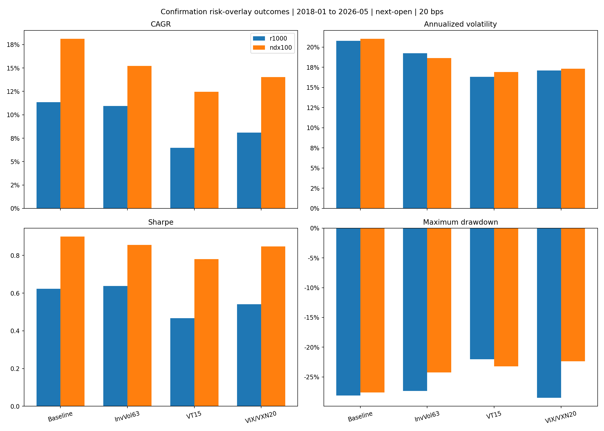
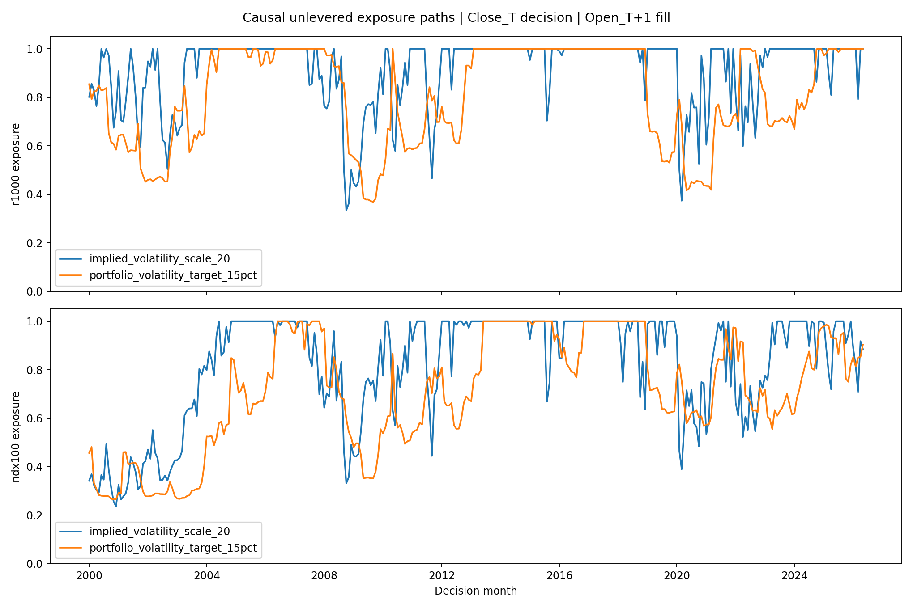

<!-- GENERATED FILE. EDIT THE CANONICAL KNOWLEDGE RECORD. -->

# Trend-Factor Risk-Overlay Study

!!! warning "Research-only"
    This page summarizes saved research evidence. It does not authorize LIVE, allocation, or deployment.

## TL;DR

> **Verdict:** No risk overlay passed the frozen validation and confirmation gate.

> **Status:** `diagnostic`

> **Disposition:** `not_recorded`

> **Replication:** `not_recorded`

## Research question

Test three isolated unlevered risk-sizing overlays on the two frozen long-only trend-factor universe hypotheses.

## Exact setup

| Field | Value |
| --- | --- |
| Signal family | cross_sectional_trend |
| Universe | ["Russell 1000", "Nasdaq-100"] |
| Decision | After final common market Close_T |
| Fill | First Open_T+1 to first Open_T+2 |
| Primary cost layer | central_research |
| Last reviewed | 2026-07-26T23:05:01.299800+03:00 |

## Timing and overnight attribution

```text
information available: After final common market Close_T
primary executable fill: First Open_T+1 to first Open_T+2
```

If final `Close_T` data formed the signal, a hypothetical `Close_T` entry is diagnostic only unless a separate pre-close protocol was modeled. Comparing that diagnostic with `Open_(T+1)` and applying the compounded return identity shows whether the apparent edge occurred in the overnight gap. Missing attribution numbers mean **not tested**, not zero.


## Primary metrics

| Metric | Value |
| --- | ---: |
| Period | confirmation_2018-01_to_2026-05 |
| Universe | r1000 |
| Cost Layer | central_research_20bps_round_trip |
| Cagr | 10.94% |
| Annualized Volatility | 19.26% |
| Sharpe | 0.637 |
| Maximum Drawdown | -27.37% |
| Turnover | 60.89% |

## Key findings

| Feature | Role | Direction | Status | Effect | Action |
| --- | --- | --- | --- | --- | --- |
| inverse_volatility_63d | position_size_normalizer | lower-volatility stocks receive larger weights | diagnostic_rejected | Least damaging overlay, but confirmation drawdown improvement was only 0.76pp in Russell 1000 and 3.36pp in Nasdaq-100. | Do not add to the frozen strategies. |
| portfolio_volatility_target_15pct | gross_exposure_normalizer | reduce exposure after high completed volatility | diagnostic_rejected | Largest drawdown reduction, but lower confirmation Sharpe and insufficient CAGR retention. | Reject under the frozen rule. |
| VIX_VXN_scale_20 | gross_exposure_normalizer | reduce exposure when implied volatility exceeds 20 | diagnostic_rejected | Lowered volatility but reduced confirmation Sharpe; Russell-1000 maximum drawdown became slightly worse. | Do not add to the frozen strategies. |

## Visual evidence






## Limitations

- Universes and overlays are post-hoc to earlier strategy inspection.
- VIX is not Russell-1000-specific.
- Cash earns zero and no leverage is allowed.
- No empirical opening-auction impact model.

## Next gates

- Keep the two existing forward hypotheses unchanged.
- Do not combine rejected overlays without a new frozen hypothesis.
- Collect forward evidence before reopening risk sizing.

## Sources

- `Frozen trend_factor_cross_universe study`
- `Norgate point-in-time prices and membership`
- `Cboe VIX and broad-based volatility-index methodology`

## Canonical artifacts

| Artifact | Pakal path |
| --- | --- |
| Concise Report | `pakal-research/reports/trend_factor_risk_overlay/REPORT.md` |
| Frozen Specification | `pakal-research/reports/trend_factor_risk_overlay/research_spec_frozen.json` |
| Full Report | `pakal-research/reports/trend_factor_risk_overlay/REPORT_FULL.md` |
| Manifest | `pakal-research/reports/trend_factor_risk_overlay/run_manifest.json` |
| Notebook | `pakal-research/trend_factor_risk_overlay_research.ipynb` |
| Primary Charts | `["pakal-research/reports/trend_factor_risk_overlay/charts/confirmation_overlay_metrics.png", "pakal-research/reports/trend_factor_risk_overlay/charts/monthly_exposure_paths.png"]` |
| Primary Source Code | `["pakal-research/norgate_trend_factor_risk_overlay_study.py"]` |
| Primary Tables | `["pakal-research/reports/trend_factor_risk_overlay/tables/performance_by_period.csv", "pakal-research/reports/trend_factor_risk_overlay/tables/promotion_gate.csv", "pakal-research/reports/trend_factor_risk_overlay/tables/ranking_alpha_inference.csv"]` |
