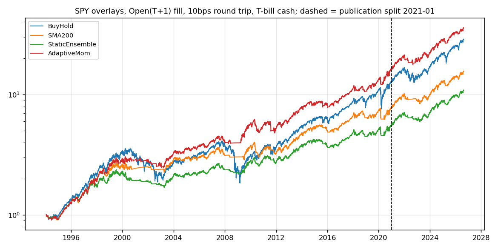
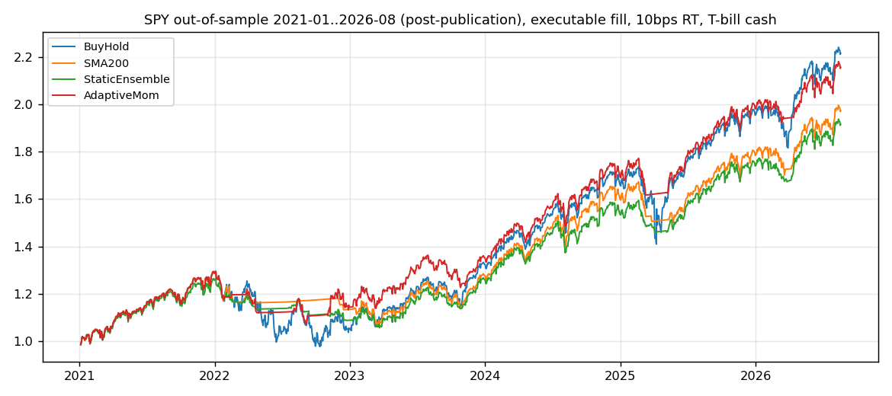

<!-- GENERATED FILE. EDIT THE CANONICAL KNOWLEDGE RECORD. -->

# Varadi Adaptive Momentum: drawdown-percentile adaptive lookback trend-following

!!! warning "Research-only"
    This page summarizes saved research evidence. It does not authorize LIVE, allocation, or deployment.

## TL;DR

> **Verdict:** Directionally replicated and robust to executable timing and costs; the frozen promotion rule passes in sign on the equal-weight four-asset roll-up. Amendment A1 materially qualifies the magnitude: the published (50,200) cell is the EW4 OOS grid MAXIMUM, and the edge over the static ensemble falls from +0.225 at that cell to +0.054 at the 3x3 parameter shoulder and +0.013 at the grid median. In-sample robustness is genuine (100% of grid cells beat the ensemble, worst +0.089); out-of-sample it is peak-dependent. EFA contradicts the mechanism outright (no IS->OOS rank transfer, and its OOS profile prefers LESS adaptivity). Three of the frozen defaults (ST=50, SMA10 filter, 126d window) are each the in-sample optimum - a clear post-hoc tuning signature. Forward expectation must be priced at shoulder level (~+0.05), not at the published cell.

> **Status:** `research_candidate`

> **Disposition:** `promising_component`

> **Replication:** `directionally_replicated`

## Research question

Does Varadi's drawdown-percentile adaptive-lookback trend filter deliver an executable edge over a frozen static-SMA-ensemble null on SPY/TLT/EFA/DBC after Open_T+1 fills, 10-25bps RT costs, and T-bill cash, in the post-publication window 2021-2026; and do predeclared mechanism modifications improve it?

## Exact setup

| Field | Value |
| --- | --- |
| Signal family | trend_following_adaptive_lookback |
| Universe | ["fixed ETF list: SPY, TLT, EFA, DBC (source assets)", "breadth extension: QQQ, IWM, EEM, GLD, IEF"] |
| Decision | Close_T |
| Fill | Open_T+1 |
| Primary cost layer | central_research |
| Last reviewed | 2026-08-20T14:05:00+00:00 |

## Timing and overnight attribution

```text
information available: Close_T
primary executable fill: Open_T+1
```

If final `Close_T` data formed the signal, a hypothetical `Close_T` entry is diagnostic only unless a separate pre-close protocol was modeled. Comparing that diagnostic with `Open_(T+1)` and applying the compounded return identity shows whether the apparent edge occurred in the overnight gap. Missing attribution numbers mean **not tested**, not zero.

| Attribution field | Value |
| --- | --- |
| Status | tested |
| Diagnostic Path | Close_T same-close fill to the symmetric exit (source convention) |
| Executable Path | Open_T+1 fill to the same exit |
| Method | Compounded overnight (sig_{t-2}) and intraday (sig_{t-1}) leg decomposition; all three fills also compared with cash=0 to isolate pure timing |
| Headline Result | Same-close minus Open_T+1 CAGR difference within +/-0.7pp per year and mixed in sign across assets - the published edge is not a same-close artifact; the close-to-close lag-2 proxy overstated the damage (notably on EFA) |
| Metrics | {"DBC_IS_CAGR_open_t1": 0.043, "DBC_IS_CAGR_same_close": 0.05, "EFA_IS_CAGR_open_t1": 0.0735, "EFA_IS_CAGR_same_close": 0.0801, "SPY_full_CAGR_open_t1": 0.1115, "SPY_full_CAGR_same_close": 0.1093} |
| Unavailable Reason | N/A |
| Artifact | reports/varadi_adaptive_momentum_study/tables/timing_attribution.csv |

## Primary metrics

| Metric | Value |
| --- | ---: |
| Period | EW4 source assets, common sample 2007-02..2026-08; IS to 2020-12-31, OOS 2021-01..2026-08-19 |
| Universe | EW4: SPY/TLT/EFA/DBC equal-weight daily roll-up of single-asset overlays |
| Cost Layer | central_research (10bps round trip, Open_T+1, T-bill cash) |
| Cagr | 11.60% |
| Annualized Volatility | 12.50% |
| Sharpe | 0.844 |
| Maximum Drawdown | -22.80% |
| Turnover | 300.00% |

## Four separate verdicts

| Question | Conclusion |
| --- | --- |
| Source Replication | directionally_replicated |
| Predictive Value | premise_confirmed_portfolio_level_economics_mixed |
| Economic Value | positive_but_peak_dependent_out_of_sample |
| Promotion | research_candidate |

## Key findings

| Feature | Role | Direction | Status | Effect | Action |
| --- | --- | --- | --- | --- | --- |
| drawdown-depth percentile (126d, squared) as EMA-alpha state variable | regime | deep drawdown -> fast lookback; at highs -> slow lookback | research_candidate | 0.295 | freeze_defaults_for_future_data |
| low turnover as structural edge component | diagnostic | AM trades ~3x/yr vs 6-10x for static nulls; cost ladder widens AM's relative edge | diagnostic | N/A | note_in_any_downstream_comparison |
| vol targeting overlay (15%, 20d) | sizing | reshapes risk without Sharpe improvement | rejected_for_sharpe_improvement | N/A | record_as_risk_shaping_option |
| 126-day percentile window for the drawdown reference distribution | regime | sets how fast the reference distribution forgets, not the average strategy speed | research_candidate | N/A | keep_frozen_at_126_note_63_is_equivalent |
| drawdown surprise depth/(sigma_peak*sqrt(time_under_water)) as gate or replacement for the trailing rank | regime | high = fresh crash, ~1 = grind indistinguishable from random-walk wander | rejected | -0.19 | record_rejection_keep_as_descriptive_statistic |
| PREMISE TEST: E[PnL(fast) - PnL(slow) \| drawdown percentile decile] | diagnostic | monotonically increasing in the drawdown percentile at a 60-day horizon | confirmed_diagnostic | 0.026 | record_as_confirmed_premise_open_two_future_questions |

## Visual evidence






## Limitations

- No untouched confirmation window: exploration lanes consumed 2021-2026; only predeclared mechanical win-rules protected selection; next clean test is future data.
- Amendment A1: the published parameter cell is the EW4 out-of-sample grid maximum; the out-of-sample edge over the static ensemble is +0.054 at the parameter shoulder and +0.013 at the grid median, not the +0.225 measured at the published cell.
- EFA shows no IS->OOS grid rank transfer (Spearman 0.235, p=0.17) and its OOS profile prefers LESS adaptivity - the mechanism does not hold on that asset and the smooth inverted-U in ST is a SPY/TLT phenomenon, not universal.
- Three frozen defaults (ST=50, SMA10 price filter, 126-day percentile window) are each the in-sample optimum of their own sweep - a post-hoc tuning signature, although the percentile window is the least fragile (63 ties it out of sample).
- Published defaults (50/200/126/^2/SMA10) sit exactly at the SPY IS grid maximum - expect neighborhood-median performance, not the published cell.
- IS edge is regime-concentrated: six years (2000, 2009, 1999, 2007, 2020, 2019) supply ~70% of the SPY log-wealth edge vs the ensemble.
- OOS significance is portfolio-level only; single assets are insignificant (SPY p=0.29) or negative (EFA); breadth-asset OOS edge is ~zero (+0.027, p=0.416).
- TLT/IEF OOS: all long/flat overlays lose to cash in the 2022+ bond bear; AM merely loses less.
- Part of the measured edge vs the static ensemble reflects the null's turnover drag rather than signal quality; AM is never nominally significant vs the best single static lookback.
- Assumed source-search multiplicity (m=10-50) is a guess; the author's true search space is unknown.

## Next gates

- Untouched future data 2026H2+ on the frozen defaults (EW4 vs static ensemble, Open_T+1, central costs).
- FUTURE FROZEN STUDY - horizon mismatch: the premise is strongest at H=60 while the rule re-decides daily. Test a pre-committed minimum holding period or a slower decision cadence. Must not be tuned on the 1993-2026 sample.
- FUTURE FROZEN STUDY - memory mismatch: the state discriminates 4x better with a 756-day percentile window, yet the strategy peaks at 126. Test separating the regime-identification window from the alpha-interpolation window as two distinct parameters. Must not be tuned on the 1993-2026 sample.
- If pursued as a component: marginal contribution to an existing trend sleeve (note the 0.91 correlation with a static ensemble - it is a substitute, not a diversifier).

## Sources

- `https://cssanalytics.wordpress.com/2020/12/23/how-should-trend-followers-adjust-to-the-modern-environment-enter-adaptive-momentum/`
- `https://cssanalytics.wordpress.com/2021/01/06/adaptive-momentum-on-major-asset-classes/`

## Canonical artifacts

| Artifact | Pakal path |
| --- | --- |
| Concise Report | `pakal-research/reports/varadi_adaptive_momentum_study/REPORT.md` |
| Full Report | `pakal-research/reports/varadi_adaptive_momentum_study/REPORT_FULL.md` |
| Notebook | `pakal-research/varadi_adaptive_momentum_study.ipynb` |
| Frozen Specification | `pakal-research/reports/varadi_adaptive_momentum_study/research_spec_frozen.json` |
| Manifest | `pakal-research/reports/varadi_adaptive_momentum_study/run_manifest.json` |
| Primary Source Code | `["pakal-research/varadi_adaptive_momentum_study.py", "pakal-research/varadi_adaptive_momentum_premise_test.py"]` |
| Primary Tables | `["pakal-research/reports/varadi_adaptive_momentum_study/tables/core_stats_long.csv", "pakal-research/reports/varadi_adaptive_momentum_study/tables/bootstrap_sharpe_diffs.csv", "pakal-research/reports/varadi_adaptive_momentum_study/tables/timing_attribution.csv", "pakal-research/reports/varadi_adaptive_momentum_study/tables/parameter_grid.csv", "pakal-research/reports/varadi_adaptive_momentum_study/tables/grid_rank_transfer.csv", "pakal-research/reports/varadi_adaptive_momentum_study/tables/yearly_edge.csv", "pakal-research/reports/varadi_adaptive_momentum_study/tables/parameter_grid_portfolio.csv", "pakal-research/reports/varadi_adaptive_momentum_study/tables/percentile_window_sweep.csv", "pakal-research/reports/varadi_adaptive_momentum_study/tables/premise_test_summary.csv", "pakal-research/reports/varadi_adaptive_momentum_study/tables/premise_test_deciles.csv"]` |
| Primary Charts | `["pakal-research/reports/varadi_adaptive_momentum_study/charts/spy_equity_executable.png", "pakal-research/reports/varadi_adaptive_momentum_study/charts/spy_equity_oos.png", "pakal-research/reports/varadi_adaptive_momentum_study/charts/spy_grid_heatmap_is_oos.png", "pakal-research/reports/varadi_adaptive_momentum_study/charts/spy_yearly_edge.png", "pakal-research/reports/varadi_adaptive_momentum_study/charts/spy_signal_anatomy_2018_2021.png", "pakal-research/reports/varadi_adaptive_momentum_study/charts/ew4_rolling_sharpe_diff.png"]` |
| Research State | `pakal-research/reports/varadi_adaptive_momentum_study/research_state.json` |
| Hypothesis Registry | `pakal-research/reports/varadi_adaptive_momentum_study/hypothesis_registry.json` |
| Experiment Ledger | `pakal-research/reports/varadi_adaptive_momentum_study/experiment_ledger.jsonl` |
| Decision Log | `pakal-research/reports/varadi_adaptive_momentum_study/decision_log.jsonl` |
| Source Rule Map | `pakal-research/reports/varadi_adaptive_momentum_study/SOURCE_RULE_MAP.md` |
