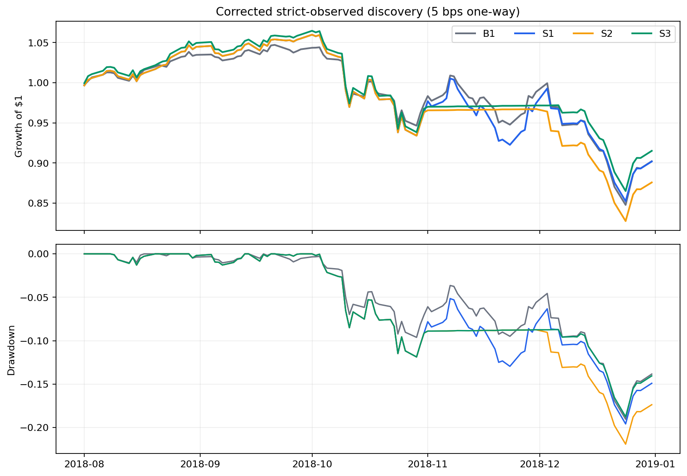
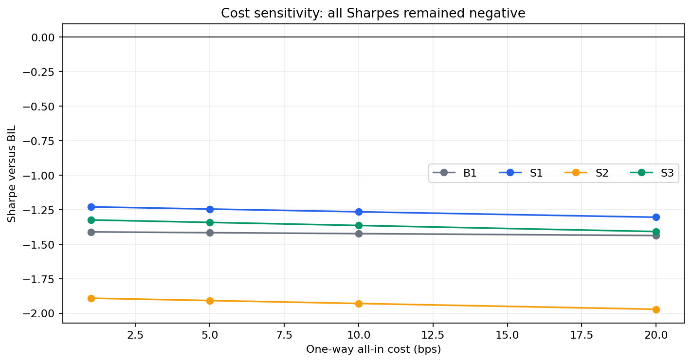

<!-- GENERATED FILE. EDIT THE CANONICAL KNOWLEDGE RECORD. -->

# Varadi Quant ETF Rotation, Trend, and Pullback Study

!!! warning "Research-only"
    This page summarizes saved research evidence. It does not authorize LIVE, allocation, or deployment.

## TL;DR

> **Verdict:** Stop before validation: the strict observed-close plane leaves only six discovery decisions, and all central paths lost money.

> **Status:** `diagnostic`

> **Disposition:** `inconclusive`

> **Replication:** `not_reproducible`

## Research question

Test whether monthly factor momentum rotation, SMA200 filtering, and prior-only pullback entry improve a five-factor ETF basket causally after costs.

## Exact setup

| Field | Value |
| --- | --- |
| Signal family | factor_etf_rotation |
| Universe | ["MTUM, VLUE, QUAL, USMV, SIZE fixed surviving ETF wrappers"] |
| Decision | Final month-end Close_T |
| Fill | First observed Open_T+1 adjusted-return proxy |
| Primary cost layer | central_research |
| Last reviewed | 2026-08-20T18:15:30.369467+03:00 |

## Timing and overnight attribution

```text
information available: Final month-end Close_T
primary executable fill: First observed Open_T+1 adjusted-return proxy
```

If final `Close_T` data formed the signal, a hypothetical `Close_T` entry is diagnostic only unless a separate pre-close protocol was modeled. Comparing that diagnostic with `Open_(T+1)` and applying the compounded return identity shows whether the apparent edge occurred in the overnight gap. Missing attribution numbers mean **not tested**, not zero.

| Attribution field | Value |
| --- | --- |
| Status | not_tested |
| Diagnostic Path | Close_T to next declared month-end |
| Executable Path | Open_T+1 to next declared month-end |
| Method | Stateful split of overnight and intraday returns was enforced in the engine, but a separate attribution table was not promoted after the discovery stop. |
| Headline Result | Not assessed; no auction-fill evidence and insufficient discovery sample. |
| Metrics | {} |
| Artifact | N/A |

## Primary metrics

| Metric | Value |
| --- | ---: |
| Period | 2018-08-01 through 2018-12-31 |
| Universe | MTUM, VLUE, QUAL, USMV, SIZE |
| Cost Layer | 5 bps one-way all-in wrapper-order proxy |
| Cagr | -21.94% |
| Annualized Volatility | 19.90% |
| Sharpe | -1.245 |
| Maximum Drawdown | -19.58% |
| Turnover | 725.65% |

## Four separate verdicts

| Question | Conclusion |
| --- | --- |
| Source Replication | Not reproducible because the 2019 source omits formulas and a backtest. |
| Predictive Value | Inconclusive: mean IC 0.045 with only six monthly cross-sections. |
| Economic Value | Negative in corrected discovery; all 5-bps paths had negative CAGR and Sharpe. |
| Promotion | Diagnostic only; validation and confirmation remained unopened. |

## Key findings

| Feature | Role | Direction | Status | Effect | Action |
| --- | --- | --- | --- | --- | --- |
| MeanRank factor rotation | cross-sectional rank | Discovery Sharpe delta S1-B1 0.171 | diagnostic | {"delta_sharpe": 0.17121635706970117} | Do not open a holdout until at least 60 clean pre-holdout months exist. |
| SMA200 rank-first filter | risk overlay | Discovery Sharpe delta S2-S1 -0.663 | rejected | {"delta_sharpe": -0.6631868432650074} | Do not advance this overlay from the current study. |
| Prior-only pullback entry | entry timing | Discovery Sharpe delta S3-S2 0.566 | diagnostic | {"delta_sharpe": 0.5664300385628316} | Freeze for future data only; do not tune thresholds on unopened holdouts. |

## Visual evidence






## Limitations

- Only six strict observed-close discovery decisions.
- The exact original frozen specification failed the current strict schema validator; the reconciled current view was completed after discovery and has no confirmatory credit.
- Fixed surviving ETF wrappers and issuer index methodology create survivorship risk.
- TOTALRETURN Open is an adjusted research proxy, not measured auction fill.
- No empirical market-impact or operational-capacity evidence.
- Validation and confirmation were never opened.

## Next gates

- Freeze a verified predecessor-index or point-in-time factor-series splice supplying at least 60 clean pre-2019 months.
- Retain 2019-2022 validation and 2023-2026 confirmation unopened until that lineage is approved.
- Calibrate opening fills and auction participation only if predictive and economic gates later pass.

## Sources

- `C:/Users/User/Downloads/QUANT-ETFS_OutPerfroms.pdf`
- `chatgpt-conversation://6a86c1dd-5998-83eb-8e01-e207c5083905`
- `Norgate Data local licensed US Equities database`

## Canonical artifacts

| Artifact | Pakal path |
| --- | --- |
| Closeout Specification Amendment | `pakal-research/reports/varadi_quant_etf_rotation_study/research_spec_amendment_002.json` |
| Concise Report | `pakal-research/reports/varadi_quant_etf_rotation_study/REPORT.md` |
| Decision Log | `pakal-research/reports/varadi_quant_etf_rotation_study/decision_log.jsonl` |
| Experiment Ledger | `pakal-research/reports/varadi_quant_etf_rotation_study/experiment_ledger.jsonl` |
| Frozen Specification | `pakal-research/reports/varadi_quant_etf_rotation_study/research_spec_frozen.json` |
| Full Report | `pakal-research/reports/varadi_quant_etf_rotation_study/REPORT_FULL.md` |
| Hypothesis Registry | `pakal-research/reports/varadi_quant_etf_rotation_study/hypothesis_registry.json` |
| Manifest | `pakal-research/reports/varadi_quant_etf_rotation_study/run_manifest.json` |
| Notebook | `pakal-research/varadi_quant_etf_rotation_study.ipynb` |
| Original Frozen Specification | `pakal-research/reports/varadi_quant_etf_rotation_study/lineage/research_spec_frozen_original_sha256_5fdf1e43.json` |
| Primary Charts | `["pakal-research/reports/varadi_quant_etf_rotation_study/charts"]` |
| Primary Source Code | `["pakal-research/varadi_quant_etf_rotation_study.py"]` |
| Primary Tables | `["pakal-research/reports/varadi_quant_etf_rotation_study/tables"]` |
| Research State | `pakal-research/reports/varadi_quant_etf_rotation_study/research_state.json` |
| Source Rule Map | `pakal-research/reports/varadi_quant_etf_rotation_study/SOURCE_RULE_MAP.md` |
| Specification Amendment | `pakal-research/reports/varadi_quant_etf_rotation_study/research_spec_amendment_001.json` |
| Specification Content Index | `pakal-research/reports/varadi_quant_etf_rotation_study/SPEC_CONTENT_INDEX.json` |
