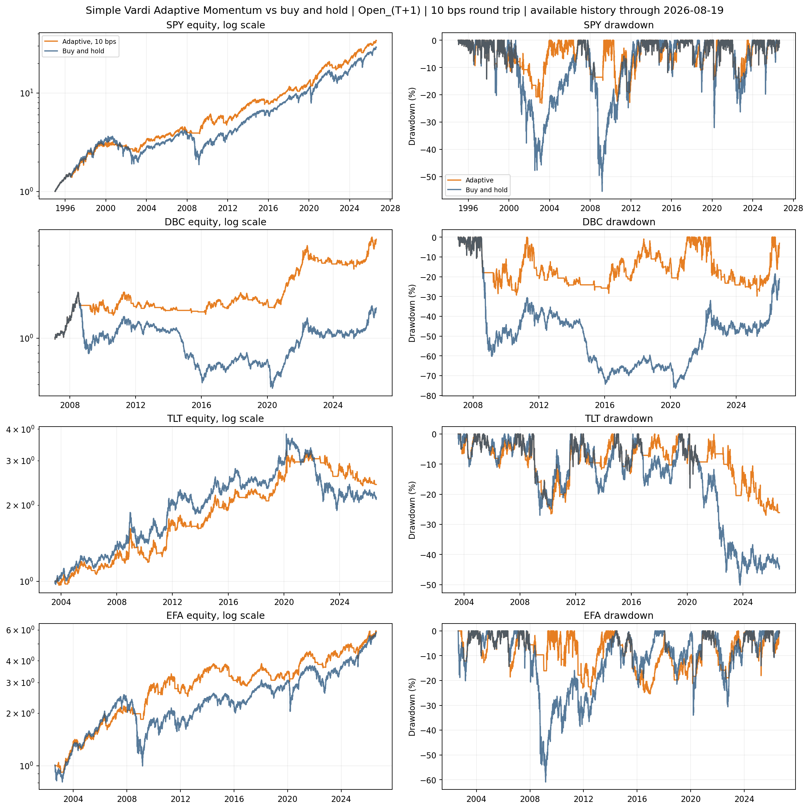
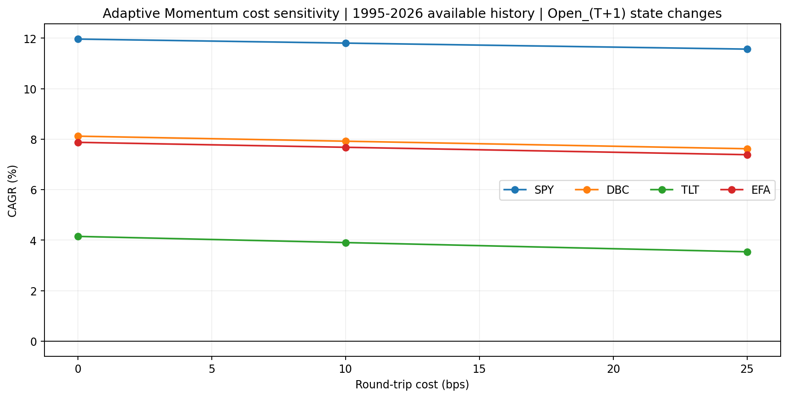

<!-- GENERATED FILE. EDIT THE CANONICAL KNOWLEDGE RECORD. -->

# Vardi Adaptive Momentum on Major ETFs

!!! warning "Research-only"
    This page summarizes saved research evidence. It does not authorize LIVE, allocation, or deployment.

## TL;DR

> **Verdict:** The source-era CAGR and Sharpe replicated and the causal next-open translation persisted after costs, but the rule beat the best static comparator on Sharpe in only two of four source assets in locked 2021-2023 validation. Confirmation remained asset-dependent. Preserve as a diagnostic trend overlay; do not implement or promote.

> **Status:** `diagnostic`

> **Disposition:** `diagnostic`

> **Replication:** `replicated`

## Research question

Replicate David Varadi's drawdown-adaptive long/cash rule, translate its same-close diagnostic into causal next-open ETF execution, and test whether it beats 200SMA, 252-day momentum, and 120-day momentum across locked post-publication periods.

## Exact setup

| Field | Value |
| --- | --- |
| Signal family | drawdown_adaptive_time_series_momentum |
| Universe | ["Literal fixed ETF proxies: SPY, DBC, TLT, EFA", "Descriptive chart set only: SPY, QQQ, IWM, EFA, EEM, TLT, IEF, HYG, GLD, DBC, VNQ, BIL"] |
| Decision | All-time-high drawdown severity, trailing 126-session rank, adaptive alpha, AMA, SMA10, and desired state are computed after final adjusted Close_T. |
| Fill | Primary executable changes occur at Open_(T+1) and earn adjusted open-to-open returns. Source-like Close_T-to-Close_(T+1) is diagnostic only. |
| Primary cost layer | central_research |
| Last reviewed | 2026-08-20T12:21:12+03:00 |

## Timing and overnight attribution

```text
information available: All-time-high drawdown severity, trailing 126-session rank, adaptive alpha, AMA, SMA10, and desired state are computed after final adjusted Close_T.
primary executable fill: Primary executable changes occur at Open_(T+1) and earn adjusted open-to-open returns. Source-like Close_T-to-Close_(T+1) is diagnostic only.
```

If final `Close_T` data formed the signal, a hypothetical `Close_T` entry is diagnostic only unless a separate pre-close protocol was modeled. Comparing that diagnostic with `Open_(T+1)` and applying the compounded return identity shows whether the apparent edge occurred in the overnight gap. Missing attribution numbers mean **not tested**, not zero.


## Primary metrics

| Metric | Value |
| --- | ---: |
| Period | 1995-01-03 to 2026-08-17 full descriptive |
| Universe | SPY independent Vardi Adaptive Momentum long/cash path |
| Cost Layer | central_research_10_bps_round_trip |
| Cagr | 11.80% |
| Annualized Volatility | 13.42% |
| Sharpe | 0.899 |
| Maximum Drawdown | -23.13% |
| Turnover | 285.00% |

## Four separate verdicts

| Question | Conclusion |
| --- | --- |
| Source Replication | Replicated within frozen CAGR and Sharpe tolerances for SPY, DBC, TLT, and EFA, with unresolved trade-count, percentile, seed, vendor, and higher-moment gaps. |
| Predictive Value | Mixed and asset-dependent. No adaptive-minus-comparator result survived the 12-cell BH family at 5% in validation or confirmation. |
| Economic Value | The next-open 10 bps rule remained historically positive in several ETFs, but failed the frozen 3-of-4 validation Sharpe-breadth gate and TLT lost money in both locked periods. |
| Promotion | No promotion. Status and disposition are diagnostic; no LIVE, PAPER, broker, scheduler, allocation, release, or capacity authority. |

## Key findings

| Feature | Role | Direction | Status | Effect | Action |
| --- | --- | --- | --- | --- | --- |
| all_time_high_drawdown_severity_percentile_squared | regime_and_risk_overlay | deeper drawdown raises the weight on the faster 50-day EMA alpha | diagnostic | Source-like adaptive CAGR and Sharpe matched all four frozen article tolerance bands; causal source-era 10 bps CAGR ranged from 4.86% to 11.25% across the four source ETFs. | Retain unchanged as a diagnostic feature and collect genuinely prospective evidence; do not tune on seen dates. |
| sma10_above_adaptive_moving_average | entry_and_exit | long when SMA10 is strictly above AMA; otherwise cash | diagnostic | Full descriptive next-open 10 bps SPY CAGR 11.80%, Sharpe 0.90, maximum drawdown 23.13%, and average exposure 82.7%. | Do not implement from this evidence. |
| same_close_source_diagnostic | timing_diagnostic | article-like state is applied to the next close-to-close interval | timing_conflicted | SPY source-era close-to-close CAGR 11.24%, with an 11.32% overnight component and -0.08% same-exit intraday component. | Use Close_T to Open_(T+1) execution only; treat same-close results as diagnostic. |

## Visual evidence






## Limitations

- The source omits percentile direction, exact six-month convention, ties, AMA seed, cash yield, costs, execution, data vendor, and most trade counts.
- The article reports 138 SPY trades while the local rule records 37 source-era entries; higher moments also differ.
- Norgate TOTALRETURN OHLC may differ from the source vendor and historical adjustment vintage.
- The wider 12-ETF chart set is current-survivor and descriptive, not a point-in-time selection universe.
- Cash earns zero, and the same-close source path is not executable without an auction protocol.
- Costs are scenarios rather than measured fills; capacity and opening-auction impact are not assessed.
- Confirmation contains only about 2.6 years and cannot establish all-regime durability.
- Global registry publication was skipped because the unrelated legacy pakal-research/reports/new_strategy_discovery_phase2_20260730/knowledge_record.json does not use quant-research-knowledge-v1. This study validated independently, and the unrelated record was not modified.

## Next gates

- Observe the unchanged four-asset literal rule prospectively from 2026-08-20 with the frozen severity rank, 126/50/200/10 parameters, strict tie rule, next-open timing, and cost layers.
- Do not select assets or modify rank, lookback, seed, tie, timing, or costs using any source, validation, or confirmation date already seen.

## Sources

- `C:/Users/User/Downloads/adaptive_mom_vardi_pt1.pdf \| sha256:BE6C6B08133C3718F672F60C9F652E5B05ED68B022B5F57BD8992D26CFCC94CA`
- `C:/Users/User/Downloads/adaptive_mom_vardi_pt2.pdf \| sha256:8D6E9F81DE2B8A4EED26B19E63A189CCCB1CAC5F0139C556F0257F115B68D7E9`

## Canonical artifacts

| Artifact | Pakal path |
| --- | --- |
| Concise Report | `C:/Users/User/Documents/workspace/pakal/pakal-research/reports/vardi_adaptive_momentum_etf_study/REPORT.md` |
| Full Report | `C:/Users/User/Documents/workspace/pakal/pakal-research/reports/vardi_adaptive_momentum_etf_study/REPORT_FULL.md` |
| Notebook | `C:/Users/User/Documents/workspace/pakal/pakal-research/notebooks/vardi_adaptive_momentum_etf_study.ipynb` |
| Frozen Specification | `C:/Users/User/Documents/workspace/pakal/pakal-research/reports/vardi_adaptive_momentum_etf_study/research_spec_frozen.json` |
| Manifest | `C:/Users/User/Documents/workspace/pakal/pakal-research/reports/vardi_adaptive_momentum_etf_study/run_manifest.json` |
| Research State | `C:/Users/User/Documents/workspace/pakal/pakal-research/reports/vardi_adaptive_momentum_etf_study/research_state.json` |
| Hypothesis Registry | `C:/Users/User/Documents/workspace/pakal/pakal-research/reports/vardi_adaptive_momentum_etf_study/hypothesis_registry.json` |
| Experiment Ledger | `C:/Users/User/Documents/workspace/pakal/pakal-research/reports/vardi_adaptive_momentum_etf_study/experiment_ledger.jsonl` |
| Decision Log | `C:/Users/User/Documents/workspace/pakal/pakal-research/reports/vardi_adaptive_momentum_etf_study/decision_log.jsonl` |
| Source Rule Map | `C:/Users/User/Documents/workspace/pakal/pakal-research/reports/vardi_adaptive_momentum_etf_study/SOURCE_RULE_MAP.md` |
| Primary Source Code | `["C:/Users/User/Documents/workspace/pakal/pakal-research/vardi_adaptive_momentum_etf_study.py", "C:/Users/User/Documents/workspace/pakal/pakal-research/tests/test_vardi_adaptive_momentum_etf_study.py"]` |
| Primary Tables | `["C:/Users/User/Documents/workspace/pakal/pakal-research/reports/vardi_adaptive_momentum_etf_study/tables/source_replication_comparison.csv", "C:/Users/User/Documents/workspace/pakal/pakal-research/reports/vardi_adaptive_momentum_etf_study/tables/simple_adaptive_strategy_table.csv", "C:/Users/User/Documents/workspace/pakal/pakal-research/reports/vardi_adaptive_momentum_etf_study/tables/validation_metrics.csv", "C:/Users/User/Documents/workspace/pakal/pakal-research/reports/vardi_adaptive_momentum_etf_study/tables/confirmation_metrics.csv", "C:/Users/User/Documents/workspace/pakal/pakal-research/reports/vardi_adaptive_momentum_etf_study/tables/full_primary_daily_returns.csv.gz"]` |
| Primary Charts | `["C:/Users/User/Documents/workspace/pakal/pakal-research/reports/vardi_adaptive_momentum_etf_study/charts/indicator_overview_12_assets.png", "C:/Users/User/Documents/workspace/pakal/pakal-research/reports/vardi_adaptive_momentum_etf_study/charts/source_replication_adaptive.png", "C:/Users/User/Documents/workspace/pakal/pakal-research/reports/vardi_adaptive_momentum_etf_study/charts/simple_strategy_equity_drawdown.png", "C:/Users/User/Documents/workspace/pakal/pakal-research/reports/vardi_adaptive_momentum_etf_study/charts/adaptive_holdout_stability.png", "C:/Users/User/Documents/workspace/pakal/pakal-research/reports/vardi_adaptive_momentum_etf_study/charts/adaptive_cost_sensitivity.png"]` |
