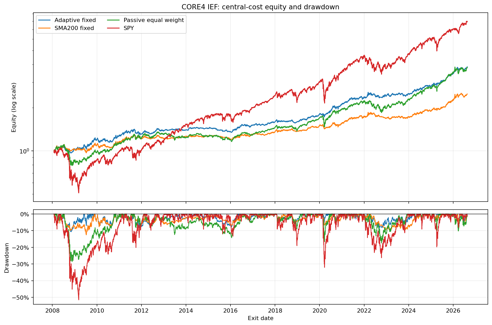
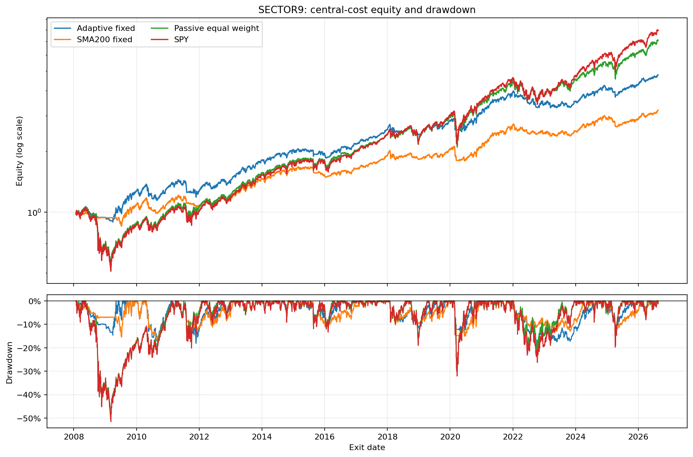

<!-- GENERATED FILE. EDIT THE CANONICAL KNOWLEDGE RECORD. -->

# Vardi Adaptive Momentum Macro and Sector Portfolios

!!! warning "Research-only"
    This page summarizes saved research evidence. It does not authorize LIVE, allocation, or deployment.

## TL;DR

> **Verdict:** CORE4_IEF adaptive fixed sleeves passed every frozen historical gate and should be frozen only as a prospective shadow forward hypothesis. Reallocating inactive sleeves was rejected. SECTOR9 failed two exact advancement gates and SECTOR11 failed transfer, so sectors remain diagnostic and are not advanced.

> **Status:** `forward_hypothesis`

> **Disposition:** `promising_component`

> **Replication:** `replicated`

## Research question

Determine whether literal Vardi LONG states can allocate exposure across frozen macro and US-sector ETF baskets, and whether fixed sleeves, a 30 percent active cap, or full active-only allocation provides the most robust portfolio construction.

## Exact setup

| Field | Value |
| --- | --- |
| Signal family | drawdown-conditioned adaptive moving-average trend with independent fixed sleeves |
| Universe | ["CORE4_IEF: SPY, IEF, GLD, DBC", "CORE4_TLT: SPY, TLT, GLD, DBC", "GLOBAL6: SPY, EFA, EEM, IEF, GLD, DBC", "FULL7_CREDIT: SPY, EFA, EEM, IEF, GLD, DBC, HYG", "SECTOR9: XLB, XLE, XLF, XLI, XLK, XLP, XLU, XLV, XLY", "SECTOR11 diagnostic: XLB, XLE, XLF, XLI, XLK, XLP, XLU, XLV, XLY, XLC, XLRE"] |
| Decision | Close_T after all Total Return OHLC inputs through T are known |
| Fill | First strict common Open_(T+1), with stateful open-to-open weight drift |
| Primary cost layer | central_research |
| Last reviewed | 2026-08-21T09:55:00+00:00 |

## Timing and overnight attribution

```text
information available: Close_T after all Total Return OHLC inputs through T are known
primary executable fill: First strict common Open_(T+1), with stateful open-to-open weight drift
```

If final `Close_T` data formed the signal, a hypothetical `Close_T` entry is diagnostic only unless a separate pre-close protocol was modeled. Comparing that diagnostic with `Open_(T+1)` and applying the compounded return identity shows whether the apparent edge occurred in the overnight gap. Missing attribution numbers mean **not tested**, not zero.

| Attribution field | Value |
| --- | --- |
| Status | not_applicable |
| Diagnostic Path | No same-close return path is used in the new portfolio study. |
| Executable Path | Close_T decision to first strict common Open_(T+1), then open-to-open returns. |
| Method | The previously audited source timing was inherited; this extension tests only the causal next-open portfolio path. |
| Headline Result | All 115 portfolio paths use the same causal next-open boundary; no timing-alpha claim is made here. |
| Metrics | {} |
| Unavailable Reason | A same-close comparator was intentionally outside this portfolio-construction question and would not be executable evidence. |
| Artifact | pakal-research/reports/vardi_adaptive_momentum_portfolio_sector_study/SOURCE_RULE_MAP.md |

## Primary metrics

| Metric | Value |
| --- | ---: |
| Period | 2008-01-25 through 2026-08-19 |
| Universe | CORE4_IEF adaptive_momentum fixed_sleeves |
| Cost Layer | central_research |
| Cagr | 7.54% |
| Annualized Volatility | 7.53% |
| Sharpe | 1.003 |
| Maximum Drawdown | -10.62% |
| Turnover | 411.82% |

## Four separate verdicts

| Question | Conclusion |
| --- | --- |
| Source Replication | The previously frozen literal Vardi indicator and signals reconcile exactly on all eight overlapping ETFs; the prior independent per-asset validation failure remains in force. |
| Predictive Value | Adaptive fixed sleeves beat matched SMA200 sleeves in all four CORE4 stability blocks and all three macro stress universes, but all evidence is on seen history. |
| Economic Value | At 10 bps round trip CORE4_IEF fixed sleeves delivered 7.54 percent CAGR, 1.003 Sharpe, and -10.62 percent maximum drawdown versus 0.748 Sharpe for SMA200 and 0.758 Sharpe with -28.55 percent drawdown for passive equal weight. |
| Promotion | Freeze CORE4_IEF fixed sleeves for prospective shadow tracking only from 2026-08-20; no PAPER, LIVE, broker, scheduler, capital-allocation, or release authority. Sector portfolios are not promoted. |

## Key findings

| Feature | Role | Direction | Status | Effect | Action |
| --- | --- | --- | --- | --- | --- |
| Independent fixed sleeves with residual BIL | portfolio_construction | Improved risk-adjusted return and drawdown versus matched SMA200 and passive equal weight in CORE4_IEF. | promising_component | Sharpe advantage +0.2549 versus SMA200 and +0.2451 versus passive; passive drawdown magnitude reduced 62.8 percent. | freeze_as_forward_hypothesis |
| Thirty-percent active cap | sizing | Raised CAGR but reduced Sharpe and worsened drawdown versus fixed sleeves. | rejected | CORE4_IEF Sharpe fell from 1.0028 to 0.9773 and drawdown worsened from -10.62 percent to -12.57 percent. | reject |
| Full equal weight among active assets | sizing | Raised gross exposure and CAGR at a material drawdown and Sharpe cost. | rejected | CORE4_IEF CAGR rose to 9.46 percent but Sharpe fell to 0.905 and drawdown worsened to -22.20 percent; SECTOR9 drawdown worsened to -40.81 percent. | reject |
| Transfer to US sector ETFs | universe | SECTOR9 improved Sharpe and drawdown versus passive, but narrowly failed exact advancement gates and did not transfer to SECTOR11. | diagnostic | SECTOR9 Adaptive-minus-SMA200 Sharpe was +0.09746 versus the +0.10 gate, and passive-CAGR retention was 79.03 percent versus the 80 percent gate. | retain_as_diagnostic_only |

## Visual evidence






## Limitations

- All historical portfolio data were already seen; no untouched validation or confirmation period survived.
- The fixed ETF baskets were chosen after observing market history and are not a point-in-time economic taxonomy.
- The prior literal per-asset Vardi audit failed its locked 3-of-4 validation breadth gate; this portfolio extension does not erase that result.
- Total Return OHLC and fixed round-trip costs do not model intraday spread, market impact, partial fills, taxes, or capital-dependent slippage.
- Capacity was not assessed, so no capital scale is supported.
- SECTOR11 begins only in 2019 because XLC and XLRE have shorter histories.

## Next gates

- Append-only prospective shadow tracking of the frozen CORE4_IEF fixed-sleeve rule from 2026-08-20.
- Review only after at least 504 new trading sessions and 20 aggregate signal-state transitions without changing assets, formula, sizing, costs, or gates.
- If the prospective gate passes, run a separate capacity study and target-engine parity audit before any PAPER request.

## Sources

- `C:/Users/User/Downloads/adaptive_mom_vardi_pt1.pdf sha256:be6c6b08133c3718f672f60c9f652e5b05ed68b022b5f57bd8992d26cfcc94ca`
- `C:/Users/User/Downloads/adaptive_mom_vardi_pt2.pdf sha256:8d6e9f81de2b8a4eed26b19e63a189cccb1cac5f0139c556f0257f115b68d7e9`
- `pakal-research/reports/vardi_adaptive_momentum_etf_study/SOURCE_RULE_MAP.md`
- `Norgate Total Return OHLC snapshot through 2026-08-19 sha256:a08e009a4e8cdb48a8bb490effc058f765f1f50a8b287d6399b0df678c6bca6a`

## Canonical artifacts

| Artifact | Pakal path |
| --- | --- |
| Concise Report | `pakal-research/reports/vardi_adaptive_momentum_portfolio_sector_study/REPORT.md` |
| Full Report | `pakal-research/reports/vardi_adaptive_momentum_portfolio_sector_study/REPORT_FULL.md` |
| Notebook | `pakal-research/notebooks/vardi_adaptive_momentum_portfolio_sector_study.ipynb` |
| Frozen Specification | `pakal-research/reports/vardi_adaptive_momentum_portfolio_sector_study/research_spec_frozen.json` |
| Manifest | `pakal-research/reports/vardi_adaptive_momentum_portfolio_sector_study/run_manifest.json` |
| Primary Source Code | `["pakal-research/vardi_adaptive_momentum_portfolio_sector_study.py", "pakal-research/build_vardi_adaptive_momentum_portfolio_sector_artifacts.py"]` |
| Primary Tables | `["pakal-research/reports/vardi_adaptive_momentum_portfolio_sector_study/tables/portfolio_metrics.csv", "pakal-research/reports/vardi_adaptive_momentum_portfolio_sector_study/tables/central_adaptive_vs_sma200_deltas.csv", "pakal-research/reports/vardi_adaptive_momentum_portfolio_sector_study/tables/stability_blocks.csv", "pakal-research/reports/vardi_adaptive_momentum_portfolio_sector_study/tables/hac_paired_tests.csv", "pakal-research/reports/vardi_adaptive_momentum_portfolio_sector_study/tables/asset_contribution.csv"]` |
| Primary Charts | `["pakal-research/reports/vardi_adaptive_momentum_portfolio_sector_study/charts/core4_fixed_equity_drawdown.png", "pakal-research/reports/vardi_adaptive_momentum_portfolio_sector_study/charts/sector9_fixed_equity_drawdown.png", "pakal-research/reports/vardi_adaptive_momentum_portfolio_sector_study/charts/cost_sizing_comparison.png", "pakal-research/reports/vardi_adaptive_momentum_portfolio_sector_study/charts/rolling_spy_correlation_exposure.png"]` |
| Research State | `pakal-research/reports/vardi_adaptive_momentum_portfolio_sector_study/research_state.json` |
| Hypothesis Registry | `pakal-research/reports/vardi_adaptive_momentum_portfolio_sector_study/hypothesis_registry.json` |
| Experiment Ledger | `pakal-research/reports/vardi_adaptive_momentum_portfolio_sector_study/experiment_ledger.jsonl` |
| Decision Log | `pakal-research/reports/vardi_adaptive_momentum_portfolio_sector_study/decision_log.jsonl` |
| Source Rule Map | `pakal-research/reports/vardi_adaptive_momentum_portfolio_sector_study/SOURCE_RULE_MAP.md` |
