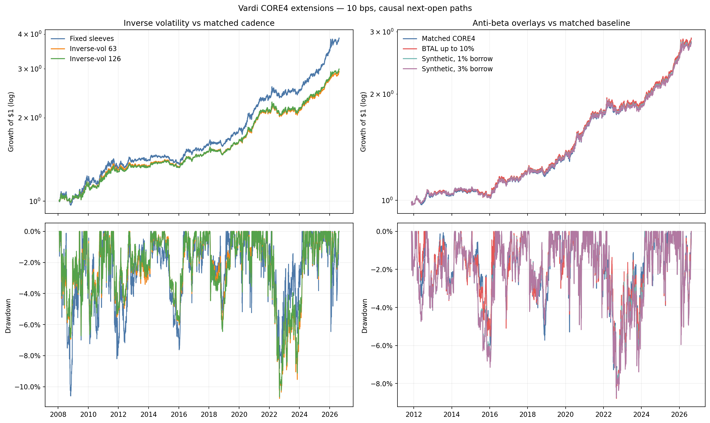
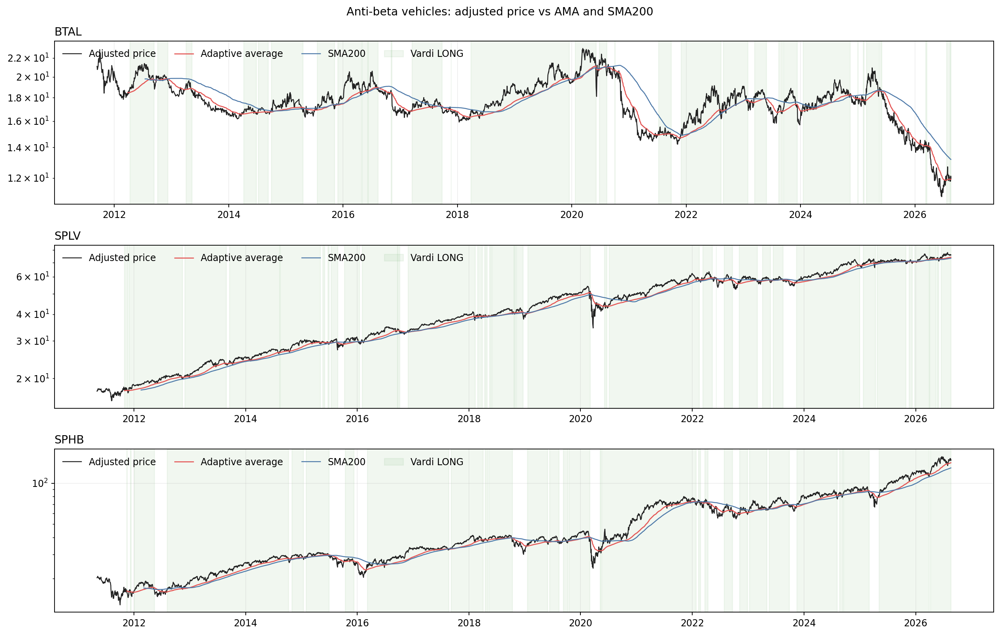

<!-- GENERATED FILE. EDIT THE CANONICAL KNOWLEDGE RECORD. -->

# Vardi CORE4 Anti-Beta and Volatility Sizing

!!! warning "Research-only"
    This page summarizes saved research evidence. It does not authorize LIVE, allocation, or deployment.

## TL;DR

> **Verdict:** Reject both extensions. Inverse-volatility reduced volatility but sacrificed too much CAGR and did not improve drawdown. BTAL preserved CAGR but reduced Sharpe and worsened drawdown. The liquid synthetic failed under both borrow assumptions, so the conditional combination was not run.

> **Status:** `forward_hypothesis`

> **Disposition:** `rejected`

> **Replication:** `replicated`

## Research question

Test whether inverse-volatility sizing or a reserve-funded anti-beta sleeve improves the frozen causal Vardi CORE4 portfolio.

## Exact setup

| Field | Value |
| --- | --- |
| Signal family | drawdown-conditioned adaptive moving-average trend with breadth-preserving CORE4 sleeves |
| Universe | ["CORE4: SPY, IEF, GLD, DBC with BIL reserve", "BTAL reserve-funded overlay up to 10 percent", "Synthetic diagnostic: BIL plus 0.5 SPLV minus 0.5 SPHB"] |
| Decision | Close_T after all adjusted close inputs through T are known |
| Fill | First strict common Open_(T+1), followed by stateful open-to-open returns |
| Primary cost layer | central_research |
| Last reviewed | 2026-08-21T11:20:00+00:00 |

## Timing and overnight attribution

```text
information available: Close_T after all adjusted close inputs through T are known
primary executable fill: First strict common Open_(T+1), followed by stateful open-to-open returns
```

If final `Close_T` data formed the signal, a hypothetical `Close_T` entry is diagnostic only unless a separate pre-close protocol was modeled. Comparing that diagnostic with `Open_(T+1)` and applying the compounded return identity shows whether the apparent edge occurred in the overnight gap. Missing attribution numbers mean **not tested**, not zero.

| Attribution field | Value |
| --- | --- |
| Status | not_applicable |
| Diagnostic Path | No same-close portfolio path was used. |
| Executable Path | Close_T target, first strict common Open_(T+1), then Open_(T+2) exit interval. |
| Method | Inherited causal next-open accounting with drifted pretrade weights and no missing-session fills. |
| Headline Result | All 29 executed primary/reference paths use the causal boundary. |
| Metrics | {} |
| Unavailable Reason | A same-close comparator was outside the portfolio-construction question. |
| Artifact | pakal-research/reports/vardi_core4_antibeta_volatility_study/SOURCE_RULE_MAP.md |

## Primary metrics

| Metric | Value |
| --- | ---: |
| Period | 2008-01-24 through 2026-08-19 |
| Universe | CORE4 inverse-volatility 63 versus identical-cadence fixed sleeves |
| Cost Layer | central_research |
| Cagr | 5.98% |
| Annualized Volatility | 5.90% |
| Sharpe | 1.014 |
| Maximum Drawdown | -10.76% |
| Turnover | 397.14% |

## Four separate verdicts

| Question | Conclusion |
| --- | --- |
| Source Replication | The inherited 10 bps daily CORE4 baseline reconciled frozen CAGR, Sharpe, and maximum drawdown within 3.8e-7. |
| Predictive Value | Neither anti-beta implementation produced consistent same-sample risk-adjusted improvement, and inverse-volatility improved both Sharpe and drawdown in only two of four blocks. |
| Economic Value | H1 and H3 each passed only one of six frozen gates. H2 preserved the H1 failure pattern; H4 reduced Sharpe under 1% and 3% borrow. |
| Promotion | Retain the original fixed-sleeve CORE4 baseline unchanged. No PAPER, LIVE, PM_READY, capital allocation, or capacity claim is authorized. |

## Key findings

| Feature | Role | Direction | Status | Effect | Action |
| --- | --- | --- | --- | --- | --- |
| Breadth-preserving 63-session inverse volatility | position_sizing | Lower volatility but insufficient Sharpe gain, severe CAGR loss, and slightly worse maximum drawdown. | rejected | Volatility fell 1.64 percentage points, Sharpe rose only 0.0075, CAGR retention was 78.9 percent, and drawdown magnitude worsened 1.54 percent relative. | reject |
| 126-session inverse-volatility robustness | position_sizing_diagnostic | Same trade-off as 63 sessions. | rejected | Sharpe delta +0.0180, CAGR retention 80.5 percent, and no drawdown improvement. | reject |
| BTAL up to 10 percent funded only from BIL | risk_overlay | CAGR neutral, Sharpe lower, drawdown worse. | rejected | Sharpe delta -0.0063, CAGR retention 100.15 percent, and drawdown magnitude worsened 2.17 percent relative. | reject |
| Liquid collateralized SPLV-minus-SPHB proxy | anti_beta_mechanism_diagnostic | Behaviorally correlated with BTAL but economically negative under both borrow assumptions. | rejected | Return correlation 0.788; Sharpe delta -0.0099 at 1 percent borrow and -0.0154 at 3 percent borrow. | retain_as_diagnostic_only |

## Visual evidence






## Limitations

- All history through 2026-08-19 was seen before the extensions were proposed; no untouched validation exists.
- BTAL changed methodology on 2022-02-14.
- The synthetic proxy is not sector neutral and assumes short SPHB availability.
- Total Return opens and scenario costs are research proxies rather than measured fills.
- Capacity is not assessed.

## Next gates

- Keep the original fixed-sleeve CORE4 forward hypothesis unchanged.
- Do not tune anti-beta caps, volatility lookbacks, or vehicle membership on this history.
- Any redesign must be frozen as a new hypothesis or evaluated on unseen forward observations after 2026-08-19.

## Sources

- `pakal-research/reports/vardi_adaptive_momentum_portfolio_sector_study/REPORT.md sha256:4758f2be2f3a36d15a1ed1b717133bf59ff40e509af4ffdbeb900db6562d2d6c`
- `AGF BTAL fact sheet as of 2026-07-31`
- `Invesco SPLV official product page accessed 2026-08-21`
- `Norgate snapshot through 2026-08-19 sha256:52a46c45751f41cd12ac5baca61bdb8ad6e053eb0ab011d58e68ec9f21eb0d7d`

## Canonical artifacts

| Artifact | Pakal path |
| --- | --- |
| Concise Report | `pakal-research/reports/vardi_core4_antibeta_volatility_study/REPORT.md` |
| Full Report | `pakal-research/reports/vardi_core4_antibeta_volatility_study/REPORT_FULL.md` |
| Notebook | `pakal-research/notebooks/vardi_core4_antibeta_volatility_study.ipynb` |
| Frozen Specification | `pakal-research/reports/vardi_core4_antibeta_volatility_study/research_spec_frozen.json` |
| Manifest | `pakal-research/reports/vardi_core4_antibeta_volatility_study/run_manifest.json` |
| Primary Source Code | `["pakal-research/vardi_core4_antibeta_volatility_study.py", "pakal-research/build_vardi_core4_antibeta_volatility_artifacts.py"]` |
| Primary Tables | `["pakal-research/reports/vardi_core4_antibeta_volatility_study/tables/path_metrics.csv", "pakal-research/reports/vardi_core4_antibeta_volatility_study/tables/central_results_ranked_by_sharpe.csv", "pakal-research/reports/vardi_core4_antibeta_volatility_study/tables/comparison_deltas.csv", "pakal-research/reports/vardi_core4_antibeta_volatility_study/tables/gate_results.csv", "pakal-research/reports/vardi_core4_antibeta_volatility_study/tables/stability_blocks.csv", "pakal-research/reports/vardi_core4_antibeta_volatility_study/tables/overlay_diagnostics.csv"]` |
| Primary Charts | `["pakal-research/reports/vardi_core4_antibeta_volatility_study/charts/central_equity_drawdown.png", "pakal-research/reports/vardi_core4_antibeta_volatility_study/charts/executed_weight_comparison.png", "pakal-research/reports/vardi_core4_antibeta_volatility_study/charts/core4_price_ama_sma200.png", "pakal-research/reports/vardi_core4_antibeta_volatility_study/charts/antibeta_price_ama_sma200.png", "pakal-research/reports/vardi_core4_antibeta_volatility_study/charts/vehicle_liquidity_adv63.png"]` |
| Research State | `pakal-research/reports/vardi_core4_antibeta_volatility_study/research_state.json` |
| Hypothesis Registry | `pakal-research/reports/vardi_core4_antibeta_volatility_study/hypothesis_registry.json` |
| Experiment Ledger | `pakal-research/reports/vardi_core4_antibeta_volatility_study/experiment_ledger.jsonl` |
| Decision Log | `pakal-research/reports/vardi_core4_antibeta_volatility_study/decision_log.jsonl` |
| Source Rule Map | `pakal-research/reports/vardi_core4_antibeta_volatility_study/SOURCE_RULE_MAP.md` |
