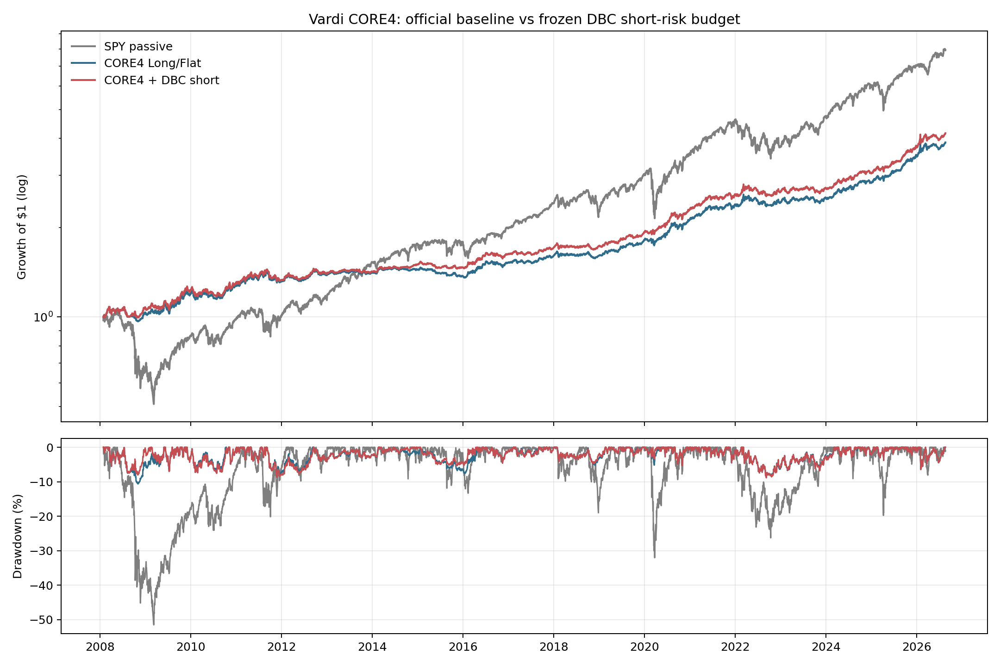
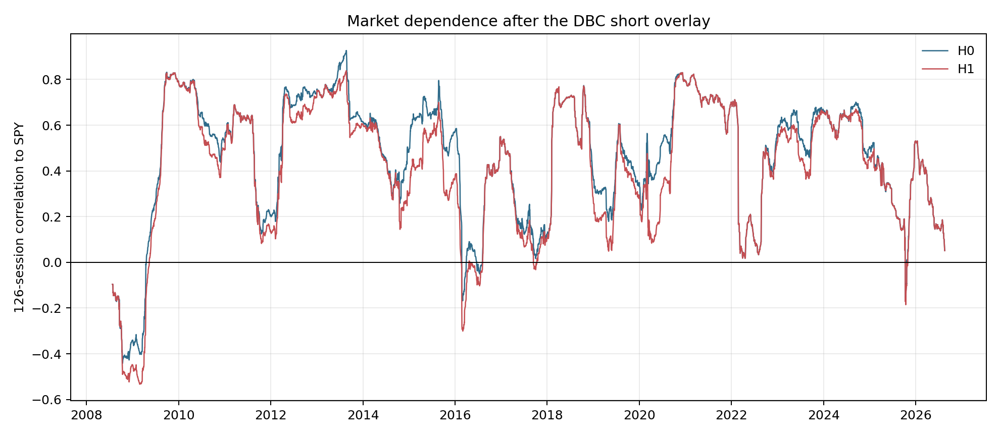

<!-- GENERATED FILE. EDIT THE CANONICAL KNOWLEDGE RECORD. -->

# Vardi CORE4 DBC Short Risk-Budget Study

!!! warning "Research-only"
    This page summarizes saved research evidence. It does not authorize LIVE, allocation, or deployment.

## TL;DR

> **Verdict:** Reject H1 and retain H0. Historical Sharpe and drawdown improved, but CAGR delta and the realized 10% exposure cap failed.

> **Status:** `diagnostic`

> **Disposition:** `rejected`

> **Replication:** `replicated`

## Research question

Test one frozen DBC short-risk-budget overlay inside official CORE4.

## Exact setup

| Field | Value |
| --- | --- |
| Signal family | Post-selected DBC Vardi OUT-state short with inverse-volatility risk budget |
| Universe | ["SPY, IEF, GLD, DBC; BIL reserve and collateral"] |
| Decision | Close_T |
| Fill | First strict Open_(T+1); stateful units persist between official rebalance events |
| Primary cost layer | central_research |
| Last reviewed | 2026-08-21T12:52:34+00:00 |

## Timing and overnight attribution

```text
information available: Close_T
primary executable fill: First strict Open_(T+1); stateful units persist between official rebalance events
```

If final `Close_T` data formed the signal, a hypothetical `Close_T` entry is diagnostic only unless a separate pre-close protocol was modeled. Comparing that diagnostic with `Open_(T+1)` and applying the compounded return identity shows whether the apparent edge occurred in the overnight gap. Missing attribution numbers mean **not tested**, not zero.

| Attribution field | Value |
| --- | --- |
| Status | completed |
| Diagnostic Path | none |
| Executable Path | Close_T -> Open_(T+1) -> Open_(T+2) mark |
| Method | Official state-change/month-end cadence with collateralized marked short liability |
| Headline Result | Seven focused tests and bit-for-bit baseline reconciliation passed. |
| Metrics | {} |
| Unavailable Reason | none |
| Artifact | pakal-research/test_vardi_core4_dbc_short_risk_budget_study.py |

## Primary metrics

| Metric | Value |
| --- | ---: |
| Period | 2008-01-24 through 2026-08-19 |
| Universe | Official CORE4 plus frozen DBC overlay |
| Cost Layer | 10 bps round trip plus 1% annual borrow |
| Cagr | 7.99% |
| Annualized Volatility | 7.52% |
| Sharpe | 1.060 |
| Maximum Drawdown | -8.83% |
| Turnover | 388.50% |

## Four separate verdicts

| Question | Conclusion |
| --- | --- |
| Source Replication | Official CORE4 daily returns, equity and turnover matched bit-for-bit at 0, 10 and 25 bps. |
| Predictive Value | Short-episode breadth passed and three of four subperiod Sharpes improved. |
| Economic Value | Central Sharpe 1.006503 to 1.059806; CAGR delta 0.004146. |
| Promotion | Seven of nine gates passed; retain H0 and make no PAPER/LIVE/allocation change. |

## Key findings

| Feature | Role | Direction | Status | Effect | Action |
| --- | --- | --- | --- | --- | --- |
| DBC short risk budget w=min(10%,2.5%/sigma63) | short sizing and risk overlay | Higher historical Sharpe and smaller drawdown, insufficient CAGR delta and cap drift above 10%. | rejected | Sharpe delta 0.053303; CAGR delta 0.004146; MaxDD delta 0.017646. | reject_and_retain_official_core4 |

## Visual evidence






## Limitations

- No untouched sample; DBC selected after prior results
- Constant borrow tiers and zero short-proceeds credit
- No locate, recall, SSR, forced buy-in, margin-liquidation or auction-fill history
- Capacity not assessed

## Next gates

- Retain official CORE4 Long/Flat unchanged.
- Do not tune cap, risk target, lookback, filter or cadence on the seen history.

## Sources

- `Parent report sha256:0a98133505ad81fb573e8a8154dedefb21f25d1cc45f68b07694b26f9831b7b1`
- `Norgate snapshot sha256:52a46c45751f41cd12ac5baca61bdb8ad6e053eb0ab011d58e68ec9f21eb0d7d`

## Canonical artifacts

| Artifact | Pakal path |
| --- | --- |
| Concise Report | `pakal-research/reports/vardi_core4_dbc_short_risk_budget_study/REPORT.md` |
| Full Report | `pakal-research/reports/vardi_core4_dbc_short_risk_budget_study/REPORT_FULL.md` |
| Notebook | `pakal-research/notebooks/vardi_core4_dbc_short_risk_budget_study.ipynb` |
| Frozen Specification | `pakal-research/reports/vardi_core4_dbc_short_risk_budget_study/research_spec_frozen.json` |
| Manifest | `pakal-research/reports/vardi_core4_dbc_short_risk_budget_study/run_manifest.json` |
| Primary Source Code | `["pakal-research/vardi_core4_dbc_short_risk_budget_study.py", "pakal-research/build_vardi_core4_dbc_short_risk_budget_artifacts.py", "pakal-research/test_vardi_core4_dbc_short_risk_budget_study.py"]` |
| Primary Tables | `["pakal-research/reports/vardi_core4_dbc_short_risk_budget_study/tables/path_metrics.csv", "pakal-research/reports/vardi_core4_dbc_short_risk_budget_study/tables/central_results_ranked_by_sharpe.csv", "pakal-research/reports/vardi_core4_dbc_short_risk_budget_study/tables/gate_matrix.csv"]` |
| Primary Charts | `["pakal-research/reports/vardi_core4_dbc_short_risk_budget_study/charts/equity_and_drawdown.png", "pakal-research/reports/vardi_core4_dbc_short_risk_budget_study/charts/short_weight_and_volatility.png", "pakal-research/reports/vardi_core4_dbc_short_risk_budget_study/charts/subperiod_sharpe_delta.png", "pakal-research/reports/vardi_core4_dbc_short_risk_budget_study/charts/short_episode_contributions.png", "pakal-research/reports/vardi_core4_dbc_short_risk_budget_study/charts/rolling_market_correlation.png"]` |
| Research State | `pakal-research/reports/vardi_core4_dbc_short_risk_budget_study/research_state.json` |
| Hypothesis Registry | `pakal-research/reports/vardi_core4_dbc_short_risk_budget_study/hypothesis_registry.json` |
| Experiment Ledger | `pakal-research/reports/vardi_core4_dbc_short_risk_budget_study/experiment_ledger.jsonl` |
| Decision Log | `pakal-research/reports/vardi_core4_dbc_short_risk_budget_study/decision_log.jsonl` |
| Source Rule Map | `pakal-research/reports/vardi_core4_dbc_short_risk_budget_study/SOURCE_RULE_MAP.md` |
