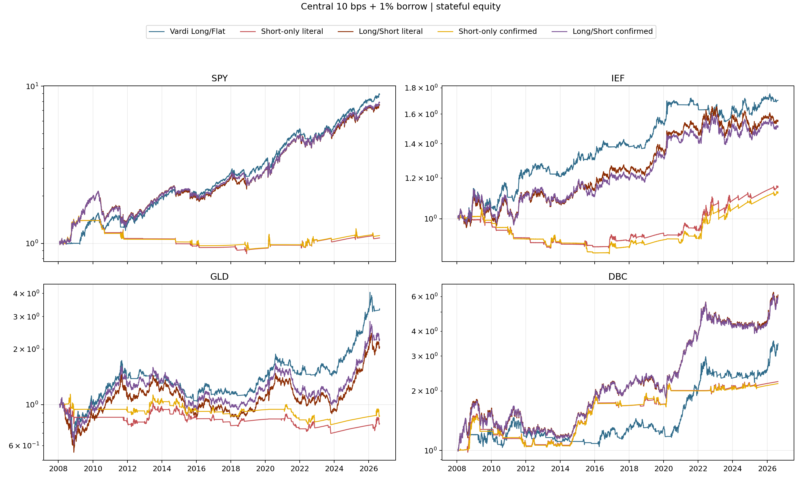
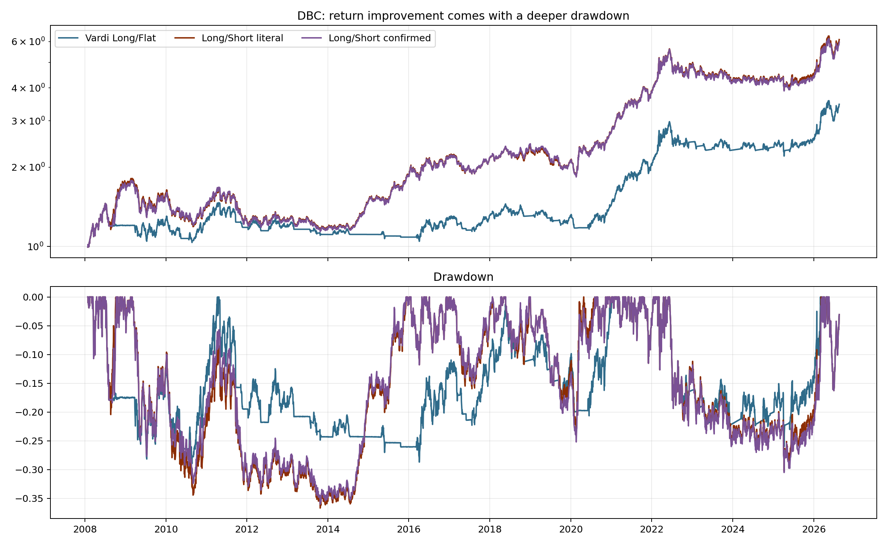

<!-- GENERATED FILE. EDIT THE CANONICAL KNOWLEDGE RECORD. -->

# Vardi CORE4 Short-Side Study

!!! warning "Research-only"
    This page summarizes saved research evidence. It does not authorize LIVE, allocation, or deployment.

## TL;DR

> **Verdict:** Reject portfolio short exposure. DBC improved CAGR and Sharpe but violated the frozen drawdown gate; the other three assets lacked standalone short edge and reduced combined Sharpe.

> **Status:** `diagnostic`

> **Disposition:** `rejected`

> **Replication:** `directionally_replicated`

## Research question

Test separately whether SPY, IEF, GLD and DBC can be shorted in the Vardi OUT state before allowing any portfolio short.

## Exact setup

| Field | Value |
| --- | --- |
| Signal family | Vardi drawdown-adaptive momentum translated into stateful short-side ETF sleeves |
| Universe | ["SPY, IEF, GLD, DBC; BIL collateral"] |
| Decision | Close_T after adjusted close is known |
| Fill | First strict Open_(T+1); stateful units persist until a later next-open transition |
| Primary cost layer | central_research |
| Last reviewed | 2026-08-21T12:11:13+00:00 |

## Timing and overnight attribution

```text
information available: Close_T after adjusted close is known
primary executable fill: First strict Open_(T+1); stateful units persist until a later next-open transition
```

If final `Close_T` data formed the signal, a hypothetical `Close_T` entry is diagnostic only unless a separate pre-close protocol was modeled. Comparing that diagnostic with `Open_(T+1)` and applying the compounded return identity shows whether the apparent edge occurred in the overnight gap. Missing attribution numbers mean **not tested**, not zero.

| Attribution field | Value |
| --- | --- |
| Status | completed |
| Diagnostic Path | none |
| Executable Path | Close_T state -> Open_(T+1) holdings -> later next-open transition |
| Method | Stateful units, restricted proceeds, BIL original-capital collateral and marked-liability borrow |
| Headline Result | Seven timing/accounting tests passed and all 60 paths use the same causal boundary. |
| Metrics | {} |
| Unavailable Reason | none |
| Artifact | pakal-research/test_vardi_core4_short_side_study.py |

## Primary metrics

| Metric | Value |
| --- | ---: |
| Period | 2008-01-24 through 2026-08-19 |
| Universe | Internal equal-initial four-sleeve diagnostic; prior official CORE4 result remains unchanged |
| Cost Layer | central |
| Cagr | 8.24% |
| Annualized Volatility | 8.08% |
| Sharpe | 1.021 |
| Maximum Drawdown | -10.59% |
| Turnover | 180.10% |

## Four separate verdicts

| Question | Conclusion |
| --- | --- |
| Source Replication | Canonical Vardi features were imported unchanged and next-open accounting passed seven focused tests. |
| Predictive Value | Only DBC had positive central excess over BIL in at least three of four blocks. |
| Economic Value | DBC literal long-short raised Sharpe by 0.117 and CAGR by 3.32 percentage points but worsened drawdown by 7.74 percentage points. |
| Promotion | Zero of eight asset-rule pairs passed all gates; retain long-flat and make no PAPER/LIVE/allocation change. |

## Key findings

| Feature | Role | Direction | Status | Effect | Action |
| --- | --- | --- | --- | --- | --- |
| Literal Vardi OUT-state short in DBC | short_signal | Positive return and Sharpe contribution with materially worse drawdown. | rejected | CAGR 0.069408 to 0.102575; Sharpe delta 0.117266; drawdown delta -0.077381. | reject_current_sizing_retain_as_future_hypothesis |
| Vardi OUT-state short in SPY, IEF and GLD | short_signal | Negative excess versus BIL and worse combined Sharpe. | rejected | Central annualized standalone excess versus BIL was negative for all six literal/confirmed asset-rule pairs. | reject |
| SMA200 short confirmation | regime_filter | Did not change any asset-level pass/fail verdict. | rejected | Confirmed DBC Sharpe 0.632 versus literal 0.637; all candidates still failed at least one gate. | reject |

## Visual evidence






## Limitations

- No untouched sample
- Constant borrow tiers and zero short-proceeds credit
- No locate recall SSR forced-buy-in or margin-liquidation history
- Adjusted daily open is not an auction fill
- Capacity not assessed

## Next gates

- Retain CORE4 long-flat unchanged.
- If desired, freeze one DBC risk-budget rule before further testing and validate only on unseen observations after 2026-08-19.

## Sources

- `Vardi Part 1 sha256:be6c6b08133c3718f672f60c9f652e5b05ed68b022b5f57bd8992d26cfcc94ca`
- `Vardi Part 2 sha256:8d6e9f81de2b8a4eed26b19e63a189cccb1cac5f0139c556f0257f115b68d7e9`
- `Norgate snapshot sha256:52a46c45751f41cd12ac5baca61bdb8ad6e053eb0ab011d58e68ec9f21eb0d7d`

## Canonical artifacts

| Artifact | Pakal path |
| --- | --- |
| Concise Report | `pakal-research/reports/vardi_core4_short_side_study/REPORT.md` |
| Full Report | `pakal-research/reports/vardi_core4_short_side_study/REPORT_FULL.md` |
| Notebook | `pakal-research/notebooks/vardi_core4_short_side_study.ipynb` |
| Frozen Specification | `pakal-research/reports/vardi_core4_short_side_study/research_spec_frozen.json` |
| Manifest | `pakal-research/reports/vardi_core4_short_side_study/run_manifest.json` |
| Primary Source Code | `["pakal-research/vardi_core4_short_side_study.py", "pakal-research/build_vardi_core4_short_side_artifacts.py", "pakal-research/test_vardi_core4_short_side_study.py"]` |
| Primary Tables | `["pakal-research/reports/vardi_core4_short_side_study/tables/path_metrics.csv", "pakal-research/reports/vardi_core4_short_side_study/tables/central_ranked_summary.csv", "pakal-research/reports/vardi_core4_short_side_study/tables/asset_gate_matrix.csv", "pakal-research/reports/vardi_core4_short_side_study/tables/portfolio_decision.csv"]` |
| Primary Charts | `["pakal-research/reports/vardi_core4_short_side_study/charts/core4_short_signal_states.png", "pakal-research/reports/vardi_core4_short_side_study/charts/central_asset_equity.png", "pakal-research/reports/vardi_core4_short_side_study/charts/dbc_equity_drawdown.png", "pakal-research/reports/vardi_core4_short_side_study/charts/asset_gate_heatmap.png", "pakal-research/reports/vardi_core4_short_side_study/charts/central_risk_return_map.png"]` |
| Research State | `pakal-research/reports/vardi_core4_short_side_study/research_state.json` |
| Hypothesis Registry | `pakal-research/reports/vardi_core4_short_side_study/hypothesis_registry.json` |
| Experiment Ledger | `pakal-research/reports/vardi_core4_short_side_study/experiment_ledger.jsonl` |
| Decision Log | `pakal-research/reports/vardi_core4_short_side_study/decision_log.jsonl` |
| Source Rule Map | `pakal-research/reports/vardi_core4_short_side_study/SOURCE_RULE_MAP.md` |
