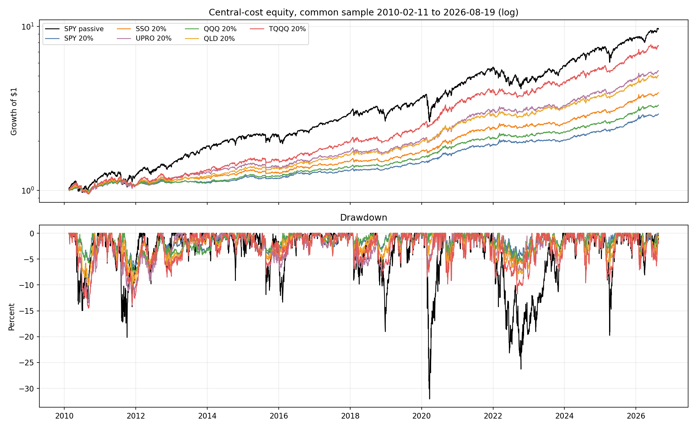
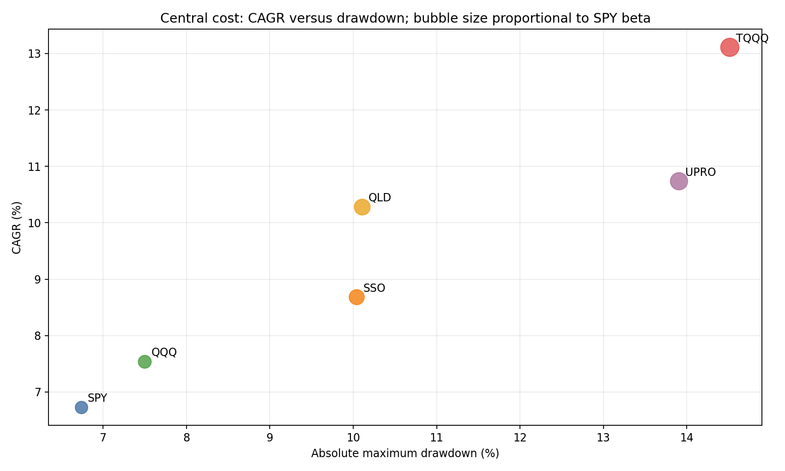

<!-- GENERATED FILE. EDIT THE CANONICAL KNOWLEDGE RECORD. -->

# Vardi CORE5 Equity Vehicle Comparison Study

!!! warning "Research-only"
    This page summarizes saved research evidence. It does not authorize LIVE, allocation, or deployment.

## TL;DR

> **Verdict:** QQQ is the balanced winner and QLD the growth candidate; UPRO and TQQQ add disproportionate downside.

> **Status:** `forward_hypothesis`

> **Disposition:** `promising_component`

> **Replication:** `replicated`

## Research question

Compare SPY, SSO, UPRO, QQQ, QLD and TQQQ as one-at-a-time 20% vehicles under the same frozen SPY state.

## Exact setup

| Field | Value |
| --- | --- |
| Signal family | Frozen adaptive CORE5 timing with alternative actual equity execution vehicles |
| Universe | ["Fixed ETFs: SPY, SSO, UPRO, QQQ, QLD, TQQQ, IEF, GLD, DBC, UUP and BIL"] |
| Decision | Frozen SPY and CORE5 signals at Close_T |
| Fill | First strict common Open_(T+1), stateful until parent rebalance |
| Primary cost layer | central_research |
| Last reviewed | 2026-08-22T18:55:00Z |

## Timing and overnight attribution

```text
information available: Frozen SPY and CORE5 signals at Close_T
primary executable fill: First strict common Open_(T+1), stateful until parent rebalance
```

If final `Close_T` data formed the signal, a hypothetical `Close_T` entry is diagnostic only unless a separate pre-close protocol was modeled. Comparing that diagnostic with `Open_(T+1)` and applying the compounded return identity shows whether the apparent edge occurred in the overnight gap. Missing attribution numbers mean **not tested**, not zero.

| Attribution field | Value |
| --- | --- |
| Status | not_applicable |
| Diagnostic Path | not_applicable |
| Executable Path | Frozen strict Open_(T+1) stateful path |
| Method | Vehicle-only comparison on identical executable timing |
| Headline Result | No same-close path is used; exact V0 reconciliation passed. |
| Metrics | {} |
| Artifact | tables/baseline_reconciliation.csv |

## Primary metrics

| Metric | Value |
| --- | ---: |
| Period | 2010-02-11 through 2026-08-19 |
| Universe | CORE5 with 20% QQQ equity vehicle plus frozen DBC short |
| Cost Layer | 10 bps round trip plus 1% annual DBC borrow |
| Cagr | 7.54% |
| Annualized Volatility | 5.82% |
| Sharpe | 1.278 |
| Maximum Drawdown | -7.50% |
| Turnover | 413.82% |

## Four separate verdicts

| Question | Conclusion |
| --- | --- |
| Source Replication | The V0 common-sample baseline reconciled exactly in all three cost tiers. |
| Predictive Value | QQQ improved Sharpe in three of four and CAGR in four of four frozen seen-history blocks. |
| Economic Value | QLD delivered 10.28% CAGR with 1.229 Sharpe and about 10.10% maximum drawdown. |
| Promotion | QQQ and QLD are forward hypotheses only; no PAPER/LIVE authorization. |

## Key findings

| Feature | Role | Direction | Status | Effect | Action |
| --- | --- | --- | --- | --- | --- |
| 20% QQQ vehicle under frozen SPY timing | balanced execution vehicle and index basis | Higher CAGR and Sharpe with only modest downside increase versus SPY. | promising_component | Central CAGR +0.81pp, Sharpe +0.045 and MaxDD -0.76pp versus SPY vehicle. | freeze_QQQ_for_forward_only_observation |
| 20% QLD vehicle under frozen SPY timing | growth execution vehicle and leveraged Nasdaq basis | Material CAGR increase with roughly unchanged full-sample Sharpe and drawdown around 10%. | promising_component | Central CAGR +3.55pp, Sharpe -0.003 and MaxDD -3.37pp versus SPY vehicle. | freeze_QLD_as_growth_forward_hypothesis |
| 20% UPRO or TQQQ vehicle | three-times leveraged execution vehicle | Higher CAGR but disproportionate tail loss, beta and drawdown. | diagnostic | UPRO/TQQQ central MaxDD -13.90%/-14.51% and beta 0.355/0.412. | do_not_promote_3x_vehicles |

## Visual evidence






## Limitations

- All dates were already seen
- TQQQ limits the common sample and excludes the GFC
- QQQ-family paths combine leverage with Nasdaq index basis
- No opening-auction, tax, margin or capacity evidence
- Fixed surviving ETF vehicles

## Next gates

- Forward-only unchanged-rule observation of QQQ and QLD after 2026-08-19; no new weights or own-asset signals

## Sources

- `pakal-research/reports/vardi_core5_sso_equity_sleeve_study/research_spec_frozen.json`
- `pakal-research/reports/vardi_core5_equity_vehicle_comparison_study/research_spec_frozen.json`

## Canonical artifacts

| Artifact | Pakal path |
| --- | --- |
| Concise Report | `pakal-research/reports/vardi_core5_equity_vehicle_comparison_study/REPORT.md` |
| Full Report | `pakal-research/reports/vardi_core5_equity_vehicle_comparison_study/REPORT_FULL.md` |
| Notebook | `pakal-research/notebooks/vardi_core5_equity_vehicle_comparison_study.ipynb` |
| Frozen Specification | `pakal-research/reports/vardi_core5_equity_vehicle_comparison_study/research_spec_frozen.json` |
| Manifest | `pakal-research/reports/vardi_core5_equity_vehicle_comparison_study/run_manifest.json` |
| Primary Source Code | `["pakal-research/vardi_core5_equity_vehicle_comparison_study.py", "pakal-research/test_vardi_core5_equity_vehicle_comparison_study.py"]` |
| Primary Tables | `["pakal-research/reports/vardi_core5_equity_vehicle_comparison_study/tables/path_metrics.csv", "pakal-research/reports/vardi_core5_equity_vehicle_comparison_study/tables/period_metrics.csv", "pakal-research/reports/vardi_core5_equity_vehicle_comparison_study/tables/vehicle_comparison.csv", "pakal-research/reports/vardi_core5_equity_vehicle_comparison_study/tables/baseline_reconciliation.csv"]` |
| Primary Charts | `["pakal-research/reports/vardi_core5_equity_vehicle_comparison_study/charts/equity_and_drawdown.png", "pakal-research/reports/vardi_core5_equity_vehicle_comparison_study/charts/risk_return_tradeoff.png", "pakal-research/reports/vardi_core5_equity_vehicle_comparison_study/charts/subperiod_cagr_sharpe.png", "pakal-research/reports/vardi_core5_equity_vehicle_comparison_study/charts/rolling_market_correlation.png"]` |
| Research State | `pakal-research/reports/vardi_core5_equity_vehicle_comparison_study/research_state.json` |
| Hypothesis Registry | `pakal-research/reports/vardi_core5_equity_vehicle_comparison_study/hypothesis_registry.json` |
| Experiment Ledger | `pakal-research/reports/vardi_core5_equity_vehicle_comparison_study/experiment_ledger.jsonl` |
| Decision Log | `pakal-research/reports/vardi_core5_equity_vehicle_comparison_study/decision_log.jsonl` |
| Source Rule Map | `pakal-research/reports/vardi_core5_equity_vehicle_comparison_study/SOURCE_RULE_MAP.md` |
