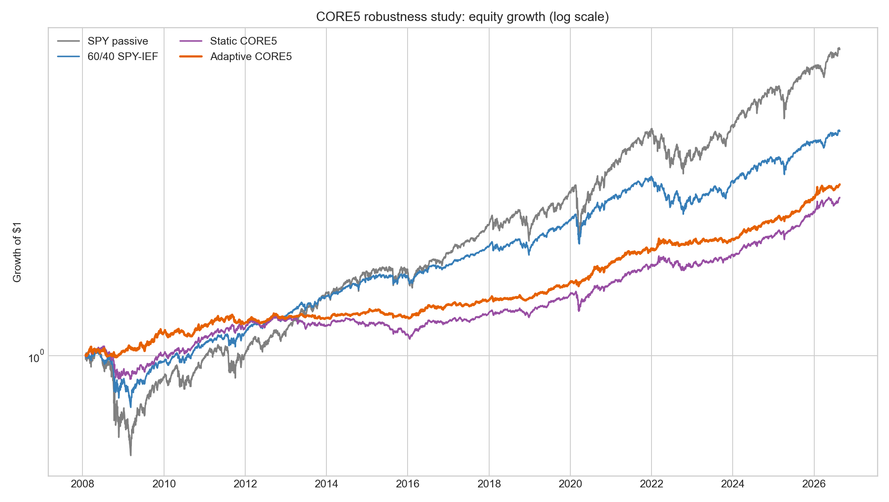
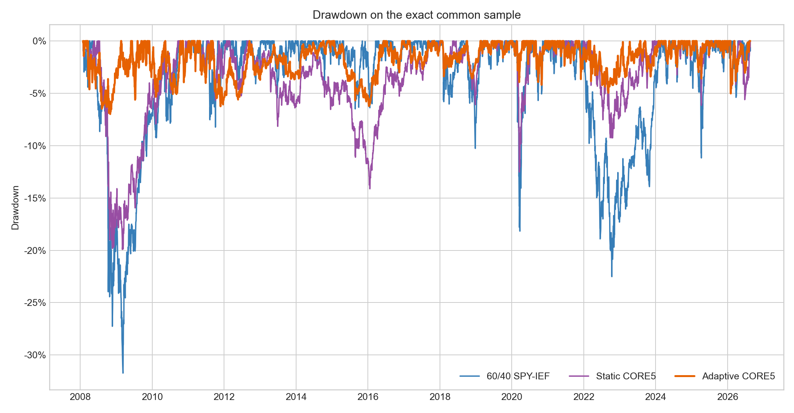

<!-- GENERATED FILE. EDIT THE CANONICAL KNOWLEDGE RECORD. -->

# Vardi CORE5 Deep Robustness Qualification

!!! warning "Research-only"
    This page summarizes saved research evidence. It does not authorize LIVE, allocation, or deployment.

## TL;DR

> **Verdict:** Freeze CORE5 Long/Flat as a strong forward hypothesis for drawdown control and proceed only to forward and deployment validation. Reject the DBC short overlay.

> **Status:** `forward_hypothesis`

> **Disposition:** `promising_component`

> **Replication:** `replicated`

## Research question

Determine whether fixed-SPY CORE5 has robust incremental portfolio value beyond static macro allocation and whether the DBC short independently qualifies.

## Exact setup

| Field | Value |
| --- | --- |
| Signal family | Asset-local adaptive macro timing with five fixed 20% sleeves and BIL reserve |
| Universe | ["CORE5: SPY, IEF, GLD, DBC, UUP with BIL reserve", "Substitutes: VTI, RSP, IEI, VGIT, IAU, SGOL, GSG, USCI, USDU, SHV"] |
| Decision | Final Close_T |
| Fill | First strict common Open_(T+1); stateful open-to-open marks until any relevant state change or month end |
| Primary cost layer | central_research |
| Last reviewed | 2026-08-23T15:52:09Z |

## Timing and overnight attribution

```text
information available: Final Close_T
primary executable fill: First strict common Open_(T+1); stateful open-to-open marks until any relevant state change or month end
```

If final `Close_T` data formed the signal, a hypothetical `Close_T` entry is diagnostic only unless a separate pre-close protocol was modeled. Comparing that diagnostic with `Open_(T+1)` and applying the compounded return identity shows whether the apparent edge occurred in the overnight gap. Missing attribution numbers mean **not tested**, not zero.

| Attribution field | Value |
| --- | --- |
| Status | tested |
| Diagnostic Path | One- and two-extra-session delay, weekly-only and monthly-only cadence |
| Executable Path | Close_T -> strict Open_(T+1) -> later common-open marks |
| Method | Exact-date intersection with no ffill/bfill and explicit unit tests |
| Headline Result | All six paired execution stresses retained positive Sharpe delta versus static CORE5. |
| Metrics | {"hostile_50bps_sharpe_delta": 0.0161404454874, "one_session_delay_sharpe_delta": 0.166559261343} |
| Artifact | tables/round4_gate_matrix.csv |

## Primary metrics

| Metric | Value |
| --- | ---: |
| Period | 2008-01-24 through 2026-08-19 |
| Universe | SPY, IEF, GLD, DBC, UUP; BIL reserve |
| Cost Layer | 10 bps round trip; ETF expenses embedded in total return |
| Cagr | 6.45% |
| Annualized Volatility | 5.91% |
| Sharpe | 1.087 |
| Maximum Drawdown | -6.99% |
| Turnover | 381.07% |

## Four separate verdicts

| Question | Conclusion |
| --- | --- |
| Source Replication | The central core and short paths reconciled to the frozen parent to about 5e-14 maximum daily return difference. |
| Predictive Value | Adaptive CORE5 improved Sharpe in three of four fixed periods, all six one-axis neighbors and all six execution stresses; paired bootstrap return and Sharpe intervals still include zero. |
| Economic Value | Adaptive CORE5 central CAGR 6.446%, volatility 5.909%, Sharpe 1.087 and MaxDD -6.986%; static CORE5 Sharpe 0.824 and MaxDD -19.916%. |
| Promotion | CORE5 is capped at forward_hypothesis and may proceed only to forward shadow and deployment validation; no PAPER, LIVE or allocation approval. |

## Key findings

| Feature | Role | Direction | Status | Effect | Action |
| --- | --- | --- | --- | --- | --- |
| Adaptive CORE5 Long/Flat | portfolio construction and risk control | Higher Sharpe and materially lower drawdown than static CORE5 and 60/40; lower absolute return than SPY and 60/40. | forward_hypothesis | Sharpe delta +0.263 versus static CORE5; MaxDD -6.99% versus -19.92%. | freeze_rules_and_collect_forward_shadow_evidence |
| DBC inverse-volatility short overlay | risk overlay | Improved the DBC sample and parameter neighborhood but failed broad-commodity transfer risk gates. | rejected | Central Sharpe delta +0.0559 and CAGR delta +0.4095 percentage point; GSG/USCI MaxDD worsened by 0.545/0.243 percentage point. | exclude_from_frozen_core5 |

## Visual evidence






## Limitations

- No untouched sample through 2026-08-19
- ETF-era history only and fixed-vehicle existence conditioning
- Cash return contributes materially to raw Sharpe
- No measured opening-auction costs or capacity
- No tax, account, base-currency or leverage analysis
- Multiple-comparison tests do not establish return alpha

## Next gates

- Freeze CORE5 rules and collect forward-only shadow decisions after 2026-08-19.
- Build a licensed pre-ETF index/futures proxy panel with consistent adjustment semantics.
- Measure realized Open execution cost and capacity by AUM before allocation review.
- Do not tune or deploy the rejected short overlay.

## Sources

- `Norgate snapshot sha256:b2b02c008e62c56bb03569046c0f4b2e1399a7f16f722891769041604337e46d`
- `Frozen parent CORE5 specification sha256:394752003ba6cbcace88ff95e1c90ba61428bcc1e1a583a471019f0e209a79bf`

## Canonical artifacts

| Artifact | Pakal path |
| --- | --- |
| Concise Report | `pakal-research/reports/vardi_core5_robustness_qualification_study/REPORT.md` |
| Full Report | `pakal-research/reports/vardi_core5_robustness_qualification_study/REPORT_FULL.md` |
| Notebook | `pakal-research/notebooks/vardi_core5_robustness_qualification_study.ipynb` |
| Frozen Specification | `pakal-research/reports/vardi_core5_robustness_qualification_study/research_spec_frozen.json` |
| Manifest | `pakal-research/reports/vardi_core5_robustness_qualification_study/run_manifest.json` |
| Primary Source Code | `["pakal-research/vardi_core5_robustness_qualification_study.py", "pakal-research/test_vardi_core5_robustness_qualification_study.py"]` |
| Primary Tables | `["pakal-research/reports/vardi_core5_robustness_qualification_study/tables/round1_path_metrics.csv", "pakal-research/reports/vardi_core5_robustness_qualification_study/tables/round2_path_metrics.csv", "pakal-research/reports/vardi_core5_robustness_qualification_study/tables/round3_path_metrics.csv", "pakal-research/reports/vardi_core5_robustness_qualification_study/tables/round4_path_metrics.csv", "pakal-research/reports/vardi_core5_robustness_qualification_study/tables/stat_paired_block_bootstrap.csv", "pakal-research/reports/vardi_core5_robustness_qualification_study/tables/stat_white_reality_check.csv", "pakal-research/reports/vardi_core5_robustness_qualification_study/tables/stat_pbo_summary.csv"]` |
| Primary Charts | `["pakal-research/reports/vardi_core5_robustness_qualification_study/charts/equity_comparison.png", "pakal-research/reports/vardi_core5_robustness_qualification_study/charts/drawdown_comparison.png", "pakal-research/reports/vardi_core5_robustness_qualification_study/charts/rolling_correlation_exposure.png", "pakal-research/reports/vardi_core5_robustness_qualification_study/charts/robustness_plateau.png"]` |
| Research State | `pakal-research/reports/vardi_core5_robustness_qualification_study/research_state.json` |
| Hypothesis Registry | `pakal-research/reports/vardi_core5_robustness_qualification_study/hypothesis_registry.json` |
| Experiment Ledger | `pakal-research/reports/vardi_core5_robustness_qualification_study/experiment_ledger.jsonl` |
| Decision Log | `pakal-research/reports/vardi_core5_robustness_qualification_study/decision_log.jsonl` |
| Source Rule Map | `pakal-research/reports/vardi_core5_robustness_qualification_study/SOURCE_RULE_MAP.md` |
