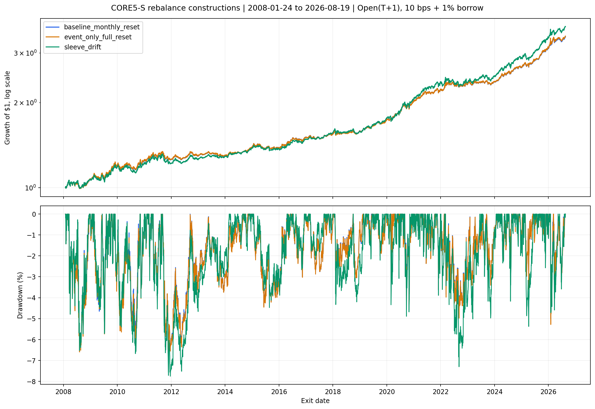
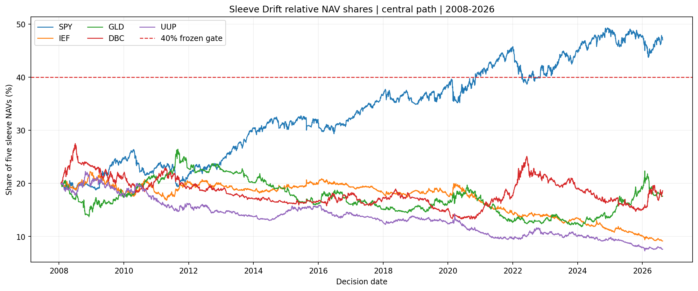

<!-- GENERATED FILE. EDIT THE CANONICAL KNOWLEDGE RECORD. -->

# Vardi CORE5-S Sleeve Drift and Rebalance Study

!!! warning "Research-only"
    This page summarizes saved research evidence. It does not authorize LIVE, allocation, or deployment.

## TL;DR

> **Verdict:** Retain monthly reset. Event-only was economically indistinguishable and sleeve drift traded higher CAGR for worse Sharpe, downside, stability, and concentration.

> **Status:** `forward_hypothesis`

> **Disposition:** `rejected`

> **Replication:** `replicated`

## Research question

Compare monthly full reset, state-change-only full reset, and independent sleeve NAV drift for frozen CORE5-S.

## Exact setup

| Field | Value |
| --- | --- |
| Signal family | adaptive_momentum_portfolio_construction |
| Universe | ["SPY, IEF, GLD, DBC, UUP with BIL"] |
| Decision | Close_T |
| Fill | Open_T+1 |
| Primary cost layer | central_research |
| Last reviewed | 2026-08-24T15:20:00+00:00 |

## Timing and overnight attribution

```text
information available: Close_T
primary executable fill: Open_T+1
```

If final `Close_T` data formed the signal, a hypothetical `Close_T` entry is diagnostic only unless a separate pre-close protocol was modeled. Comparing that diagnostic with `Open_(T+1)` and applying the compounded return identity shows whether the apparent edge occurred in the overnight gap. Missing attribution numbers mean **not tested**, not zero.

| Attribution field | Value |
| --- | --- |
| Status | tested |
| Diagnostic Path | not used for selection |
| Executable Path | strict Open_T+1 to next common Open |
| Method | Stateful next-open engine with parent parity tests |
| Headline Result | Every path uses the same causal next-open boundary. |
| Metrics | {} |
| Artifact | tables/daily_paths.csv.gz |

## Primary metrics

| Metric | Value |
| --- | ---: |
| Period | 2008-01-24/2026-08-19 |
| Universe | CORE5-S |
| Cost Layer | 10 bps round trip plus 1% annual borrow |
| Cagr | 6.86% |
| Annualized Volatility | 5.96% |
| Sharpe | 1.143 |
| Maximum Drawdown | -6.74% |
| Turnover | 401.54% |

## Four separate verdicts

| Question | Conclusion |
| --- | --- |
| Source Replication | Baseline signal, timing, short target, and rebalance parity passed. |
| Predictive Value | Not reassessed because only portfolio construction changed. |
| Economic Value | Neither new construction passed all frozen gates. |
| Promotion | No alpha_super, PAPER, LIVE, or allocation promotion. |

## Key findings

| Feature | Role | Direction | Status | Effect | Action |
| --- | --- | --- | --- | --- | --- |
| event-only full reset | turnover control | Economically indistinguishable; lower turnover but slightly weaker Sharpe. | rejected | Central CAGR delta +0.000335; Sharpe delta -0.003019. | Retain monthly reset. |
| independent sleeve drift | portfolio construction | Higher return with weaker risk-adjusted behavior and excessive concentration. | rejected | Central CAGR delta +0.004866; Sharpe delta -0.039729; maximum sleeve 0.492999. | Do not implement uncapped drift. |

## Visual evidence






## Limitations

- All history through 2026-08-19 was previously seen.
- No real fill, borrow recall, tax, or capacity evidence.
- Fixed surviving ETFs create vehicle-existence conditioning.
- The DBC target cap is not a continuous marked-exposure cap.
- Global registry refresh is blocked by an unrelated missing Inflation Compass report; local strict validation passed.

## Next gates

- Keep monthly-reset CORE5-S as the research reference.
- Any capped or periodic drift must be frozen for future-only evidence.

## Sources

- `Frozen parent specification sha256:91e97eb92843d2f60e6dd3e3721d351a6365d5b10b3b5f7cf4e9da79e29ea66d`
- `User-approved construction hypotheses, 2026-08-24`

## Canonical artifacts

| Artifact | Pakal path |
| --- | --- |
| Concise Report | `pakal-research/reports/vardi_core5_sleeve_drift_rebalance_study/REPORT.md` |
| Full Report | `pakal-research/reports/vardi_core5_sleeve_drift_rebalance_study/REPORT_FULL.md` |
| Notebook | `pakal-research/notebooks/vardi_core5_sleeve_drift_rebalance_study.ipynb` |
| Frozen Specification | `pakal-research/reports/vardi_core5_sleeve_drift_rebalance_study/research_spec_frozen.json` |
| Manifest | `pakal-research/reports/vardi_core5_sleeve_drift_rebalance_study/run_manifest.json` |
| Primary Source Code | `["pakal-research/vardi_core5_sleeve_drift_rebalance_study.py", "pakal-research/build_vardi_core5_sleeve_drift_rebalance_artifacts.py"]` |
| Primary Tables | `["pakal-research/reports/vardi_core5_sleeve_drift_rebalance_study/tables/path_metrics.csv", "pakal-research/reports/vardi_core5_sleeve_drift_rebalance_study/tables/gate_matrix.csv", "pakal-research/reports/vardi_core5_sleeve_drift_rebalance_study/tables/bootstrap_inference.csv"]` |
| Primary Charts | `["pakal-research/reports/vardi_core5_sleeve_drift_rebalance_study/charts/equity_drawdown_comparison.png", "pakal-research/reports/vardi_core5_sleeve_drift_rebalance_study/charts/sleeve_weight_drift.png"]` |
| Source Rule Map | `pakal-research/reports/vardi_core5_sleeve_drift_rebalance_study/SOURCE_RULE_MAP.md` |
| Hypothesis Registry | `pakal-research/reports/vardi_core5_sleeve_drift_rebalance_study/hypothesis_registry.json` |
| Research State | `pakal-research/reports/vardi_core5_sleeve_drift_rebalance_study/research_state.json` |
| Publication Status | `pakal-research/reports/vardi_core5_sleeve_drift_rebalance_study/publication_status.json` |
| Experiment Ledger | `pakal-research/reports/vardi_core5_sleeve_drift_rebalance_study/experiment_ledger.jsonl` |
| Decision Log | `pakal-research/reports/vardi_core5_sleeve_drift_rebalance_study/decision_log.jsonl` |
