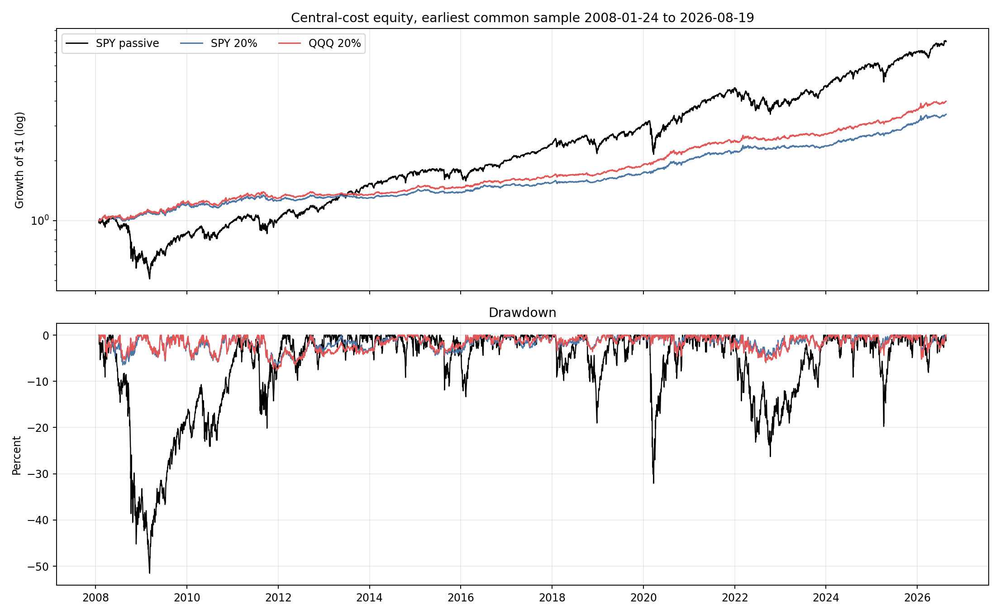
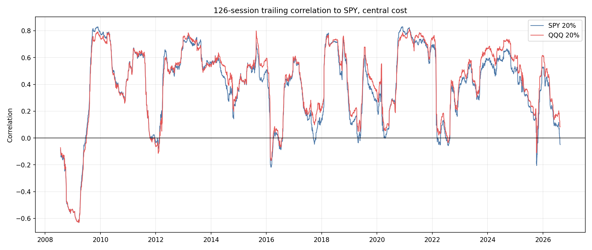

<!-- GENERATED FILE. EDIT THE CANONICAL KNOWLEDGE RECORD. -->

# Vardi CORE5 SPY versus QQQ Early Sample Study

!!! warning "Research-only"
    This page summarizes saved research evidence. It does not authorize LIVE, allocation, or deployment.

## TL;DR

> **Verdict:** QQQ is preferred to SPY on the full 2008-2026 sample, with higher CAGR and Sharpe but modestly deeper downside.

> **Status:** `forward_hypothesis`

> **Disposition:** `promising_component`

> **Replication:** `replicated`

## Research question

Compare actual SPY and QQQ as mutually exclusive 20% vehicles under the same frozen SPY state from the earliest common executable date.

## Exact setup

| Field | Value |
| --- | --- |
| Signal family | Frozen adaptive CORE5 timing with SPY or QQQ equity execution vehicle |
| Universe | ["Fixed ETFs: SPY, QQQ, IEF, GLD, DBC, UUP and BIL"] |
| Decision | Frozen SPY and CORE5 signals at Close_T |
| Fill | First strict common Open_(T+1), stateful until parent rebalance |
| Primary cost layer | central_research |
| Last reviewed | 2026-08-22T20:18:00Z |

## Timing and overnight attribution

```text
information available: Frozen SPY and CORE5 signals at Close_T
primary executable fill: First strict common Open_(T+1), stateful until parent rebalance
```

If final `Close_T` data formed the signal, a hypothetical `Close_T` entry is diagnostic only unless a separate pre-close protocol was modeled. Comparing that diagnostic with `Open_(T+1)` and applying the compounded return identity shows whether the apparent edge occurred in the overnight gap. Missing attribution numbers mean **not tested**, not zero.

| Attribution field | Value |
| --- | --- |
| Status | not_applicable |
| Diagnostic Path | not_applicable |
| Executable Path | Frozen strict Open_(T+1) stateful path |
| Method | Vehicle-only comparison on identical executable timing |
| Headline Result | No same-close path is used; exact SPY reconciliation passed. |
| Metrics | {} |
| Artifact | tables/baseline_reconciliation.csv |

## Primary metrics

| Metric | Value |
| --- | ---: |
| Period | 2008-01-24 through 2026-08-19 |
| Universe | CORE5 with 20% QQQ equity vehicle plus frozen DBC short |
| Cost Layer | 10 bps round trip plus 1% annual DBC borrow |
| Cagr | 7.72% |
| Annualized Volatility | 6.29% |
| Sharpe | 1.214 |
| Maximum Drawdown | -7.50% |
| Turnover | 402.56% |

## Four separate verdicts

| Question | Conclusion |
| --- | --- |
| Source Replication | The SPY baseline reconciled exactly in all three cost tiers. |
| Predictive Value | QQQ improved CAGR in four of four and Sharpe in three of four frozen seen-history blocks. |
| Economic Value | Central CAGR delta 0.87pp and Sharpe delta 0.072. |
| Promotion | QQQ remains a forward hypothesis only; no PAPER/LIVE authorization. |

## Key findings

| Feature | Role | Direction | Status | Effect | Action |
| --- | --- | --- | --- | --- | --- |
| 20% QQQ vehicle under frozen SPY timing | execution vehicle and Nasdaq index basis | Higher CAGR and Sharpe with modestly deeper downside versus SPY. | promising_component | Central CAGR +0.87pp, Sharpe +0.072, MaxDD delta -0.76pp. | freeze_QQQ_for_forward_only_observation |

## Visual evidence






## Limitations

- All dates were already seen
- QQQ changes both vehicle and index basis
- No opening-auction, tax or capacity evidence
- Fixed surviving ETF vehicles

## Next gates

- Forward-only unchanged-rule observation of QQQ after 2026-08-19; no new weight or own-asset signal

## Sources

- `pakal-research/reports/vardi_core5_equity_vehicle_comparison_study/research_spec_frozen.json`
- `pakal-research/reports/vardi_core5_spy_qqq_early_sample_study/research_spec_frozen.json`

## Canonical artifacts

| Artifact | Pakal path |
| --- | --- |
| Concise Report | `pakal-research/reports/vardi_core5_spy_qqq_early_sample_study/REPORT.md` |
| Full Report | `pakal-research/reports/vardi_core5_spy_qqq_early_sample_study/REPORT_FULL.md` |
| Notebook | `pakal-research/notebooks/vardi_core5_spy_qqq_early_sample_study.ipynb` |
| Frozen Specification | `pakal-research/reports/vardi_core5_spy_qqq_early_sample_study/research_spec_frozen.json` |
| Manifest | `pakal-research/reports/vardi_core5_spy_qqq_early_sample_study/run_manifest.json` |
| Primary Source Code | `["pakal-research/vardi_core5_spy_qqq_early_sample_study.py", "pakal-research/test_vardi_core5_spy_qqq_early_sample_study.py"]` |
| Primary Tables | `["pakal-research/reports/vardi_core5_spy_qqq_early_sample_study/tables/path_metrics.csv", "pakal-research/reports/vardi_core5_spy_qqq_early_sample_study/tables/period_metrics.csv", "pakal-research/reports/vardi_core5_spy_qqq_early_sample_study/tables/comparison.csv", "pakal-research/reports/vardi_core5_spy_qqq_early_sample_study/tables/baseline_reconciliation.csv"]` |
| Primary Charts | `["pakal-research/reports/vardi_core5_spy_qqq_early_sample_study/charts/equity_and_drawdown.png", "pakal-research/reports/vardi_core5_spy_qqq_early_sample_study/charts/subperiod_cagr_sharpe.png", "pakal-research/reports/vardi_core5_spy_qqq_early_sample_study/charts/rolling_market_correlation.png"]` |
| Research State | `pakal-research/reports/vardi_core5_spy_qqq_early_sample_study/research_state.json` |
| Hypothesis Registry | `pakal-research/reports/vardi_core5_spy_qqq_early_sample_study/hypothesis_registry.json` |
| Experiment Ledger | `pakal-research/reports/vardi_core5_spy_qqq_early_sample_study/experiment_ledger.jsonl` |
| Decision Log | `pakal-research/reports/vardi_core5_spy_qqq_early_sample_study/decision_log.jsonl` |
| Source Rule Map | `pakal-research/reports/vardi_core5_spy_qqq_early_sample_study/SOURCE_RULE_MAP.md` |
