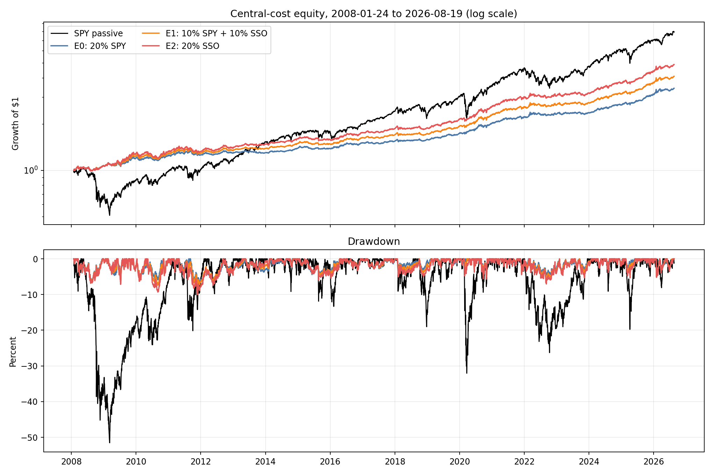
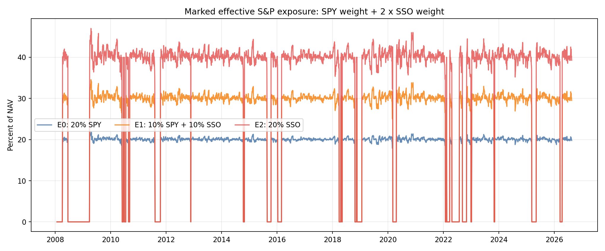

<!-- GENERATED FILE. EDIT THE CANONICAL KNOWLEDGE RECORD. -->

# Vardi CORE5 SSO Equity Sleeve Study

!!! warning "Research-only"
    This page summarizes saved research evidence. It does not authorize LIVE, allocation, or deployment.

## TL;DR

> **Verdict:** Select E2 full SSO sleeve by frozen hierarchy; keep E1 as the lower-risk alternative; forward evidence required.

> **Status:** `forward_hypothesis`

> **Disposition:** `promising_component`

> **Replication:** `replicated`

## Research question

Test whether SSO should replace some or all of the frozen 20% SPY sleeve when the SPY Vardi signal is LONG.

## Exact setup

| Field | Value |
| --- | --- |
| Signal family | Adaptive macro-asset timing with an actual SSO execution vehicle and frozen DBC short |
| Universe | ["SPY, SSO, IEF, GLD, DBC, UUP; BIL reserve/collateral"] |
| Decision | Frozen SPY signal at Close_T |
| Fill | First strict common Open_(T+1), stateful until parent rebalance |
| Primary cost layer | central_research |
| Last reviewed | 2026-08-21T21:42:51Z |

## Timing and overnight attribution

```text
information available: Frozen SPY signal at Close_T
primary executable fill: First strict common Open_(T+1), stateful until parent rebalance
```

If final `Close_T` data formed the signal, a hypothetical `Close_T` entry is diagnostic only unless a separate pre-close protocol was modeled. Comparing that diagnostic with `Open_(T+1)` and applying the compounded return identity shows whether the apparent edge occurred in the overnight gap. Missing attribution numbers mean **not tested**, not zero.


## Primary metrics

| Metric | Value |
| --- | ---: |
| Period | 2008-01-24 through 2026-08-19 |
| Universe | CORE5 with 20% SSO equity sleeve plus frozen DBC short |
| Cost Layer | 10 bps round trip plus 1% annual DBC borrow |
| Cagr | 8.92% |
| Annualized Volatility | 7.60% |
| Sharpe | 1.163 |
| Maximum Drawdown | -10.04% |
| Turnover | 405.14% |

## Four separate verdicts

| Question | Conclusion |
| --- | --- |
| Source Replication | E0 reconciled exactly with the selected parent path in all cost tiers. |
| Predictive Value | E1 and E2 passed every frozen gate on seen history. |
| Economic Value | E2 added 2.07 percentage points of CAGR with similar Sharpe but deeper drawdown and higher market dependence. |
| Promotion | E2 is a frozen forward hypothesis only; no PAPER/LIVE authorization. |

## Key findings

| Feature | Role | Direction | Status | Effect | Action |
| --- | --- | --- | --- | --- | --- |
| Replace the active 20% SPY sleeve with actual SSO | execution vehicle and equity exposure | Positive CAGR effect with bounded Sharpe deterioration under frozen gates. | promising_component | E2 central CAGR +2.07pp, Sharpe +0.020, MaxDD -3.30pp and beta +0.092 versus E0. | freeze_E2_for_forward_only_observation |
| Split the sleeve equally between SPY and SSO | lower-risk portfolio construction alternative | Positive CAGR and Sharpe with less risk increase than E2. | promising_component | E1 central CAGR +1.04pp, Sharpe +0.024 and MaxDD -1.26pp versus E0. | retain_E1_as_lower_risk_alternative |

## Visual evidence






## Limitations

- All dates were already seen
- No opening-auction spread, participation or fill evidence
- No tax or margin model
- No AUM/ADV capacity assessment
- SSO target weights drift between rebalances

## Next gates

- Forward-only unchanged-rule observation after 2026-08-19; do not test neighboring SSO weights

## Sources

- `pakal-research/reports/vardi_core5_uup_short_variants_study/SELECTED_RESEARCH_BASELINE_FREEZE.md`
- `pakal-research/reports/vardi_core5_sso_equity_sleeve_study/research_spec_frozen.json`

## Canonical artifacts

| Artifact | Pakal path |
| --- | --- |
| Concise Report | `pakal-research/reports/vardi_core5_sso_equity_sleeve_study/REPORT.md` |
| Full Report | `pakal-research/reports/vardi_core5_sso_equity_sleeve_study/REPORT_FULL.md` |
| Notebook | `pakal-research/notebooks/vardi_core5_sso_equity_sleeve_study.ipynb` |
| Frozen Specification | `pakal-research/reports/vardi_core5_sso_equity_sleeve_study/research_spec_frozen.json` |
| Manifest | `pakal-research/reports/vardi_core5_sso_equity_sleeve_study/run_manifest.json` |
| Primary Source Code | `["pakal-research/vardi_core5_sso_equity_sleeve_study.py", "pakal-research/test_vardi_core5_sso_equity_sleeve_study.py"]` |
| Primary Tables | `["pakal-research/reports/vardi_core5_sso_equity_sleeve_study/tables/path_metrics.csv", "pakal-research/reports/vardi_core5_sso_equity_sleeve_study/tables/period_metrics.csv", "pakal-research/reports/vardi_core5_sso_equity_sleeve_study/tables/gate_matrix.csv", "pakal-research/reports/vardi_core5_sso_equity_sleeve_study/tables/selection_matrix.csv", "pakal-research/reports/vardi_core5_sso_equity_sleeve_study/tables/baseline_reconciliation.csv"]` |
| Primary Charts | `["pakal-research/reports/vardi_core5_sso_equity_sleeve_study/charts/equity_and_drawdown.png", "pakal-research/reports/vardi_core5_sso_equity_sleeve_study/charts/subperiod_cagr_sharpe.png", "pakal-research/reports/vardi_core5_sso_equity_sleeve_study/charts/effective_sp500_exposure.png", "pakal-research/reports/vardi_core5_sso_equity_sleeve_study/charts/rolling_market_correlation.png"]` |
| Research State | `pakal-research/reports/vardi_core5_sso_equity_sleeve_study/research_state.json` |
| Hypothesis Registry | `pakal-research/reports/vardi_core5_sso_equity_sleeve_study/hypothesis_registry.json` |
| Experiment Ledger | `pakal-research/reports/vardi_core5_sso_equity_sleeve_study/experiment_ledger.jsonl` |
| Decision Log | `pakal-research/reports/vardi_core5_sso_equity_sleeve_study/decision_log.jsonl` |
| Source Rule Map | `pakal-research/reports/vardi_core5_sso_equity_sleeve_study/SOURCE_RULE_MAP.md` |
