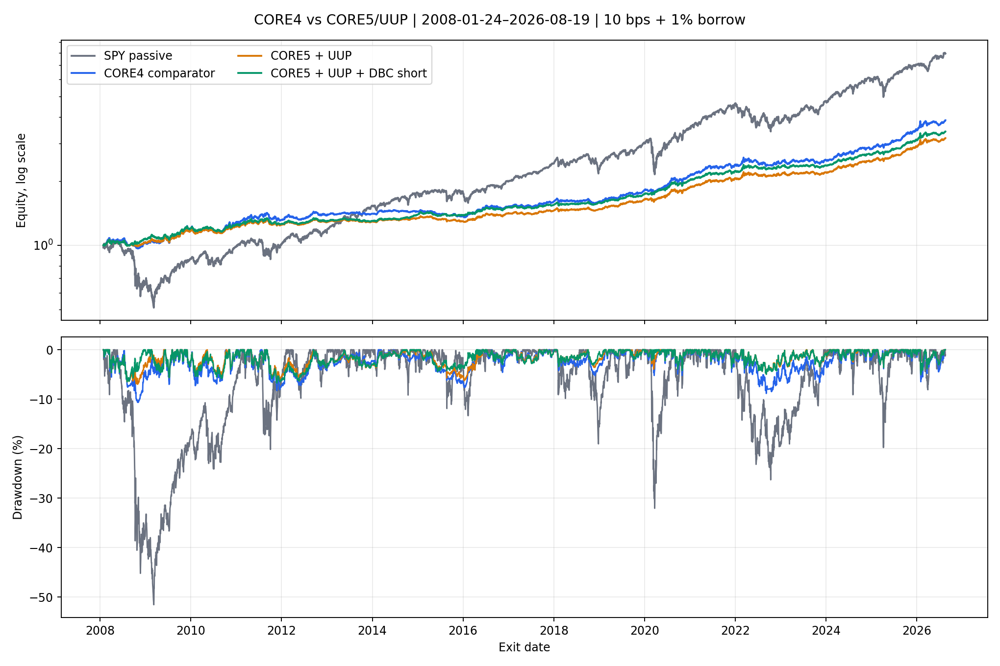
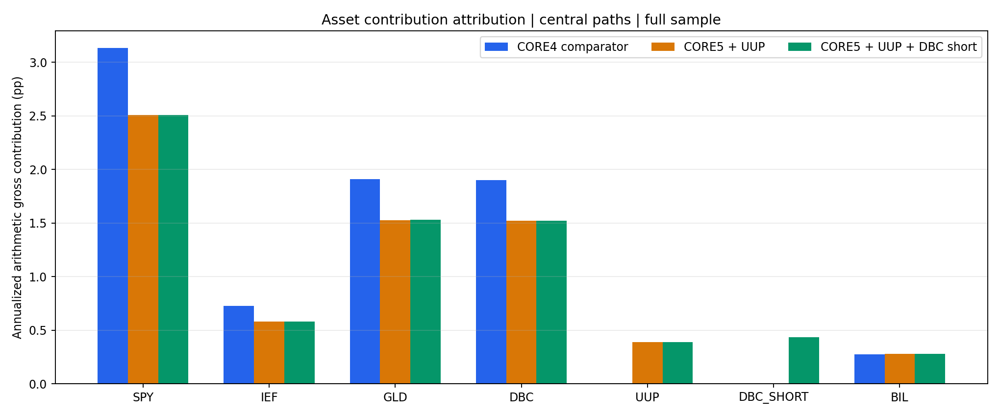

<!-- GENERATED FILE. EDIT THE CANONICAL KNOWLEDGE RECORD. -->

# Vardi CORE5 UUP and DBC Short Study

!!! warning "Research-only"
    This page summarizes saved research evidence. It does not authorize LIVE, allocation, or deployment.

## TL;DR

> **Verdict:** Retain H0. CORE5 bought real risk reduction at an excessive CAGR cost; DBC short only partly recovered it.

> **Status:** `diagnostic`

> **Disposition:** `rejected`

> **Replication:** `replicated`

## Research question

Test a genuine equal-weight CORE5 with UUP and a sequential DBC-short extension against common-cadence CORE4.

## Exact setup

| Field | Value |
| --- | --- |
| Signal family | Adaptive macro-asset timing with fixed sleeves and optional DBC short risk budget |
| Universe | ["SPY, IEF, GLD, DBC, UUP; BIL reserve/collateral"] |
| Decision | Close_T |
| Fill | First strict common Open_(T+1); stateful units until CORE5 state-change or month-end |
| Primary cost layer | central_research |
| Last reviewed | 2026-08-21T16:08:00Z |

## Timing and overnight attribution

```text
information available: Close_T
primary executable fill: First strict common Open_(T+1); stateful units until CORE5 state-change or month-end
```

If final `Close_T` data formed the signal, a hypothetical `Close_T` entry is diagnostic only unless a separate pre-close protocol was modeled. Comparing that diagnostic with `Open_(T+1)` and applying the compounded return identity shows whether the apparent edge occurred in the overnight gap. Missing attribution numbers mean **not tested**, not zero.

| Attribution field | Value |
| --- | --- |
| Status | tested |
| Diagnostic Path | none |
| Executable Path | Close_T -> Open_(T+1) -> next-open mark |
| Method | Strict common-open stateful simulation and bit-for-bit baseline reconciliation |
| Headline Result | Five focused CORE5 tests and three-tier reconciliation passed. |
| Metrics | {} |
| Artifact | pakal-research/test_vardi_core5_uup_dbc_short_study.py |

## Primary metrics

| Metric | Value |
| --- | ---: |
| Period | 2008-01-24 through 2026-08-19 |
| Universe | CORE5/UUP plus optional DBC short |
| Cost Layer | 10 bps round trip plus 1% annual borrow |
| Cagr | 6.86% |
| Annualized Volatility | 5.96% |
| Sharpe | 1.143 |
| Maximum Drawdown | -6.74% |
| Turnover | 401.54% |

## Four separate verdicts

| Question | Conclusion |
| --- | --- |
| Source Replication | Zero-short H0 matched the official stateful engine bit-for-bit in all cost tiers. |
| Predictive Value | CORE5 and DBC short improved Sharpe in three of four fixed seen-history periods. |
| Economic Value | H0/H1/H2 central Sharpe 1.004/1.087/1.143; CAGR 0.0756/0.0645/0.0686. |
| Promotion | H1 failed one of five gates; H2 failed two of ten sequential gates. No implementation change. |

## Key findings

| Feature | Role | Direction | Status | Effect | Action |
| --- | --- | --- | --- | --- | --- |
| UUP as a fifth equal fixed sleeve | universe and portfolio construction | Lower volatility, drawdown and beta; materially lower CAGR. | rejected | Sharpe delta 0.083136; CAGR delta -0.011135. | retain_core4_and_do_not_tune_uup_weight_on_seen_history |
| DBC short risk budget inside CORE5 | risk overlay | Improved Sharpe, CAGR, drawdown and beta, but missed the frozen CAGR delta and H1 dependency gates. | rejected | Sharpe delta 0.055890; CAGR delta 0.004095. | retain_as_diagnostic_component_only |

## Visual evidence






## Limitations

- No untouched sample
- UUP and DBC short are post-result hypotheses
- UUP commodity-pool tax and roll implementation not modeled
- Constant borrow tiers and zero proceeds credit
- No auction-fill, locate, recall, SSR, margin-liquidation or capacity evidence

## Next gates

- Retain CORE4 H0 unchanged.
- If pursued, record forward-only shadow evidence after 2026-08-19 with frozen rules.

## Sources

- `Norgate snapshot sha256:e2c5d99b9750486d12f642ae1f3d7094938b9fe99768048262cac3acc63d4803`
- `Parent CORE4/DBC report sha256:dc0668b7d19d0a4642c76f2eb3218db1231ff75e0f61f92e16248f0014d64ef0`

## Canonical artifacts

| Artifact | Pakal path |
| --- | --- |
| Concise Report | `pakal-research/reports/vardi_core5_uup_dbc_short_study/REPORT.md` |
| Full Report | `pakal-research/reports/vardi_core5_uup_dbc_short_study/REPORT_FULL.md` |
| Notebook | `pakal-research/notebooks/vardi_core5_uup_dbc_short_study.ipynb` |
| Frozen Specification | `pakal-research/reports/vardi_core5_uup_dbc_short_study/research_spec_frozen.json` |
| Manifest | `pakal-research/reports/vardi_core5_uup_dbc_short_study/run_manifest.json` |
| Primary Source Code | `["pakal-research/vardi_core5_uup_dbc_short_study.py", "pakal-research/build_vardi_core5_uup_dbc_short_artifacts.py", "pakal-research/test_vardi_core5_uup_dbc_short_study.py"]` |
| Primary Tables | `["pakal-research/reports/vardi_core5_uup_dbc_short_study/tables/central_results_ranked_by_sharpe.csv", "pakal-research/reports/vardi_core5_uup_dbc_short_study/tables/gate_matrix.csv", "pakal-research/reports/vardi_core5_uup_dbc_short_study/tables/annualized_asset_contribution.csv"]` |
| Primary Charts | `["pakal-research/reports/vardi_core5_uup_dbc_short_study/charts/equity_and_drawdown.png", "pakal-research/reports/vardi_core5_uup_dbc_short_study/charts/uup_and_dbc_short_exposure.png", "pakal-research/reports/vardi_core5_uup_dbc_short_study/charts/subperiod_sharpe.png", "pakal-research/reports/vardi_core5_uup_dbc_short_study/charts/rolling_market_correlation.png", "pakal-research/reports/vardi_core5_uup_dbc_short_study/charts/annualized_asset_contribution.png"]` |
| Research State | `pakal-research/reports/vardi_core5_uup_dbc_short_study/research_state.json` |
| Hypothesis Registry | `pakal-research/reports/vardi_core5_uup_dbc_short_study/hypothesis_registry.json` |
| Experiment Ledger | `pakal-research/reports/vardi_core5_uup_dbc_short_study/experiment_ledger.jsonl` |
| Decision Log | `pakal-research/reports/vardi_core5_uup_dbc_short_study/decision_log.jsonl` |
| Source Rule Map | `pakal-research/reports/vardi_core5_uup_dbc_short_study/SOURCE_RULE_MAP.md` |
