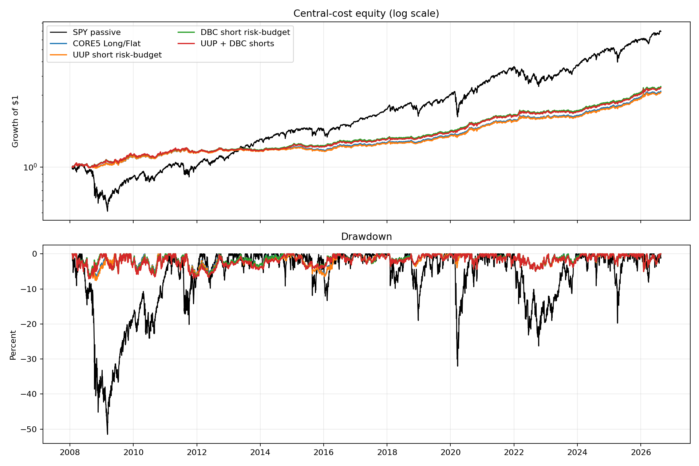
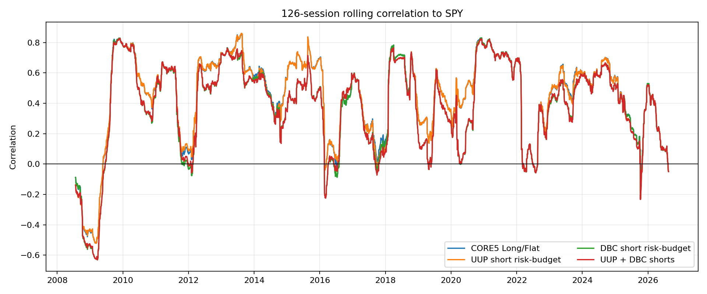

<!-- GENERATED FILE. EDIT THE CANONICAL KNOWLEDGE RECORD. -->

# Vardi CORE5 UUP Short Variants Study

!!! warning "Research-only"
    This page summarizes saved research evidence. It does not authorize LIVE, allocation, or deployment.

## TL;DR

> **Verdict:** Reject every UUP short route; retain DBC-only as the best diagnostic route.

> **Status:** `forward_hypothesis`

> **Disposition:** `rejected`

> **Replication:** `replicated`

## Research question

Test whether Vardi OUT on UUP supports a useful short and whether it adds value beside DBC short.

## Exact setup

| Field | Value |
| --- | --- |
| Signal family | Adaptive macro-asset timing with optional volatility-normalized UUP and DBC shorts |
| Universe | ["SPY, IEF, GLD, DBC, UUP; BIL reserve/collateral"] |
| Decision | Close_T |
| Fill | First strict common Open_(T+1), stateful until CORE5 state-change or month-end |
| Primary cost layer | central_research |
| Last reviewed | 2026-08-21T17:10:00Z |

## Timing and overnight attribution

```text
information available: Close_T
primary executable fill: First strict common Open_(T+1), stateful until CORE5 state-change or month-end
```

If final `Close_T` data formed the signal, a hypothetical `Close_T` entry is diagnostic only unless a separate pre-close protocol was modeled. Comparing that diagnostic with `Open_(T+1)` and applying the compounded return identity shows whether the apparent edge occurred in the overnight gap. Missing attribution numbers mean **not tested**, not zero.


## Primary metrics

| Metric | Value |
| --- | ---: |
| Period | 2008-01-24 through 2026-08-19 |
| Universe | CORE5 plus optional DBC short |
| Cost Layer | 10 bps round trip plus 1% annual borrow |
| Cagr | 6.86% |
| Annualized Volatility | 5.96% |
| Sharpe | 1.143 |
| Maximum Drawdown | -6.74% |
| Turnover | 401.54% |

## Four separate verdicts

| Question | Conclusion |
| --- | --- |
| Source Replication | H0 and H4 reconciled exactly in all three cost tiers. |
| Predictive Value | UUP short improved Sharpe in zero of four frozen subperiods. |
| Economic Value | H2 and H5 both reduced Sharpe and CAGR versus their comparators. |
| Promotion | H1, H2, H3 and H5 failed their frozen gate sets; no implementation change. |

## Key findings

| Feature | Role | Direction | Status | Effect | Action |
| --- | --- | --- | --- | --- | --- |
| UUP OUT-state short | direction and risk overlay | Negative incremental value versus CORE5. | rejected | H2 Sharpe delta -0.04555 and CAGR delta -0.001018. | do_not_add_uup_short |
| UUP plus DBC short combination | portfolio construction | Negative incremental value versus DBC-only. | rejected | H5 Sharpe delta -0.04605 and CAGR delta -0.001020. | retain_dbc_only_as_diagnostic |

## Visual evidence






## Limitations

- All dates were already seen
- Constant borrow assumptions
- No locate, recall, margin or auction-fill evidence
- Capacity not assessed

## Next gates

- Forward-only unchanged-rule observation after 2026-08-19; no rescue tuning

## Sources

- `pakal-research/reports/vardi_core5_uup_dbc_short_study/REPORT.md`
- `pakal-research/reports/vardi_core5_uup_short_variants_study/research_spec_frozen.json`

## Canonical artifacts

| Artifact | Pakal path |
| --- | --- |
| Concise Report | `pakal-research/reports/vardi_core5_uup_short_variants_study/REPORT.md` |
| Full Report | `pakal-research/reports/vardi_core5_uup_short_variants_study/REPORT_FULL.md` |
| Notebook | `pakal-research/notebooks/vardi_core5_uup_short_variants_study.ipynb` |
| Frozen Specification | `pakal-research/reports/vardi_core5_uup_short_variants_study/research_spec_frozen.json` |
| Manifest | `pakal-research/reports/vardi_core5_uup_short_variants_study/run_manifest.json` |
| Primary Source Code | `["pakal-research/vardi_core5_uup_short_variants_study.py", "pakal-research/test_vardi_core5_uup_short_variants_study.py"]` |
| Primary Tables | `["pakal-research/reports/vardi_core5_uup_short_variants_study/tables/path_metrics.csv", "pakal-research/reports/vardi_core5_uup_short_variants_study/tables/period_metrics.csv", "pakal-research/reports/vardi_core5_uup_short_variants_study/tables/gate_matrix.csv", "pakal-research/reports/vardi_core5_uup_short_variants_study/tables/baseline_reconciliation.csv", "pakal-research/reports/vardi_core5_uup_short_variants_study/tables/uup_short_episodes.csv"]` |
| Primary Charts | `["pakal-research/reports/vardi_core5_uup_short_variants_study/charts/equity_and_drawdown.png", "pakal-research/reports/vardi_core5_uup_short_variants_study/charts/subperiod_sharpe.png", "pakal-research/reports/vardi_core5_uup_short_variants_study/charts/short_exposure.png", "pakal-research/reports/vardi_core5_uup_short_variants_study/charts/rolling_market_correlation.png"]` |
| Research State | `pakal-research/reports/vardi_core5_uup_short_variants_study/research_state.json` |
| Hypothesis Registry | `pakal-research/reports/vardi_core5_uup_short_variants_study/hypothesis_registry.json` |
| Experiment Ledger | `pakal-research/reports/vardi_core5_uup_short_variants_study/experiment_ledger.jsonl` |
| Decision Log | `pakal-research/reports/vardi_core5_uup_short_variants_study/decision_log.jsonl` |
| Source Rule Map | `pakal-research/reports/vardi_core5_uup_short_variants_study/SOURCE_RULE_MAP.md` |
