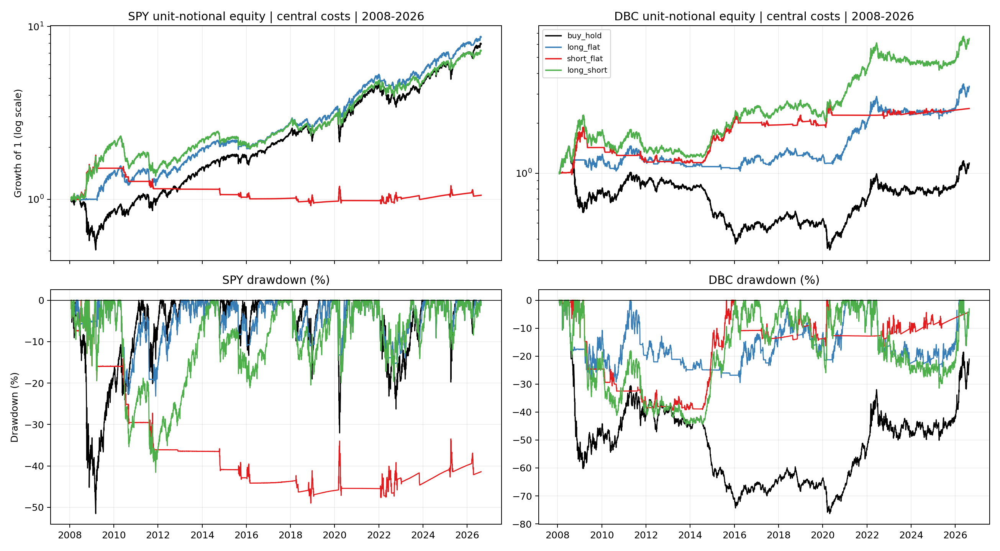
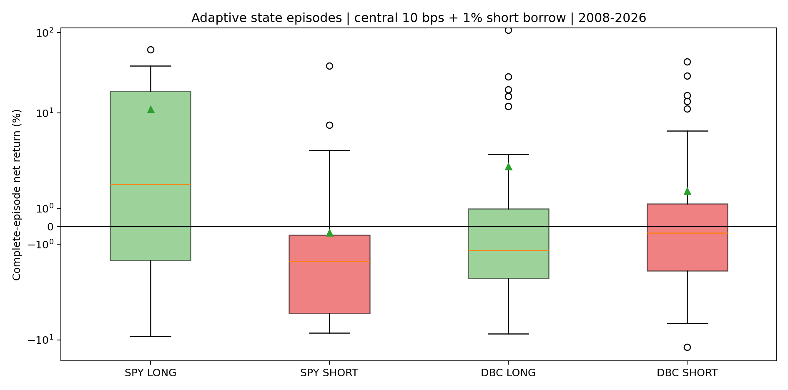

<!-- GENERATED FILE. EDIT THE CANONICAL KNOWLEDGE RECORD. -->

# Vardi SPY vs DBC Trend and Mean-Reversion Diagnostic

!!! warning "Research-only"
    This page summarizes saved research evidence. It does not authorize LIVE, allocation, or deployment.

## TL;DR

> **Verdict:** SPY is Long/Flat. DBC shows economically positive conditional short behavior, but passes only four of seven frozen shortability gates and remains a forward hypothesis rather than a deployment candidate.

> **Status:** `forward_hypothesis`

> **Disposition:** `promising_component`

> **Replication:** `replicated`

## Research question

Determine whether the frozen Vardi adaptive state identifies trend continuation and an economically positive SHORT regime in DBC more reliably than in SPY.

## Exact setup

| Field | Value |
| --- | --- |
| Signal family | asset-local adaptive trend state and long-short asymmetry |
| Universe | ["SPY", "DBC", "BIL reserve"] |
| Decision | Final Close_T |
| Fill | First strict common Open_(T+1); fixed Open_(T+h+1) or next-open state exit |
| Primary cost layer | central_research |
| Last reviewed | 2026-08-23T19:25:00Z |

## Timing and overnight attribution

```text
information available: Final Close_T
primary executable fill: First strict common Open_(T+1); fixed Open_(T+h+1) or next-open state exit
```

If final `Close_T` data formed the signal, a hypothetical `Close_T` entry is diagnostic only unless a separate pre-close protocol was modeled. Comparing that diagnostic with `Open_(T+1)` and applying the compounded return identity shows whether the apparent edge occurred in the overnight gap. Missing attribution numbers mean **not tested**, not zero.

| Attribution field | Value |
| --- | --- |
| Status | tested |
| Diagnostic Path | Close_T to the same future open exit |
| Executable Path | Open_(T+1) to the same future open exit |
| Method | Compounded overnight and executable-return decomposition |
| Headline Result | The LONG/SHORT direction for DBC survives executable next-open timing at 21, 63, and 126 sessions. |
| Metrics | {"maximum_identity_error": 2.3e-16} |
| Artifact | tables/timing_attribution.csv |

## Primary metrics

| Metric | Value |
| --- | ---: |
| Period | 2008-01-24 through 2026-08-19 |
| Universe | DBC with BIL collateral |
| Cost Layer | 10 bps round trip and 1% annual short borrow |
| Cagr | 10.62% |
| Annualized Volatility | 19.12% |
| Sharpe | 0.623 |
| Maximum Drawdown | -44.80% |
| Turnover | 618.53% |

## Four separate verdicts

| Question | Conclusion |
| --- | --- |
| Source Replication | SPY and DBC states are bit-exact with the frozen parent on all common dates. |
| Predictive Value | DBC SHORT-state mean asset returns are negative at all five horizons; SPY SHORT-state mean returns remain positive at all five horizons. |
| Economic Value | DBC Long/Short central CAGR 0.106196, Sharpe 0.623477, MaxDD -0.448026; DBC Short/Flat Sharpe 0.470973. |
| Promotion | Research-only forward hypothesis. No PAPER, LIVE, broker, scheduler, allocation, or release approval. |

## Key findings

| Feature | Role | Direction | Status | Effect | Action |
| --- | --- | --- | --- | --- | --- |
| SPY adaptive SHORT state | direction diagnostic | SPY mean future returns remain positive in the SHORT state at all five horizons. | rejected | SPY Long/Flat Sharpe 0.959; SPY passed 0 of 7 shortability gates. | retain_long_flat_only |
| DBC adaptive SHORT state | direction and cyclical return component | Mean DBC returns are negative in the SHORT state at all five frozen horizons. | forward_hypothesis | Central Short/Flat Sharpe 0.471; complete SHORT episode mean 2.000%, median -0.354%. | freeze_for_forward_shadow_or_small_pilot_validation |

## Visual evidence






## Limitations

- No untouched sample through 2026-08-19
- Fixed surviving ETF vehicles
- DBC index methodology changed in November 2025
- DBC short economics have positive mean but negative median episode return
- No measured live borrow, locate, recall, opening spread, tax, or capacity
- Unit-notional paths are diagnostics rather than allocations
- Global research registry refresh is blocked by an unrelated pre-existing Inflation Compass knowledge record that references a missing REPORT.md

## Next gates

- Freeze the DBC SHORT rule and collect forward-only complete episodes after 2026-08-19.
- Verify current DBC methodology transfer and actual broker borrow/open execution before any capital review.
- Do not add SPY short or tune the 21/63/126 horizons on the seen sample.

## Sources

- `Norgate snapshot sha256:b2b02c008e62c56bb03569046c0f4b2e1399a7f16f722891769041604337e46d`
- `Norgate metadata sha256:51730a0298145c563fdded54c405861557e2fd1a90214b7289b4fb18e0287307`
- `Frozen parent specification sha256:91e97eb92843d2f60e6dd3e3721d351a6365d5b10b3b5f7cf4e9da79e29ea66d`

## Canonical artifacts

| Artifact | Pakal path |
| --- | --- |
| Concise Report | `pakal-research/reports/vardi_spy_dbc_trend_mean_reversion_diagnostic_study/REPORT.md` |
| Full Report | `pakal-research/reports/vardi_spy_dbc_trend_mean_reversion_diagnostic_study/REPORT_FULL.md` |
| Notebook | `pakal-research/notebooks/vardi_spy_dbc_trend_mean_reversion_diagnostic_study.ipynb` |
| Frozen Specification | `pakal-research/reports/vardi_spy_dbc_trend_mean_reversion_diagnostic_study/research_spec_frozen.json` |
| Manifest | `pakal-research/reports/vardi_spy_dbc_trend_mean_reversion_diagnostic_study/run_manifest.json` |
| Primary Source Code | `["pakal-research/vardi_spy_dbc_trend_mean_reversion_diagnostic_study.py", "pakal-research/test_vardi_spy_dbc_trend_mean_reversion_diagnostic_study.py"]` |
| Primary Tables | `["pakal-research/reports/vardi_spy_dbc_trend_mean_reversion_diagnostic_study/tables/conditional_summary.csv", "pakal-research/reports/vardi_spy_dbc_trend_mean_reversion_diagnostic_study/tables/trend_inference.csv", "pakal-research/reports/vardi_spy_dbc_trend_mean_reversion_diagnostic_study/tables/episodes.csv", "pakal-research/reports/vardi_spy_dbc_trend_mean_reversion_diagnostic_study/tables/path_metrics.csv", "pakal-research/reports/vardi_spy_dbc_trend_mean_reversion_diagnostic_study/tables/gate_matrix.csv"]` |
| Primary Charts | `["pakal-research/reports/vardi_spy_dbc_trend_mean_reversion_diagnostic_study/charts/trend_horizon_heatmap.png", "pakal-research/reports/vardi_spy_dbc_trend_mean_reversion_diagnostic_study/charts/episode_return_distributions.png", "pakal-research/reports/vardi_spy_dbc_trend_mean_reversion_diagnostic_study/charts/stateful_equity_drawdown.png", "pakal-research/reports/vardi_spy_dbc_trend_mean_reversion_diagnostic_study/charts/rolling_market_correlation.png"]` |
| Research State | `pakal-research/reports/vardi_spy_dbc_trend_mean_reversion_diagnostic_study/research_state.json` |
| Hypothesis Registry | `pakal-research/reports/vardi_spy_dbc_trend_mean_reversion_diagnostic_study/hypothesis_registry.json` |
| Experiment Ledger | `pakal-research/reports/vardi_spy_dbc_trend_mean_reversion_diagnostic_study/experiment_ledger.jsonl` |
| Decision Log | `pakal-research/reports/vardi_spy_dbc_trend_mean_reversion_diagnostic_study/decision_log.jsonl` |
| Source Rule Map | `pakal-research/reports/vardi_spy_dbc_trend_mean_reversion_diagnostic_study/SOURCE_RULE_MAP.md` |
| Publication Status | `pakal-research/reports/vardi_spy_dbc_trend_mean_reversion_diagnostic_study/publication_status.json` |
