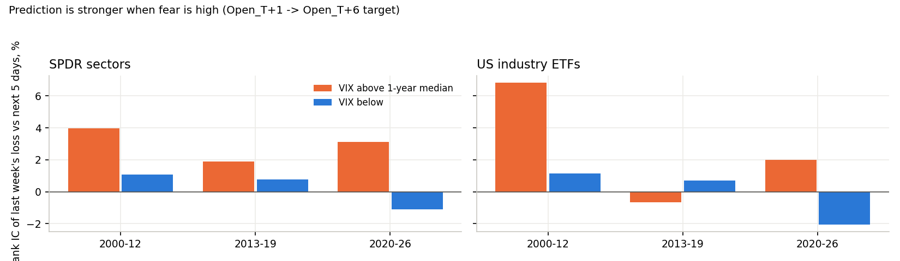
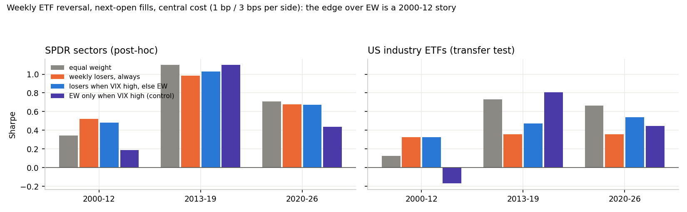

<!-- GENERATED FILE. EDIT THE CANONICAL KNOWLEDGE RECORD. -->

# VIX-gated weekly reversal of sector and industry ETFs

!!! warning "Research-only"
    This page summarizes saved research evidence. It does not authorize LIVE, allocation, or deployment.

## TL;DR

> **Verdict:** Buying the week's weakest sector / industry ETFs when VIX is above its 1-year median beats equal weight only in 2000-12; after 2012 no variant beats EW in either universe, and the VIX gate adds nothing beyond the ungated rule (the gate alone is worse than EW). VIX does raise the reversal IC (3.2% vs 0.5% in sectors). No forward paper test.

> **Status:** `diagnostic`

> **Disposition:** `rejected`

> **Replication:** `replicated`

## Research question

Does buying the week's weakest sector / industry ETFs only when VIX is above its 1-year median beat (a) equal weight, (b) the ungated rule and (c) a VIX-gated equal-weight control, in SPDR sectors (post-hoc) and in never-used US industry ETFs (transfer test), well enough to justify a forward paper test?

## Exact setup

| Field | Value |
| --- | --- |
| Signal family | mean_reversion |
| Universe | ["11 SPDR sector ETFs", "45 US industry ETFs (current listings, PIT liquidity filter)"] |
| Decision | Close_T |
| Fill | Open_T+1 (Close_T MOC diagnostic) |
| Primary cost layer | central_research |
| Last reviewed | 2026-09-28T20:52:09+00:00 |

## Timing and overnight attribution

```text
information available: Close_T
primary executable fill: Open_T+1 (Close_T MOC diagnostic)
```

If final `Close_T` data formed the signal, a hypothetical `Close_T` entry is diagnostic only unless a separate pre-close protocol was modeled. Comparing that diagnostic with `Open_(T+1)` and applying the compounded return identity shows whether the apparent edge occurred in the overnight gap. Missing attribution numbers mean **not tested**, not zero.

| Attribution field | Value |
| --- | --- |
| Status | tested |
| Diagnostic Path | Close_T fills |
| Executable Path | Open_T+1 fills |
| Method | same books under two fill conventions |
| Headline Result | fill timing changes Sharpe by at most 0.04 for reversal variants (0.07 for the control); not the binding issue |
| Metrics | {} |
| Artifact | pakal-research/reports/vix_gated_etf_industry_reversal_study/tables/books.csv |

## Primary metrics

| Metric | Value |
| --- | ---: |
| Period | 2000-01..2026-09 (full) |
| Universe | SPDR sectors |
| Cost Layer | central (1 bp/side) |
| Cagr | 10.81% |
| Annualized Volatility | 19.86% |
| Sharpe | 0.617 |
| Maximum Drawdown | -46.52% |
| Turnover | 0.73 of tranche NAV per weekly rebalance |

## Four separate verdicts

| Question | Conclusion |
| --- | --- |
| Source Replication | replicated: V0 reproduces the parent P-F sector book (Sharpe 0.98 vs 1.02 in 2013-19, 0.68 vs 0.67 in 2020-26) |
| Predictive Value | VIX-high raises weekly ETF reversal IC in both universes |
| Economic Value | no variant beats EW after 2012; gate adds nothing to the ungated rule |
| Promotion | rejected by the frozen rule; no paper test |

## Key findings

| Feature | Role | Direction | Status | Effect | Action |
| --- | --- | --- | --- | --- | --- |
| VIX above its 1-year median | regime | higher ETF reversal IC | supported_diagnostic | IC 3.2% vs 0.5% (sectors), 2.4% vs -0.1% (industries) | do not trade; keep as a diagnostic |
| weekly bottom-k ETF reversal | signal | reversal | rejected | beats EW only 2000-12 | archive |

## Visual evidence






## Limitations

- post-hoc idea; no untouched historical holdout
- U2 survivorship
- no intraday data

## Next gates

- No next test recorded.

## Sources

- `{"location": "pakal-research/reports/gics_residual_reversal_momentum_study/REPORT.md", "read_complete": true, "role": "hypothesis_origin (GRR-02, GRR-03)", "source_id": "P1"}`
- `{"content_id": "sha256:0d633e4c50f361b30560d542fb3308b029a592d9e0f76c0e3e7d51e195f57f84", "location": "0_papers/Articles/concretum_articles/2026-07-11_a-mean-reversion-model-for-us-sectors.pdf", "read_complete": true, "role": "methodology", "source_id": "P3"}`

## Canonical artifacts

| Artifact | Pakal path |
| --- | --- |
| Concise Report | `pakal-research/reports/vix_gated_etf_industry_reversal_study/REPORT.md` |
| Full Report | `pakal-research/reports/vix_gated_etf_industry_reversal_study/REPORT_FULL.md` |
| Notebook | `pakal-research/reports/vix_gated_etf_industry_reversal_study/vix_gated_etf_industry_reversal_study.ipynb` |
| Frozen Specification | `pakal-research/reports/vix_gated_etf_industry_reversal_study/research_spec_frozen.json` |
| Manifest | `pakal-research/reports/vix_gated_etf_industry_reversal_study/run_manifest.json` |
| Primary Source Code | `["pakal-research/vix_gated_etf_reversal/test_vgr_timing.py", "pakal-research/vix_gated_etf_reversal/vgr_artifacts.py", "pakal-research/vix_gated_etf_reversal/vgr_record.py", "pakal-research/vix_gated_etf_reversal/vgr_study.py"]` |
| Primary Tables | `["pakal-research/reports/vix_gated_etf_industry_reversal_study/tables/books.csv", "pakal-research/reports/vix_gated_etf_industry_reversal_study/tables/ic_by_vix.csv", "pakal-research/reports/vix_gated_etf_industry_reversal_study/tables/g3_component.csv"]` |
| Primary Charts | `["pakal-research/reports/vix_gated_etf_industry_reversal_study/charts/sharpe_by_period.png", "pakal-research/reports/vix_gated_etf_industry_reversal_study/charts/ic_by_vix.png"]` |
| Research State | `pakal-research/reports/vix_gated_etf_industry_reversal_study/research_state.json` |
| Hypothesis Registry | `pakal-research/reports/vix_gated_etf_industry_reversal_study/hypothesis_registry.json` |
| Experiment Ledger | `pakal-research/reports/vix_gated_etf_industry_reversal_study/experiment_ledger.jsonl` |
| Decision Log | `pakal-research/reports/vix_gated_etf_industry_reversal_study/decision_log.jsonl` |
| Source Rule Map | `pakal-research/reports/vix_gated_etf_industry_reversal_study/SOURCE_RULE_MAP.md` |
