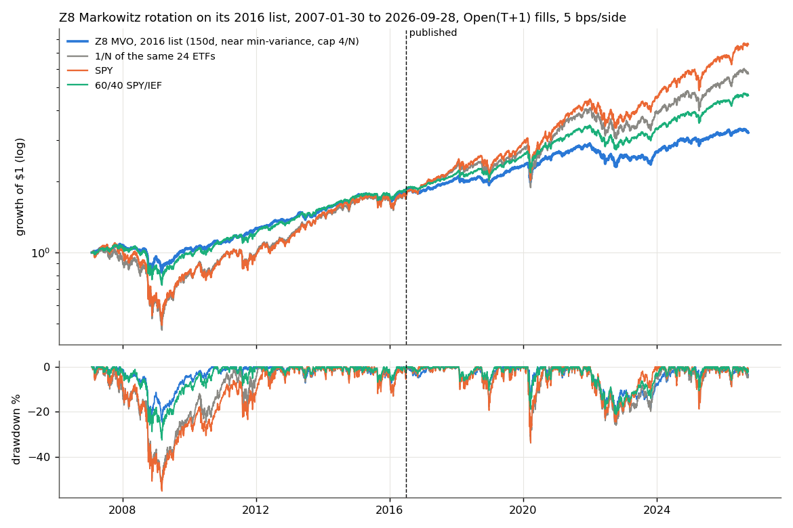
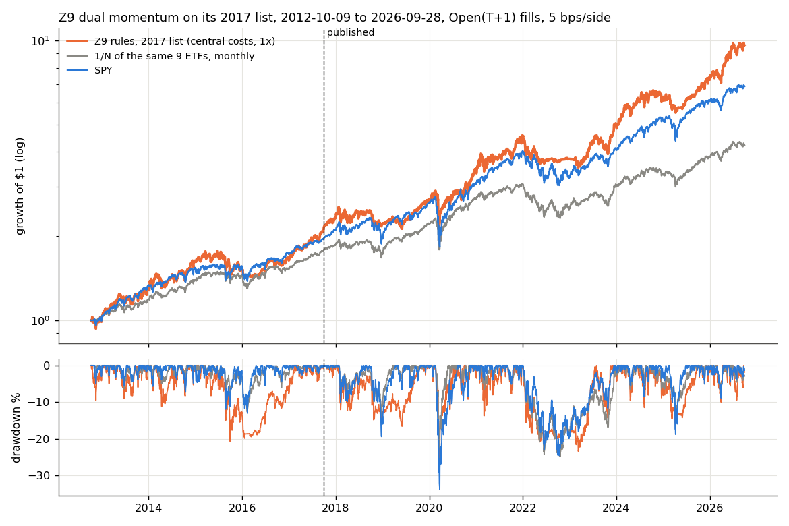

<!-- GENERATED FILE. EDIT THE CANONICAL KNOWLEDGE RECORD. -->

# Zorro Z systems on daily bars (Z8 MVO, Z9 dual momentum, Z13 SPY put selling) audit

!!! warning "Research-only"
    This page summarizes saved research evidence. It does not authorize LIVE, allocation, or deployment.

## TL;DR

> **Verdict:** No daily Z system passes. Z8 lost to equal weight of its own 24 ETFs and to SPY after its July 2016 publication in all 16 rule variants (post-publication Sharpe 0.39 vs 0.63 / 0.76), and its advertised 17-30% is not reached even at the 4x leverage of the 2016 script. Z9 beat SPY after publication only on its 2017 list (0.83 vs 0.70, p 0.53), a list picked from 2011-2017's top sectors, and the lead is SMH plus the year 2026; on a neutral list it loses to equal weight in 22 of 24 variants. Z13 is a put-write index plus leverage: the unlevered proxy is about PUT-like after its ~0.2 Sharpe pricing bias, and the advertised 45% needs leverage that wiped out 4 of 6 proxy variants. Trade-level win rates and profit factors reproduce, but they describe holding periods, not edge.

> **Status:** `diagnostic`

> **Disposition:** `diagnostic`

> **Replication:** `directionally_replicated`

## Research question

Do the Zorro Z systems that trade on daily bars (Z8 Markowitz MVO rotation, Z9 dual-momentum rotation, Z13 in-the-money SPY put selling) deliver their advertised results when rebuilt from the published rules with Close_T decisions, Open_(T+1) fills and realistic costs, and did they beat simple benchmarks after publication?

## Exact setup

| Field | Value |
| --- | --- |
| Signal family | etf_rotation_momentum_mvo_and_put_writing |
| Universe | ["Z8 2016 default list (24 ETFs, SMH spliced with SOXX before 2011-12)", "Z9 2017 list reconstructed from forum logs: XBI ITB SMH XLV VOO AGG HYG IGSB TLT", "Neutral 14-ETF list declared before results: 9 SPDR sectors, EFA, EEM, IEF, TLT, GLD", "Z13 proxy: S&P 500 with VIX and T-bills; Cboe PUT index as real anchor"] |
| Decision | Close_T |
| Fill | Open_T+1 (Z8/Z9); Z13 proxy at Close_T |
| Primary cost layer | central_research |
| Last reviewed | 2026-09-29T19:55:00+00:00 |

## Timing and overnight attribution

```text
information available: Close_T
primary executable fill: Open_T+1 (Z8/Z9); Z13 proxy at Close_T
```

If final `Close_T` data formed the signal, a hypothetical `Close_T` entry is diagnostic only unless a separate pre-close protocol was modeled. Comparing that diagnostic with `Open_(T+1)` and applying the compounded return identity shows whether the apparent edge occurred in the overnight gap. Missing attribution numbers mean **not tested**, not zero.

| Attribution field | Value |
| --- | --- |
| Status | tested |
| Diagnostic Path | Close_T fill to the next scheduled rebalance |
| Executable Path | Open_T+1 fill to the same rebalance |
| Method | Same weight schedules run through the stateful engine with same-close versus next-open fills |
| Headline Result | Fill timing changes Sharpe by at most 0.015 for every Z8/Z9 run; no overnight dependence. |
| Metrics | {"Z8_L2016_post_pub_next_open": 0.391, "Z8_L2016_post_pub_same_close": 0.389, "Z9_L2017_post_pub_next_open": 0.827, "Z9_L2017_post_pub_same_close": 0.812} |
| Unavailable Reason | N/A |
| Artifact | pakal-research/reports/zorro_zsystems_daily_audit/tables/cost_layers_and_timing.csv |

## Primary metrics

| Metric | Value |
| --- | ---: |
| Period | publication date to 2026-09-28 (Z8 from 2016-07-01, Z9 from 2017-10-01, Z13 from 2019-05-01) |
| Universe | Z9 2017 list (headline system); others in series |
| Cost Layer | central_research (5 bps per side, cash at T-bill) |
| Cagr | 18.30% |
| Annualized Volatility | 19.40% |
| Sharpe | 0.827 |
| Maximum Drawdown | -28.70% |
| Turnover | traded value about 4.0x equity per year (buys + sells) |

## Four separate verdicts

| Question | Conclusion |
| --- | --- |
| Source Replication | directionally_replicated: trade statistics (Z9 69%/PF 9.6 vs 73%/9; Z8 61%/2.75 vs 62%/3) and Z9 return level (22% at 1.5x vs 25%); Z8 advertised return not reproducible (7% at 1.5x, 14% at 4x); Z13 not assessable without option chains. |
| Predictive Value | Z9 momentum adds nothing over equal weight on a neutral list (median post-publication Sharpe 0.47 vs 1/N 0.59); Z8 near-minimum-variance weights reduce volatility but not risk-adjusted return versus 1/N after 2016. |
| Economic Value | None robust. Z9's post-publication outperformance on its own list depends on SMH (10.4 pp/yr) and 2026 (68% of excess); without SMH 0.57 < SPY 0.70. Costs are immaterial (<= 0.05 Sharpe). |
| Promotion | Fails the frozen rule (Sharpe +0.15 over SPY and 1/N after publication, neutral list also beating 1/N, BH q < 0.10, >= 60% of the neighborhood). Diagnostic; do not implement. |

## Key findings

| Feature | Role | Direction | Status | Effect | Action |
| --- | --- | --- | --- | --- | --- |
| 200-day average-return momentum, top third, positive only (Z9) | rank | long top third | rejected_as_stand_alone_edge | post-publication Sharpe minus 1/N: +0.24 on the 2017 list, -0.04 on the neutral list | do not implement; the dual-momentum family is already covered by other Pakal studies |
| Asset-list choice (hindsight selection) | universe | lists built from recent winners inflate the in-sample record | supported | 2017 picks at the 80-100th percentile pre-publication vs 30-100th after; neutral-list Sharpe 0.55 vs 1.03 pre-publication | always test vendor rotation systems on a neutral list declared in advance |
| Markowitz frontier near minimum variance with cap 4/N, 150-day window (Z8) | sizing | low-volatility tilt | rejected | post-publication Sharpe -0.24 vs 1/N, -0.37 vs SPY | do not implement |
| Lead-index SMA200 crash filter (Z9 option) | regime | switch to bonds when SPY < SMA200 | diagnostic | 2017 list post-publication 0.80 vs 0.83 without; neutral 0.48 vs 0.55 | no action |
| VIX > 30 entry filter for put selling (Z13 proxy) | regime | skip new puts in high volatility | diagnostic | post-2019 Sharpe 1.01 vs 0.69 without; full-sample 0.73 vs 0.70 | revisit only with real option data |
| Put-write leverage 6 (Z13 Leverage 6 setting) | sizing | higher CAGR, ruin risk | rejected | 4 of 6 L6 proxy variants lose everything; survivors -99% drawdown | never |

## Visual evidence






## Limitations

- Z systems are compiled; current asset lists and exact sizing are unknown; historical lists reconstructed
- Z9 weighting and SMA length unstated
- Z8 cap applied to every frontier point
- Z13 is a Black-Scholes/VIX proxy (Sharpe bias ~+0.2, no bid/ask, no early exercise); replication not assessed
- Black Book scripts are password-protected and were not read
- Validation and confirmation were read together with the grid (audit); post-hoc diagnostics are labeled

## Next gates

- Only if Z13 matters: rebuild it on real SPY option chains (Cboe DataShop / ORATS) and compare with the Cboe PUT index and delta-matched SPY

## Sources

- `https://zorro-project.com/manual/en/zsystems.htm`
- `Wayback snapshots 2016-2026 of the same page`
- `https://financial-hacker.com/get-rich-slowly/`
- `https://financial-hacker.com/scripts2016.zip`
- `https://zorro-project.com/manual/en/markowitz.htm`
- `https://zorro-project.com/manual/en/new.htm`
- `opserver.de Zorro forum threads on Z8/Z9/Z13 (2017-2020)`
- `https://financial-hacker.com/algorithmic-options-trading-part-3/`

## Canonical artifacts

| Artifact | Pakal path |
| --- | --- |
| Concise Report | `pakal-research/reports/zorro_zsystems_daily_audit/REPORT.md` |
| Full Report | `pakal-research/reports/zorro_zsystems_daily_audit/REPORT_FULL.md` |
| Notebook | `pakal-research/zorro_zsystems_daily_audit.ipynb` |
| Frozen Specification | `pakal-research/reports/zorro_zsystems_daily_audit/research_spec_frozen.json` |
| Manifest | `pakal-research/reports/zorro_zsystems_daily_audit/run_manifest.json` |
| Primary Source Code | `["pakal-research/zorro_zsystems_daily_audit.py", "pakal-research/zorro_zsystems_daily_audit_run.py", "pakal-research/zorro_zsystems_daily_audit_charts.py", "tests/test_zorro_zsystems_daily_audit.py"]` |
| Primary Tables | `["pakal-research/reports/zorro_zsystems_daily_audit/tables/variant_period_metrics.csv", "pakal-research/reports/zorro_zsystems_daily_audit/tables/bootstrap_sharpe_tests.csv", "pakal-research/reports/zorro_zsystems_daily_audit/tables/trade_stats.csv", "pakal-research/reports/zorro_zsystems_daily_audit/tables/posthoc_diagnostics.csv", "pakal-research/reports/zorro_zsystems_daily_audit/tables/claims_history.csv"]` |
| Primary Charts | `["pakal-research/reports/zorro_zsystems_daily_audit/charts/neighborhood_post_publication.png", "pakal-research/reports/zorro_zsystems_daily_audit/charts/z9_equity_drawdown_l2017.png", "pakal-research/reports/zorro_zsystems_daily_audit/charts/z8_equity_drawdown_l2016.png", "pakal-research/reports/zorro_zsystems_daily_audit/charts/z13_proxy.png", "pakal-research/reports/zorro_zsystems_daily_audit/charts/claims_history.png"]` |
| Research State | `pakal-research/reports/zorro_zsystems_daily_audit/research_state.json` |
| Hypothesis Registry | `pakal-research/reports/zorro_zsystems_daily_audit/hypothesis_registry.json` |
| Experiment Ledger | `pakal-research/reports/zorro_zsystems_daily_audit/experiment_ledger.jsonl` |
| Decision Log | `pakal-research/reports/zorro_zsystems_daily_audit/decision_log.jsonl` |
| Source Rule Map | `pakal-research/reports/zorro_zsystems_daily_audit/SOURCE_RULE_MAP.md` |
