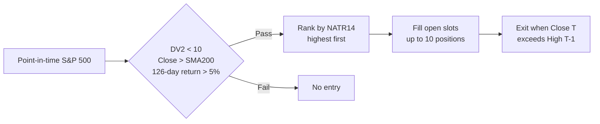

# DV2 Mean Reversion

!!! abstract "Plain-English summary"
    Look for deeply oversold S&P 500 stocks that are still in a long-term uptrend. Buy the most volatile qualifying names and exit after a short rebound.

-   :material-calendar-today: **Decision**

    Every trading-day close

-   :material-clock-outline: **Execution**

    Modeled at the next trading-day open

-   :material-view-grid-plus-outline: **Portfolio**

    Up to 10 positions, one 10% slot per position

-   :material-connection: **Maturity**

    `WIRED` — connected to a LIVE account route

## Decision flow

## Exact rules

| Item | Rule |
|---|---|
| Universe | Point-in-time S&P 500 membership |
| Entry | `DV2(126) < 10`, `Close > SMA200`, and 126-day return `> 5%` |
| Ranking | `NATR(14)` descending |
| Sizing | Previous portfolio value ÷ 10 for each new position |
| Exit | Current close is above the previous trading day’s high |
| Data | Stocks use `CAPITALSPECIAL`; performance benchmark uses total-return S&P 500 |
| Modeled costs | 2.5 bps slippage; $0.005/share commission; $1 minimum |

!!! danger "Timing boundary"
    Signals use information through `Close T`. Orders are not filled at that close; the default execution model fills at `Open T+1`.

!!! warning "What WIRED does — and does not — mean"
    `WIRED` means the strategy has a LIVE account route in the registry. It does not prove an edge, guarantee that a release is enabled, or prove that an order is currently scheduled.

## Sources of truth

- Maturity: `alpha/strategy_registry.py`
- Rules and timing: `strategies/dv2/strategy_mr_dv2.py`
