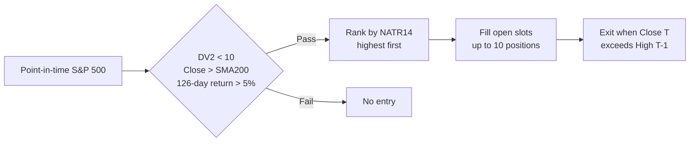

# DV2 Mean Reversion

!!! abstract "Plain-English summary"
    Look for deeply oversold S&P 500 stocks that are still in a long-term uptrend. Buy the most volatile qualifying names and exit after a short rebound.

-   :material-calendar-today: **Decision**

    Every trading-day close

-   :material-clock-outline: **Execution**

    Modeled at the next trading-day open

-   :material-view-grid-plus-outline: **Portfolio**

    Up to 10 positions, one 10% slot per position

-   :material-connection: **Maturity**

    `WIRED` — connected to a LIVE account route

## Decision flow

```mermaid
flowchart LR
    A["Point-in-time S&P 500"] --> B{"DV2 < 10<br/>Close > SMA200<br/>126-day return > 5%"}
    B -->|"Pass"| C["Rank by NATR14<br/>highest first"]
    B -->|"Fail"| D["No entry"]
    C --> E["Fill open slots<br/>up to 10 positions"]
    E --> F["Exit when Close T<br/>exceeds High T-1"]
```

## Exact rules

| Item | Rule |
|---|---|
| Universe | Point-in-time S&P 500 membership |
| Entry | `DV2(126) < 10`, `Close > SMA200`, and 126-day return `> 5%` |
| Ranking | `NATR(14)` descending |
| Sizing | Previous portfolio value ÷ 10 for each new position |
| Exit | Current close is above the previous trading day’s high |
| Data | Stocks use `CAPITALSPECIAL`; performance benchmark uses total-return S&P 500 |
| Modeled costs | 2.5 bps slippage; $0.005/share commission; $1 minimum |

!!! danger "Timing boundary"
    Signals use information through `Close T`. Orders are not filled at that close; the default execution model fills at `Open T+1`.

!!! warning "What WIRED does — and does not — mean"
    `WIRED` means the strategy has a LIVE account route in the registry. It does not prove an edge, guarantee that a release is enabled, or prove that an order is currently scheduled.

## Known caveats

Recorded from the [readiness audit 2026-09-28](../research/STRATEGY_READINESS_AUDIT_20260928.md). *Direction* says whether the published backtest is **conservative** (reality should be better), **optimistic** (reality should be worse), or neutral. Update this table whenever a caveat is measured again or fixed.

| Caveat | Direction | Size | Evidence |
|---|---|---|---|
| Commission and share rounding use split-adjusted share counts | Conservative | +0.87 pp/yr CAGR if charged on real shares | `mr_dv2_qpi/DV2_QPI_FINDINGS.md` A-DV2-01 |
| 5-session membership trim | Optimistic (recent) | About 0 full history; -0.22 pp/yr last 3 years | A-DV2-02; fix #7 |
| Small-account friction (USD 1 minimum commission, whole shares) | Size-dependent | -4.5 pp/yr at USD 30K vs USD 10M over the last 3 years; best run at USD 100K or more | A-DV2-06 |
| Exits and refills share one MOO basket | Account requirement | Margin needed on 78% of entry days, up to 97% of NAV | A-DV2-08 |
| Held name without a price column raises (blocks the pod for the day) | Live risk (loud) | 1 merger case in 22.7 years | A-DV2-04; fix #9 |
| Class-share tickers (BRK.B, BF.B) are sent to IBKR unmapped | Live risk | 2 entries in the last 3 years | A-DV2-05; fix #9 |

## Sources of truth

- Maturity: `alpha/strategy_registry.py`
- Rules and timing: `strategies/dv2/strategy_mr_dv2.py`
