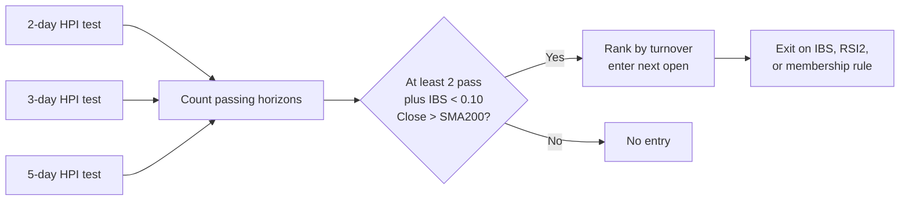

# HPI 2/3/5-Day Vote

!!! abstract "Plain-English summary"
    Use the same HPI mean-reversion framework, but require at least two of the 2-day, 3-day, and 5-day horizons to identify an unusually deep negative move.

-   :material-calendar-today: **Decision**

    Every trading-day close

-   :material-vote-outline: **Vote**

    At least 2 of 3 horizons must pass

-   :material-view-grid-plus-outline: **Portfolio**

    Up to 10 equal 10% slots

-   :material-connection: **Maturity**

    `WIRED` — connected to a LIVE account route

## Decision flow

## Exact rules

| Item | Rule |
|---|---|
| Universe | Point-in-time S&P 500 membership |
| Horizon pass | The horizon return is `< 0` and its HPI is `< 30` |
| Entry | At least 2 of the 2-day, 3-day, and 5-day horizons pass; also `IBS < 0.10` and `Close > SMA200` |
| Ranking | Turnover descending; symbol ascending on ties |
| Sizing | Up to 10 equal 10% slots |
| Exit | `IBS > 0.90`, `RSI(2) > 90`, or loss of point-in-time index membership |
| HPI history | Previous 1,260 same-horizon observations, excluding today |
| Data | Stocks use `CAPITALSPECIAL`; performance benchmark uses total-return S&P 500 |
| Modeled costs | 2.5 bps slippage; $0.005/share commission; $1 minimum |

!!! danger "Timing boundary"
    Every vote uses information available through `Close T`. Entry and exit orders execute at the modeled `Open T+1`.

!!! warning "What WIRED does — and does not — mean"
    `WIRED` confirms a LIVE route exists. It does not establish an edge, release enablement, or current runtime health.

## Sources of truth

- Maturity: `alpha/strategy_registry.py`
- Variant configuration: `strategies/hpi/strategy_mr_hpi_sp500_2_3_5_vote.py`
- Shared HPI rules and lifecycle: `strategies/hpi/stateful_long.py`
