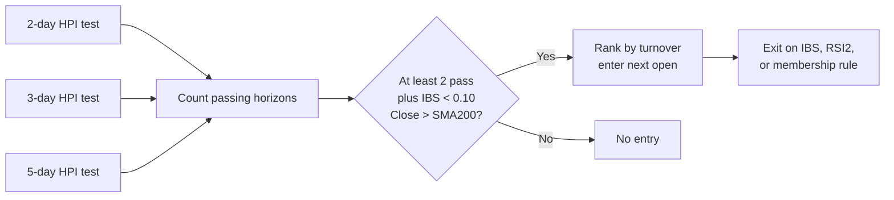

# HPI 2/3/5-Day Vote

!!! abstract "Plain-English summary"
    Use the same HPI mean-reversion framework, but require at least two of the 2-day, 3-day, and 5-day horizons to identify an unusually deep negative move.

-   :material-calendar-today: **Decision**

    Every trading-day close

-   :material-vote-outline: **Vote**

    At least 2 of 3 horizons must pass

-   :material-view-grid-plus-outline: **Portfolio**

    Up to 10 equal 10% slots

-   :material-connection: **Maturity**

    `WIRED` — connected to a LIVE account route

## Decision flow

```mermaid
flowchart LR
    A["2-day HPI test"] --> D["Count passing horizons"]
    B["3-day HPI test"] --> D
    C["5-day HPI test"] --> D
    D --> E{"At least 2 pass<br/>plus IBS < 0.10<br/>Close > SMA200?"}
    E -->|"Yes"| F["Rank by turnover<br/>enter next open"]
    E -->|"No"| G["No entry"]
    F --> H["Exit on IBS, RSI2,<br/>or membership rule"]
```

## Exact rules

| Item | Rule |
|---|---|
| Universe | Point-in-time S&P 500 membership |
| Horizon pass | The horizon return is `< 0` and its HPI is `< 30` |
| Entry | At least 2 of the 2-day, 3-day, and 5-day horizons pass; also `IBS < 0.10` and `Close > SMA200` |
| Ranking | Turnover descending; symbol ascending on ties |
| Sizing | Up to 10 equal 10% slots |
| Exit | `IBS > 0.90`, `RSI(2) > 90`, or loss of point-in-time index membership |
| HPI history | Previous 1,260 same-horizon observations, excluding today |
| Data | Stocks use `CAPITALSPECIAL`; performance benchmark uses total-return S&P 500 |
| Modeled costs | 2.5 bps slippage; $0.005/share commission; $1 minimum |

!!! danger "Timing boundary"
    Every vote uses information available through `Close T`. Entry and exit orders execute at the modeled `Open T+1`.

!!! warning "What WIRED does — and does not — mean"
    `WIRED` confirms a LIVE route exists. It does not establish an edge, release enablement, or current runtime health.

## Known caveats

Recorded from the [readiness audit 2026-09-28](../research/STRATEGY_READINESS_AUDIT_20260928.md). *Direction* says whether the published backtest is **conservative** (reality should be better), **optimistic** (reality should be worse), or neutral. Update this table whenever a caveat is measured again or fixed.

| Caveat | Direction | Size | Evidence |
|---|---|---|---|
| Commission and share rounding use split-adjusted share counts | Conservative | +0.33 pp/yr CAGR if charged on real shares | `hpi/HPI_FINDINGS.md` A-HPI-01 |
| Idle cash earns 0% while about 28-30% of NAV is idle | Conservative | About +0.45 pp/yr at T-bill rates | A-HPI-02 |
| Same-open refill needs buying power before the funding sales settle | Account requirement | Median 9.4% of NAV beyond cash on refill days, up to 60% | A-HPI-06 |
| A missed daily cycle loses exit signals with no alert | Live risk | Example: 2025-06-12 exits lost when run on 06-13 | Fix #8 |
| A halted member is treated as removed from the index | Neutral | Never happened on a held name 2004-2026 | A-HPI-03 |
| Variant chosen from a 20-variant sweep | Selection | No deflated Sharpe on record | A-HPI-13 |
| Names priced above a slot cannot be bought at small size | Size-dependent | About 0.1-0.6% of entries at USD 30K; +0.06 pp/yr effect | A-HPI-11 |

## Sources of truth

- Maturity: `alpha/strategy_registry.py`
- Variant configuration: `strategies/hpi/strategy_mr_hpi_sp500_2_3_5_vote.py`
- Shared HPI rules and lifecycle: `strategies/hpi/stateful_long.py`
