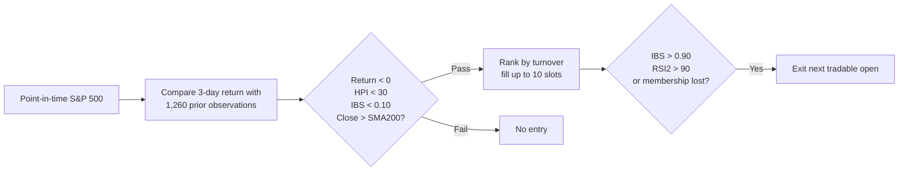

# HPI 3-Day Mean Reversion

!!! abstract "Plain-English summary"
    Find S&P 500 stocks whose negative 3-day move is unusually deep relative to their own negative history. Enter only when the stock is still above its long-term trend and closes near the day’s low.

-   :material-calendar-today: **Decision**

    Every trading-day close

-   :material-clock-outline: **Execution**

    Modeled at the next trading-day open

-   :material-history: **HPI history**

    Previous 1,260 observations, excluding today

-   :material-connection: **Maturity**

    `WIRED` — connected to a LIVE account route

## Decision flow

## Exact rules

| Item | Rule |
|---|---|
| Universe | Point-in-time S&P 500 membership |
| HPI | Percentile-like rank of the current 3-day return within the same-sign tail of the previous 1,260 observations |
| Entry | 3-day return `< 0`, `HPI < 30`, `IBS < 0.10`, and `Close > SMA200` |
| Ranking | Turnover descending; symbol ascending on ties |
| Sizing | Up to 10 equal 10% slots |
| Exit | `IBS > 0.90`, `RSI(2) > 90`, or loss of point-in-time index membership |
| Data | Stocks use `CAPITALSPECIAL`; performance benchmark uses total-return S&P 500 |
| Modeled costs | 2.5 bps slippage; $0.005/share commission; $1 minimum |

!!! danger "Timing boundary"
    The HPI reference set excludes the current observation. Decisions use `Close T`; orders execute at the modeled `Open T+1`.

!!! warning "What WIRED does — and does not — mean"
    `WIRED` confirms a LIVE route exists. It does not establish research quality, release enablement, or current runtime health.

## Sources of truth

- Maturity: `alpha/strategy_registry.py`
- Variant configuration: `strategies/hpi/strategy_mr_hpi_sp500_ibs_rsi_exit.py`
- Shared HPI rules and lifecycle: `strategies/hpi/stateful_long.py`
