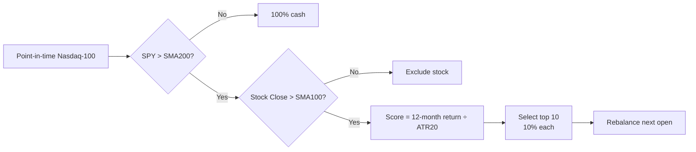

# NDX ATR-Normalized Momentum

!!! abstract "Plain-English summary"
    Once a month, rank current Nasdaq-100 members by 12-month momentum divided by their 20-day ATR. Hold up to ten names that remain above their 100-day trend, but only while SPY is above its 200-day trend.

-   :material-calendar-month: **Decision**

    Actual last tradable close of the month

-   :material-clock-outline: **Execution**

    Next tradable open

-   :material-view-grid-plus-outline: **Portfolio**

    Top 10, one 10% slot per selected stock

-   :material-connection: **Maturity**

    `WIRED` — connected to a LIVE account route

## Decision flow

## Exact rules

| Item | Rule |
|---|---|
| Universe | Point-in-time Nasdaq-100 membership |
| Market gate | `SPY Close > SPY SMA200`; otherwise no positions |
| Stock gate | Stock `Close > SMA100` |
| Score | 12-month month-end return ÷ trailing 20-day ATR |
| Selection | Highest scores first; symbol ascending on ties; up to 10 stocks |
| Sizing | 10% target per selected stock; fewer than 10 names leaves residual cash |
| Data | Signals and trading use `CAPITALSPECIAL`; performance benchmark is total-return S&P 500 |
| Modeled costs | 2.5 bps slippage; $0.005/share commission; $1 minimum |

!!! danger "Timing boundary"
    The decision uses the actual month-end close. Target shares are fixed from that prior close and cannot adapt to the realized next-open price.

!!! warning "What WIRED does — and does not — mean"
    `WIRED` confirms a LIVE route exists. It does not prove an edge, release enablement, or current runtime health.

## Sources of truth

- Maturity: `alpha/strategy_registry.py`
- Rules, data, sizing, and timing: `strategies/momentum/strategy_mo_atr_normalized_ndx.py`
