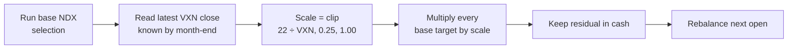

# NDX ATR Momentum + VXN Scaling

!!! abstract "Plain-English summary"
    Use the same Nasdaq-100 stock selection as the base ATR-momentum strategy, then reduce the whole portfolio when VXN is high. Unused exposure stays in cash; the scaler never adds leverage.

-   :material-calendar-month: **Decision**

    Actual last tradable close of the month

-   :material-tune-vertical-variant: **Exposure scale**

    `clip(22 ÷ VXN, 25%, 100%)`

-   :material-cash-multiple: **Residual**

    Unused exposure remains cash

-   :material-connection: **Maturity**

    `WIRED` — connected to a LIVE account route

## Decision flow

## Exact rules

| Item | Rule |
|---|---|
| Stock selection | Identical to [NDX ATR-Normalized Momentum](ndx-atr-momentum.md) |
| VXN input | Latest `$VXN` close known on or before the month-end decision |
| Scale | `clip(22 / VXN, 0.25, 1.00)` |
| Position target | Base 10% target × exposure scale |
| Portfolio exposure | Between 25% and 100% when the base strategy has ten names; never leveraged |
| Residual | Literal cash |
| Execution | Next tradable open after the month-end decision |

!!! danger "Timing boundary"
    VXN is an as-of input: only a close observed on or before the decision date may be used. Selection, scale, and target shares are fixed before the next open.

!!! warning "What WIRED does — and does not — mean"
    `WIRED` confirms a LIVE route exists. It does not prove profitability, release enablement, or current runtime health.

## Sources of truth

- Maturity: `alpha/strategy_registry.py`
- Base stock selection: `strategies/momentum/strategy_mo_atr_normalized_ndx.py`
- VXN scaling: `strategies/momentum/strategy_mo_atr_normalized_ndx_vxn_scaled.py`
