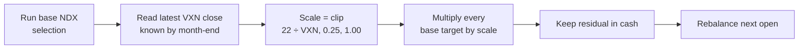

# NDX ATR Momentum + VXN Scaling

!!! abstract "Plain-English summary"
    Use the same Nasdaq-100 stock selection as the base ATR-momentum strategy, then reduce the whole portfolio when VXN is high. Unused exposure stays in cash; the scaler never adds leverage.

-   :material-calendar-month: **Decision**

    Actual last tradable close of the month

-   :material-tune-vertical-variant: **Exposure scale**

    `clip(22 ÷ VXN, 25%, 100%)`

-   :material-cash-multiple: **Residual**

    Unused exposure remains cash

-   :material-connection: **Maturity**

    `WIRED` — connected to a LIVE account route

## Decision flow

```mermaid
flowchart LR
    A["Run base NDX<br/>selection"] --> B["Read latest VXN close<br/>known by month-end"]
    B --> C["Scale = clip<br/>22 ÷ VXN, 0.25, 1.00"]
    C --> D["Multiply every<br/>base target by scale"]
    D --> E["Keep residual in cash"]
    E --> F["Rebalance next open"]
```

## Exact rules

| Item | Rule |
|---|---|
| Stock selection | Identical to [NDX ATR-Normalized Momentum](ndx-atr-momentum.md) |
| VXN input | Latest `$VXN` close known on or before the month-end decision |
| Scale | `clip(22 / VXN, 0.25, 1.00)` |
| Position target | Base 10% target × exposure scale |
| Portfolio exposure | Between 25% and 100% when the base strategy has ten names; never leveraged |
| Residual | Literal cash |
| Execution | Next tradable open after the month-end decision |

!!! danger "Timing boundary"
    VXN is an as-of input: only a close observed on or before the decision date may be used. Selection, scale, and target shares are fixed before the next open.

!!! warning "What WIRED does — and does not — mean"
    `WIRED` confirms a LIVE route exists. It does not prove profitability, release enablement, or current runtime health.

## Known caveats

Recorded from the [readiness audit 2026-09-28](../research/STRATEGY_READINESS_AUDIT_20260928.md). *Direction* says whether the published backtest is **conservative** (reality should be better), **optimistic** (reality should be worse), or neutral. Update this table whenever a caveat is measured again or fixed.

| Caveat | Direction | Size | Evidence |
|---|---|---|---|
| 5-session membership trim removes index leavers early, using knowledge live does not have | Fixed 2026-09-29 (exact membership is now the default; fix #7) | About 0 over 2000-2026; -0.47 pp/yr over the last 3 years; 8 of 320 picks differ from live (applies to backtests re-run after 2026-09-29) | Fix #7; `review_quant/rq_ndx_untrimmed.json` |
| Score divides momentum by ATR in dollars, so it favours low-priced shares | Design | Median pick price USD 68 vs USD 198 for a price-free NATR ranking; NATR20 was not better risk-adjusted | Audit sections 3.2 and 5b |
| Parameters chosen on 2000-2026 data | Selection | 151 configurations; Reality Check p = 0.61 | NDX parameter robustness study |
| Small-account friction (USD 1 minimum commission, whole shares) | Size-dependent | About -1.0 to -1.4 pp/yr at a USD 12K pod on IBKR Fixed, about half on Tiered; below 0.3 pp/yr from about USD 100K | Audit section 5b |
| High-priced names get zero shares at small size, with no warning | Size-dependent | Whole slot (10% of NAV) in cash at USD 12-15K, e.g. SNDK on 2026-08-31 | Fix #6 |
| Idle cash earns 0% (VXN scaling holds cash) | Conservative at fund size | Mean cash 32% of NAV (13% last 3y) | House ledger G-024 |
| Live data-freshness guard missing for $VXN; no stale-plan guard in the NDX host | Live risk | One-day-stale $VXN changes exposure by up to 12% of NAV | Fixes #3 and #5 |

## Sources of truth

- Maturity: `alpha/strategy_registry.py`
- Base stock selection: `strategies/momentum/strategy_mo_atr_normalized_ndx.py`
- VXN scaling: `strategies/momentum/strategy_mo_atr_normalized_ndx_vxn_scaled.py`
