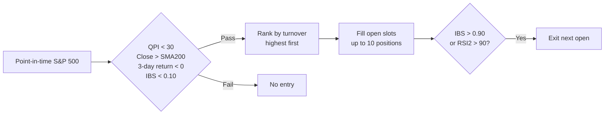

# QPI + IBS Mean Reversion

!!! abstract "Plain-English summary"
    Buy liquid S&P 500 stocks after a sharp short-term pullback, but only while the stock remains above its 200-day trend. Exit when the stock becomes short-term overbought.

-   :material-calendar-today: **Decision**

    Every trading-day close

-   :material-clock-outline: **Execution**

    Modeled at the next trading-day open

-   :material-view-grid-plus-outline: **Portfolio**

    Up to 10 positions, one 10% slot per position

-   :material-connection: **Maturity**

    `WIRED` — connected to a LIVE account route

## Decision flow

## Exact rules

| Item | Rule |
|---|---|
| Universe | Point-in-time S&P 500 membership |
| Entry | `QPI(3-day, 5-year history) < 30`, `Close > SMA200`, 3-day return `< 0`, and `IBS < 0.10` |
| Ranking | Turnover descending; symbol ascending on ties |
| Sizing | Previous portfolio value ÷ 10 for each new position |
| Exit | `IBS > 0.90` or `RSI(2) > 90` |
| Data | Stocks use `CAPITALSPECIAL`; performance benchmark uses total-return S&P 500 |
| Modeled costs | 2.5 bps slippage; $0.005/share commission; $1 minimum |

!!! danger "Timing boundary"
    All indicators use data through `Close T`. Entry and exit orders are modeled at `Open T+1`.

!!! warning "What WIRED does — and does not — mean"
    `WIRED` is a plumbing status. It does not prove profitability, an enabled release, or a currently due order.

## Sources of truth

- Maturity: `alpha/strategy_registry.py`
- Rules and timing: `strategies/qpi/strategy_mr_qpi_ibs_rsi_exit.py`
