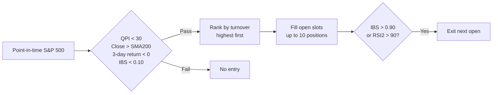

# QPI + IBS Mean Reversion

!!! abstract "Plain-English summary"
    Buy liquid S&P 500 stocks after a sharp short-term pullback, but only while the stock remains above its 200-day trend. Exit when the stock becomes short-term overbought.

!!! info "Retired from live on 2026-09-28"
    By owner decision, QPI was demoted from `WIRED` to `RESEARCH`. It was not running live on any VPS, and the HPI pods ([HPI 3-Day](hpi-3d-mean-reversion.md), [HPI 2/3/5 Vote](hpi-235-vote.md)) cover the same role. Its live host route and release template were removed. A leftover `pod_qpi*.yaml` in a releases root now fails validation. The [readiness audit](../research/STRATEGY_READINESS_AUDIT_20260928.md) (sections 3.4 and 10) found three problems: a held name with no bar or a NaN IBS is never exited (A-QPI-05); the choice among 14 QPI variants is undocumented (last-3-year Sharpe 0.78 vs 0.98 over the full sample); and small-account friction costs -1.8 pp/yr. The strategy module stays for research.

-   :material-calendar-today: **Decision**

    Every trading-day close

-   :material-clock-outline: **Execution**

    Modeled at the next trading-day open

-   :material-view-grid-plus-outline: **Portfolio**

    Up to 10 positions, one 10% slot per position

-   :material-connection: **Maturity**

    `RESEARCH` — no live route since 2026-09-28

## Decision flow

```mermaid
flowchart LR
    A["Point-in-time S&P 500"] --> B{"QPI < 30<br/>Close > SMA200<br/>3-day return < 0<br/>IBS < 0.10"}
    B -->|"Pass"| C["Rank by turnover<br/>highest first"]
    B -->|"Fail"| D["No entry"]
    C --> E["Fill open slots<br/>up to 10 positions"]
    E --> F{"IBS > 0.90<br/>or RSI2 > 90?"}
    F -->|"Yes"| G["Exit next open"]
```

## Exact rules

| Item | Rule |
|---|---|
| Universe | Point-in-time S&P 500 membership |
| Entry | `QPI(3-day, 5-year history) < 30`, `Close > SMA200`, 3-day return `< 0`, and `IBS < 0.10` |
| Ranking | Turnover descending; symbol ascending on ties |
| Sizing | Previous portfolio value ÷ 10 for each new position |
| Exit | `IBS > 0.90` or `RSI(2) > 90` |
| Data | Stocks use `CAPITALSPECIAL`; performance benchmark uses total-return S&P 500 |
| Modeled costs | 2.5 bps slippage; $0.005/share commission; $1 minimum |

!!! danger "Timing boundary"
    All indicators use data through `Close T`. Entry and exit orders are modeled at `Open T+1`.

!!! warning "What RESEARCH means"
    `RESEARCH` is a plumbing status: the strategy is for research runs only (single-strategy backtests, the legacy `strategies/run_portfolio.py` runner, and crisis stress tests). The portfolio manager refuses it in a book, and the live release loader refuses it in a release.

## Sources of truth

- Maturity: `alpha/strategy_registry.py`
- Rules and timing: `strategies/qpi/strategy_mr_qpi_ibs_rsi_exit.py`
