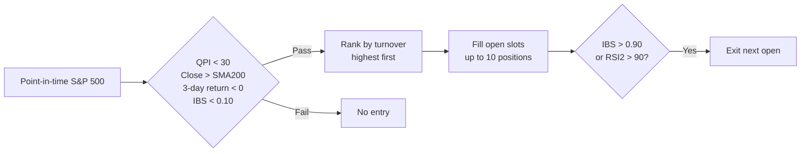

# QPI + IBS Mean Reversion

!!! abstract "Plain-English summary"
    Buy liquid S&P 500 stocks after a sharp short-term pullback, but only while the stock remains above its 200-day trend. Exit when the stock becomes short-term overbought.

-   :material-calendar-today: **Decision**

    Every trading-day close

-   :material-clock-outline: **Execution**

    Modeled at the next trading-day open

-   :material-view-grid-plus-outline: **Portfolio**

    Up to 10 positions, one 10% slot per position

-   :material-connection: **Maturity**

    `WIRED` — connected to a LIVE account route

## Decision flow

```mermaid
flowchart LR
    A["Point-in-time S&P 500"] --> B{"QPI < 30<br/>Close > SMA200<br/>3-day return < 0<br/>IBS < 0.10"}
    B -->|"Pass"| C["Rank by turnover<br/>highest first"]
    B -->|"Fail"| D["No entry"]
    C --> E["Fill open slots<br/>up to 10 positions"]
    E --> F{"IBS > 0.90<br/>or RSI2 > 90?"}
    F -->|"Yes"| G["Exit next open"]
```

## Exact rules

| Item | Rule |
|---|---|
| Universe | Point-in-time S&P 500 membership |
| Entry | `QPI(3-day, 5-year history) < 30`, `Close > SMA200`, 3-day return `< 0`, and `IBS < 0.10` |
| Ranking | Turnover descending; symbol ascending on ties |
| Sizing | Previous portfolio value ÷ 10 for each new position |
| Exit | `IBS > 0.90` or `RSI(2) > 90` |
| Data | Stocks use `CAPITALSPECIAL`; performance benchmark uses total-return S&P 500 |
| Modeled costs | 2.5 bps slippage; $0.005/share commission; $1 minimum |

!!! danger "Timing boundary"
    All indicators use data through `Close T`. Entry and exit orders are modeled at `Open T+1`.

!!! warning "What WIRED does — and does not — mean"
    `WIRED` is a plumbing status. It does not prove profitability, an enabled release, or a currently due order.

## Known caveats

Recorded from the [readiness audit 2026-09-28](../research/STRATEGY_READINESS_AUDIT_20260928.md). *Direction* says whether the published backtest is **conservative** (reality should be better), **optimistic** (reality should be worse), or neutral. Update this table whenever a caveat is measured again or fixed.

| Caveat | Direction | Size | Evidence |
|---|---|---|---|
| Commission and share rounding use split-adjusted share counts | Conservative | +0.36 pp/yr CAGR if charged on real shares | `mr_dv2_qpi/DV2_QPI_FINDINGS.md` A-QPI-01 |
| 5-session membership trim | Fixed 2026-09-29 (exact membership is now the default; fix #7) | -0.24 pp/yr last 3 years (applies to backtests re-run after 2026-09-29) | A-QPI-02 |
| A held name with no bar or a NaN IBS is never exited, silently | Live risk | 0 historical cases | A-QPI-05; fix #9 |
| Selection lineage undocumented | Selection | 14 QPI modules; last-3y Sharpe 0.78 vs 0.98 full sample | A-QPI-08 |
| Small-account friction | Size-dependent | -1.8 pp/yr at USD 30K over the last 3 years | A-QPI-06 |
| Owner decision 2026-09-28: to be removed from the wired set (HPI covers the role) | Status | Not running live | Pending change |

## Sources of truth

- Maturity: `alpha/strategy_registry.py`
- Rules and timing: `strategies/qpi/strategy_mr_qpi_ibs_rsi_exit.py`
