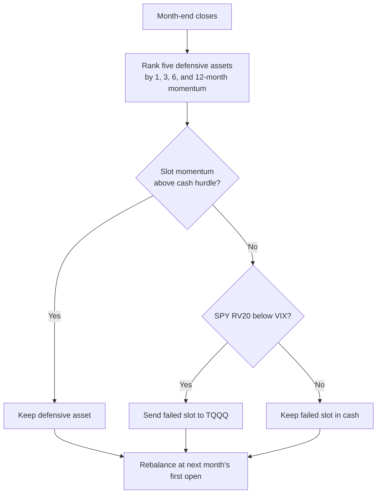

# TAA Defensive + TQQQ

!!! abstract "Plain-English summary"
    Each month, rank five defensive assets. Strong slots stay defensive; weak slots move toward `TQQQ`. The `TQQQ` portion is allowed only when 20-day realized SPY volatility is below VIX; otherwise that portion stays in cash.

-   :material-calendar-month: **Decision**

    Month-end close

-   :material-clock-outline: **Execution**

    First trading day of the next month, at the modeled next open

-   :material-shield-half-full: **Defensive basket**

    `GLD · UUP · TLT · DBC · BTAL`

-   :material-rocket-launch-outline: **Fallback**

    `TQQQ`, or literal cash when the volatility gate blocks it

-   :material-connection: **Maturity**

    `WIRED` — connected to a LIVE account route

## Decision flow

!!! danger "Timing boundary"
    The decision uses month-end information and does not trade at that same close. Execution is modeled at the next month’s first trading-day open.

!!! warning "What WIRED does — and does not — mean"
    `WIRED` confirms a LIVE route exists. It does not prove an edge, an enabled release, or current runtime health.

Full canonical specification

The content below is included directly from `strategies/taa_df/strategy_taa_df_btal_fallback_tqqq_vix_cash.md`. Edit that source, not this wrapper. Maturity comes separately from `alpha/strategy_registry.py`.

--8<-- "strategies/taa_df/strategy_taa_df_btal_fallback_tqqq_vix_cash.md"

