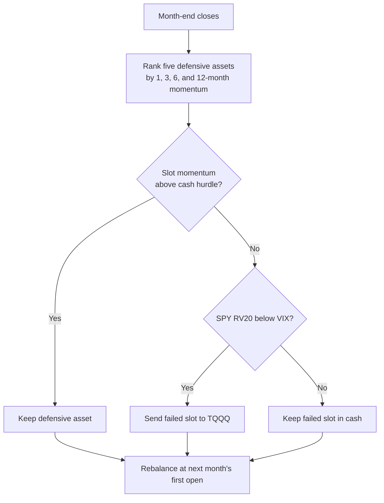

# TAA Defensive + TQQQ

!!! abstract "Plain-English summary"
    Each month, rank five defensive assets. Strong slots stay defensive; weak slots move toward `TQQQ`. The `TQQQ` portion is allowed only when 20-day realized SPY volatility is below VIX; otherwise that portion stays in cash.

-   :material-calendar-month: **Decision**

    Month-end close

-   :material-clock-outline: **Execution**

    First trading day of the next month, at the modeled next open

-   :material-shield-half-full: **Defensive basket**

    `GLD · UUP · TLT · DBC · BTAL`

-   :material-rocket-launch-outline: **Fallback**

    `TQQQ`, or literal cash when the volatility gate blocks it

-   :material-connection: **Maturity**

    `WIRED` — connected to a LIVE account route

## Decision flow

```mermaid
flowchart TD
    A["Month-end closes"] --> B["Rank five defensive assets<br/>by 1, 3, 6, and 12-month momentum"]
    B --> C{"Slot momentum<br/>above cash hurdle?"}
    C -->|"Yes"| D["Keep defensive asset"]
    C -->|"No"| E{"SPY RV20 below VIX?"}
    E -->|"Yes"| F["Send failed slot to TQQQ"]
    E -->|"No"| G["Keep failed slot in cash"]
    D --> H["Rebalance at next month's first open"]
    F --> H
    G --> H
```

!!! danger "Timing boundary"
    The decision uses month-end information and does not trade at that same close. Execution is modeled at the next month’s first trading-day open.

!!! warning "What WIRED does — and does not — mean"
    `WIRED` confirms a LIVE route exists. It does not prove an edge, an enabled release, or current runtime health.

## Known caveats

Recorded from the [readiness audit 2026-09-28](../research/STRATEGY_READINESS_AUDIT_20260928.md). *Direction* says whether the published backtest is **conservative** (reality should be better), **optimistic** (reality should be worse), or neutral. Update this table whenever a caveat is measured again or fixed.

| Caveat | Direction | Size | Evidence |
|---|---|---|---|
| Commission and share rounding use split-adjusted share counts (TQQQ split 8 times) | Conservative | +0.32 pp/yr CAGR if charged on real shares | Audit section 3.1; `review_quant/rq_taa_fee_and_hurdle_margin.json` |
| BTAL and the TQQQ fallback were chosen after seeing 2012-2026 results | Selection | #3 of 48 sibling variants | Leakage hunt 2026-09-27 |
| Unfinanced negative cash from sizing at Close_T and filling at the open | Optimistic, negligible | Min about -1.8% of NAV; < 0.01 pp/yr | `taa/bc_checks_*.json` |
| Live re-prices targets at the opening-auction price; the backtest freezes shares at Close_T | Neutral | -0.16 pp/yr; needs margin up to about 2% of NAV | Fix #4 in the audit fix list |
| Opening-auction (MOO) execution vs the modelled 2.5 bp slippage is not verified on IBKR fills | Unknown | House model: +0.1 pp/yr at USD 30K, +0.9 pp/yr at USD 1M, about +2 pp/yr at USD 5M (mostly BTAL) | `review_bc_trade/rbt04_capacity_at_todays_adv.json` |
| Capacity at today's volume (MOO, p99 order at or below 5% of ADV) | Limit | About USD 1.8M; BTAL is the binding name | Audit section 7b |
| Live data-freshness guard missing for $VIX / SPY at month-end | Live risk | One-day-stale $VIX would flip the TQQQ gate in 4 of 169 months | Fix #3 |
| Live XNYS calendar window starts 20 years back | Live risk | Host raises from about 2031-09 (loud, no wrong order) | Fix #17 |
| DTB3 hurdle decisions can sit on a knife edge | Neutral | Smallest score-hurdle margin 2.5e-5 (2025-09); 0 of 169 decisions flip with a one-session publication lag | `review_quant/rq_taa_checks.json` |

Full canonical specification

The content below is included directly from `strategies/taa_df/strategy_taa_df_btal_fallback_tqqq_vix_cash.md`. Edit that source, not this wrapper. Maturity comes separately from `alpha/strategy_registry.py`.

--8<-- "strategies/taa_df/strategy_taa_df_btal_fallback_tqqq_vix_cash.md"

