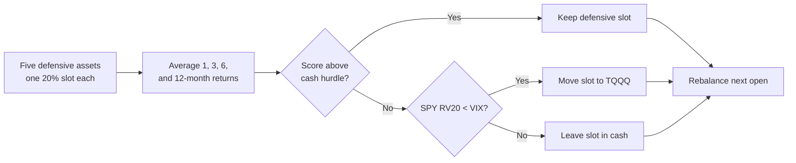

# TAA Equal Slots + TQQQ

!!! abstract "Plain-English summary"
    Give each of five defensive assets a 20% slot. A defensive asset keeps its slot only when its multi-horizon momentum beats the cash hurdle. Failed slots move to `TQQQ`, unless the volatility gate sends them to cash.

-   :material-calendar-month: **Decision**

    Month-end close

-   :material-clock-outline: **Execution**

    First trading day of the next month, modeled at the open

-   :material-shield-half-full: **Defensive basket**

    `GLD · UUP · TLT · DBC · BTAL`

-   :material-connection: **Maturity**

    `WIRED` — connected to a LIVE account route

## Decision flow

## Exact rules

| Item | Rule |
|---|---|
| Defensive assets | `GLD`, `UUP`, `TLT`, `DBC`, `BTAL` |
| Slot size | 20% for each defensive asset |
| Momentum | Average of 1-, 3-, 6-, and 12-month simple returns |
| Qualification | Momentum score is above the DTB3-derived one-month cash hurdle |
| Failed slot | `TQQQ` when 20-day realized SPY volatility is below VIX; otherwise literal cash |
| Sizing | Passing defensive slots retain 20%; failed slots accumulate in the fallback or cash |
| Data | Total-return closes form signals; `CAPITALSPECIAL` OHLC drives fills and valuation |
| Modeled costs | 2.5 bps slippage; $0.005/share commission; $1 minimum |

!!! danger "Timing boundary"
    The allocation is decided from month-end data. The modeled rebalance occurs at the next month’s first tradable open.

!!! warning "What WIRED does — and does not — mean"
    `WIRED` confirms a LIVE route exists. It does not prove an edge, an enabled release, or current runtime health.

## Sources of truth

- Maturity: `alpha/strategy_registry.py`
- Equal-slot model: `strategies/taa_df/strategy_taa_df_btal_1n.py`
- TQQQ fallback: `strategies/taa_df/strategy_taa_df_btal_1n_fallback_tqqq.py`
- Volatility cash gate: `strategies/taa_df/strategy_taa_df_btal_1n_fallback_tqqq_vix_cash.py`
