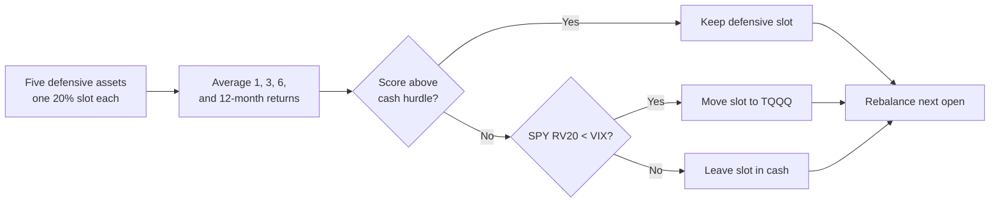

# TAA Equal Slots + TQQQ

!!! abstract "Plain-English summary"
    Give each of five defensive assets a 20% slot. A defensive asset keeps its slot only when its multi-horizon momentum beats the cash hurdle. Failed slots move to `TQQQ`, unless the volatility gate sends them to cash.

-   :material-calendar-month: **Decision**

    Month-end close

-   :material-clock-outline: **Execution**

    First trading day of the next month, modeled at the open

-   :material-shield-half-full: **Defensive basket**

    `GLD · UUP · TLT · DBC · BTAL`

-   :material-connection: **Maturity**

    `WIRED` — connected to a LIVE account route

## Decision flow

```mermaid
flowchart LR
    A["Five defensive assets<br/>one 20% slot each"] --> B["Average 1, 3, 6,<br/>and 12-month returns"]
    B --> C{"Score above<br/>cash hurdle?"}
    C -->|"Yes"| D["Keep defensive slot"]
    C -->|"No"| E{"SPY RV20 < VIX?"}
    E -->|"Yes"| F["Move slot to TQQQ"]
    E -->|"No"| G["Leave slot in cash"]
    D --> H["Rebalance next open"]
    F --> H
    G --> H
```

## Exact rules

| Item | Rule |
|---|---|
| Defensive assets | `GLD`, `UUP`, `TLT`, `DBC`, `BTAL` |
| Slot size | 20% for each defensive asset |
| Momentum | Average of 1-, 3-, 6-, and 12-month simple returns |
| Qualification | Momentum score is above the DTB3-derived one-month cash hurdle |
| Failed slot | `TQQQ` when 20-day realized SPY volatility is below VIX; otherwise literal cash |
| Sizing | Passing defensive slots retain 20%; failed slots accumulate in the fallback or cash |
| Data | Total-return closes form signals; `CAPITALSPECIAL` OHLC drives fills and valuation |
| Modeled costs | 2.5 bps slippage; $0.005/share commission; $1 minimum |

!!! danger "Timing boundary"
    The allocation is decided from month-end data. The modeled rebalance occurs at the next month’s first tradable open.

!!! warning "What WIRED does — and does not — mean"
    `WIRED` confirms a LIVE route exists. It does not prove an edge, an enabled release, or current runtime health.

## Known caveats

Recorded from the [readiness audit 2026-09-28](../research/STRATEGY_READINESS_AUDIT_20260928.md). *Direction* says whether the published backtest is **conservative** (reality should be better), **optimistic** (reality should be worse), or neutral. Update this table whenever a caveat is measured again or fixed.

| Caveat | Direction | Size | Evidence |
|---|---|---|---|
| Commission and share rounding use split-adjusted share counts (TQQQ split 8 times) | Conservative | +0.38 pp/yr CAGR if charged on real shares | Audit section 3.1; `review_quant/rq_taa_fee_and_hurdle_margin.json` |
| BTAL and the TQQQ fallback were chosen after seeing 2012-2026 results | Selection | Same family search as TAA 3x | Leakage hunt 2026-09-27 |
| Unfinanced negative cash from sizing at Close_T and filling at the open | Optimistic, negligible | Min about -1.8% of NAV; < 0.01 pp/yr | `taa/bc_checks_*.json` |
| Live re-prices targets at the opening-auction price; the backtest freezes shares at Close_T | Neutral | -0.20 pp/yr; needs margin up to about 2.8% of NAV | Fix #4 in the audit fix list |
| Opening-auction (MOO) execution vs the modelled 2.5 bp slippage is not verified on IBKR fills | Unknown | House model: +0.1 pp/yr at USD 30K, +0.9 pp/yr at USD 1M, about +2 pp/yr at USD 5M (mostly BTAL) | `review_bc_trade/rbt04_capacity_at_todays_adv.json` |
| Capacity at today's volume (MOO, p99 order at or below 5% of ADV) | Limit | About USD 1.8M; BTAL is the binding name | Audit section 7b |
| Live data-freshness guard missing for $VIX / SPY at month-end | Live risk | One-day-stale $VIX would flip the TQQQ gate in 4 of 169 months | Fix #3 |
| Live XNYS calendar window starts 20 years back | Live risk | Host raises from about 2031-09 (loud, no wrong order) | Fix #17 |

## Sources of truth

- Maturity: `alpha/strategy_registry.py`
- Equal-slot model: `strategies/taa_df/strategy_taa_df_btal_1n.py`
- TQQQ fallback: `strategies/taa_df/strategy_taa_df_btal_1n_fallback_tqqq.py`
- Volatility cash gate: `strategies/taa_df/strategy_taa_df_btal_1n_fallback_tqqq_vix_cash.py`
