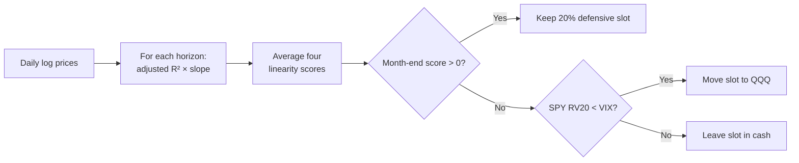

# TAA Linearity + QQQ

!!! abstract "Plain-English summary"
    Give each defensive asset a 20% slot. Keep the slot when its price trend is positive and consistently linear across four horizons. Failed slots move to `QQQ`, unless the volatility gate sends them to cash.

-   :material-calendar-month: **Decision**

    Month-end close

-   :material-chart-bell-curve-cumulative: **Signal**

    Regression linearity over 21, 63, 126, and 252 days

-   :material-shield-half-full: **Defensive basket**

    `GLD · UUP · TLT · DBC · BTAL`

-   :material-connection: **Maturity**

    `WIRED` — connected to a LIVE account route

## Decision flow

## Exact rules

| Item | Rule |
|---|---|
| Defensive assets | `GLD`, `UUP`, `TLT`, `DBC`, `BTAL` |
| Slot size | 20% for each defensive asset |
| Horizon score | Regression slope of log price × adjusted R² |
| Composite | Average of the 21-, 63-, 126-, and 252-day horizon scores |
| Qualification | Month-end composite linearity score `> 0` |
| Failed slot | `QQQ` when 20-day realized SPY volatility is below VIX; otherwise literal cash |
| Data | Total-return closes form signals; `CAPITALSPECIAL` OHLC drives fills and valuation |
| Execution | First tradable open after the month-end decision |
| Modeled costs | 2.5 bps slippage; $0.005/share commission; $1 minimum |

!!! danger "Timing boundary"
    The regression windows end at the month-end decision close. The strategy does not use the next open to change its decision.

!!! warning "What WIRED does — and does not — mean"
    `WIRED` confirms a LIVE route exists. It does not prove profitability, release enablement, or current runtime health.

## Sources of truth

- Maturity: `alpha/strategy_registry.py`
- Linearity and equal-slot rules: `strategies/taa_df/strategy_taa_df_btal_linearity_1n.py`
- QQQ fallback: `strategies/taa_df/strategy_taa_df_btal_linearity_1n_fallback_qqq.py`
- Volatility cash gate: `strategies/taa_df/strategy_taa_df_btal_linearity_1n_fallback_qqq_vix_cash.py`
