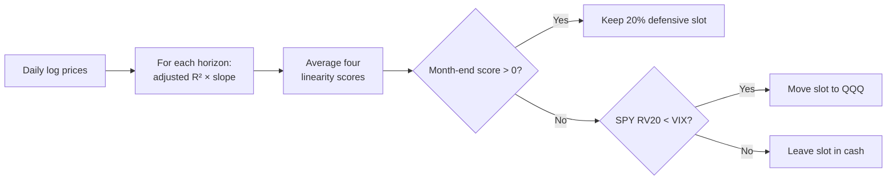

# TAA Linearity + QQQ

!!! abstract "Plain-English summary"
    Give each defensive asset a 20% slot. Keep the slot when its price trend is positive and consistently linear across four horizons. Failed slots move to `QQQ`, unless the volatility gate sends them to cash.

-   :material-calendar-month: **Decision**

    Month-end close

-   :material-chart-bell-curve-cumulative: **Signal**

    Regression linearity over 21, 63, 126, and 252 days

-   :material-shield-half-full: **Defensive basket**

    `GLD · UUP · TLT · DBC · BTAL`

-   :material-connection: **Maturity**

    `WIRED` — connected to a LIVE account route

## Decision flow

```mermaid
flowchart LR
    A["Daily log prices"] --> B["For each horizon:<br/>adjusted R² × slope"]
    B --> C["Average four<br/>linearity scores"]
    C --> D{"Month-end score > 0?"}
    D -->|"Yes"| E["Keep 20% defensive slot"]
    D -->|"No"| F{"SPY RV20 < VIX?"}
    F -->|"Yes"| G["Move slot to QQQ"]
    F -->|"No"| H["Leave slot in cash"]
```

## Exact rules

| Item | Rule |
|---|---|
| Defensive assets | `GLD`, `UUP`, `TLT`, `DBC`, `BTAL` |
| Slot size | 20% for each defensive asset |
| Horizon score | Regression slope of log price × adjusted R² |
| Composite | Average of the 21-, 63-, 126-, and 252-day horizon scores |
| Qualification | Month-end composite linearity score `> 0` |
| Failed slot | `QQQ` when 20-day realized SPY volatility is below VIX; otherwise literal cash |
| Data | Total-return closes form signals; `CAPITALSPECIAL` OHLC drives fills and valuation |
| Execution | First tradable open after the month-end decision |
| Modeled costs | 2.5 bps slippage; $0.005/share commission; $1 minimum |

!!! danger "Timing boundary"
    The regression windows end at the month-end decision close. The strategy does not use the next open to change its decision.

!!! warning "What WIRED does — and does not — mean"
    `WIRED` confirms a LIVE route exists. It does not prove profitability, release enablement, or current runtime health.

## Known caveats

Recorded from the [readiness audit 2026-09-28](../research/STRATEGY_READINESS_AUDIT_20260928.md). *Direction* says whether the published backtest is **conservative** (reality should be better), **optimistic** (reality should be worse), or neutral. Update this table whenever a caveat is measured again or fixed.

| Caveat | Direction | Size | Evidence |
|---|---|---|---|
| Commission and share rounding use split-adjusted share counts | Conservative | about 0 (+0.0015 pp/yr; QQQ fallback) | Audit section 3.1; `review_quant/rq_taa_fee_and_hurdle_margin.json` |
| BTAL and the QQQ fallback were chosen after seeing 2012-2026 results | Selection | #2 of 48 sibling variants | Leakage hunt 2026-09-27 |
| Unfinanced negative cash from sizing at Close_T and filling at the open | Optimistic, negligible | Min about -1.8% of NAV; < 0.01 pp/yr | `taa/bc_checks_*.json` |
| Live re-prices targets at the opening-auction price; the backtest freezes shares at Close_T | Neutral | -0.01 pp/yr; needs margin up to about 1.3% of NAV | Fix #4 in the audit fix list |
| Opening-auction (MOO) execution vs the modelled 2.5 bp slippage is not verified on IBKR fills | Unknown | House model: +0.1 pp/yr at USD 30K, +0.9 pp/yr at USD 1M, about +2 pp/yr at USD 5M (mostly BTAL) | `review_bc_trade/rbt04_capacity_at_todays_adv.json` |
| Capacity at today's volume (MOO, p99 order at or below 5% of ADV) | Limit | About USD 1.8M; BTAL is the binding name | Audit section 7b |
| Live data-freshness guard missing for $VIX / SPY at month-end | Live risk | One-day-stale $VIX would flip the TQQQ gate in 4 of 169 months | Fix #3 |
| Live XNYS calendar window starts 20 years back | Live risk | Host raises from about 2031-09 (loud, no wrong order) | Fix #17 |

## Sources of truth

- Maturity: `alpha/strategy_registry.py`
- Linearity and equal-slot rules: `strategies/taa_df/strategy_taa_df_btal_linearity_1n.py`
- QQQ fallback: `strategies/taa_df/strategy_taa_df_btal_linearity_1n_fallback_qqq.py`
- Volatility cash gate: `strategies/taa_df/strategy_taa_df_btal_linearity_1n_fallback_qqq_vix_cash.py`
