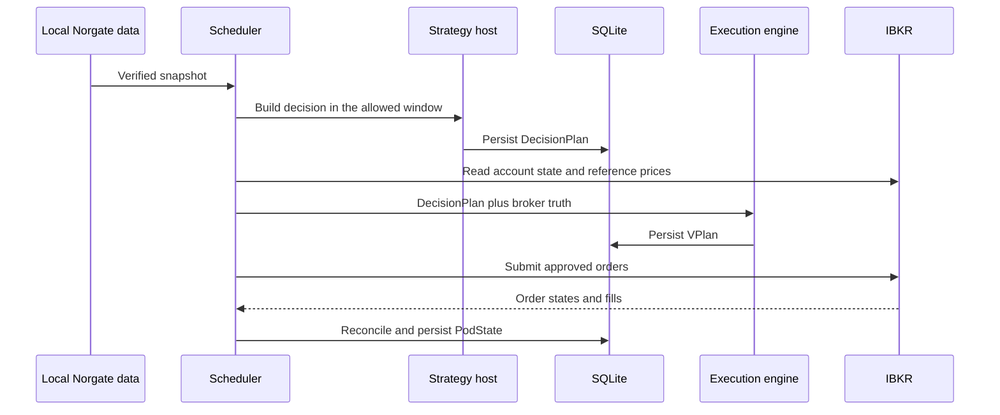

# How the System Works

!!! abstract "Summary"
    A strategy creates intent from information available at its decision time. Near execution, the LIVE layer reads broker state and reference prices, builds exact orders, submits them, and reconciles the result against the broker.

## The simple model

```text
data -> decision -> DecisionPlan -> VPlan -> broker -> reconciliation -> new state
```

The separation between `DecisionPlan` and `VPlan` is deliberate:

- `DecisionPlan` records **what the strategy wants**.
- `VPlan` records **which exact orders can be constructed now**, using current broker state and approved reference prices.

## End-to-end flow



!!! danger "Critical timing boundary"
    Information arriving after the strategy decision time must not influence the strategy decision. New broker information may affect executable quantity or whether execution is safe, but it must not silently change the strategy's meaning.

## Component responsibilities

| Component | Responsibility | Must not do |
|---|---|---|
| Norgate data | Provide a verified local snapshot | Submit orders |
| Strategy host | Run the approved strategy and create `DecisionPlan` | Invent broker state |
| Execution engine | Convert intent into a `VPlan` using broker truth | Change strategy rules |
| Order clerk | Submit and track approved orders | Add opaque optimization |
| Reconciliation | Compare actual outcome with target state | Declare success without position agreement |
| SQLite | Persist decisions, plans, and state | Replace broker truth |

## Source hierarchy

This page is a guide. The current canonical contracts remain:

- `LIVE_START_HERE.md`
- `docs/live/LIVE_TRADING_ARCHITECTURE.md`
- `docs/live/LIVE_TECHNICAL_REFERENCE.md`
- `QUANT_PHILOSOPHY.md`

If this page conflicts with one of those sources, stop and correct this page. Do not interpret the conflict in its favor.
